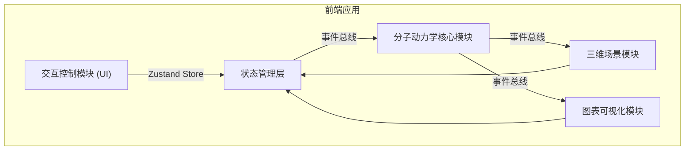

## 1. 架构设计



## 2. 技术描述
- 前端框架：React 18 + TypeScript
- 构建工具：Vite
- 3D渲染：Three.js + @types/three
- 状态管理：Zustand
- 图表可视化：Recharts
- 动画库：Framer Motion
- 初始化方式：Vite React TypeScript 模板

## 3. 模块划分与文件结构

```
src/
├── main.tsx                    # React入口，初始化所有模块
├── core/
│   ├── kinetics.ts             # 分子动力学核心模块：原子位移、键能计算、轨迹记录
│   ├── scene.ts                # 三维场景模块：Three.js场景、原子、键、轨迹渲染
│   └── chart.ts                # 图表可视化模块：能量折线图
├── ui/
│   └── panel.tsx               # 交互控制模块：控制面板UI组件
├── model/
│   └── reaction.ts             # 反应路径数据模型
└── utils/
    ├── store.ts                # Zustand状态管理
    └── eventBus.ts             # 事件总线
```

## 4. 核心模块职责

### 4.1 分子动力学核心模块 (core/kinetics.ts)
- 计算原子位移插值（5秒动画）
- 基于简化力场模型计算键能和总势能
- 记录原子运动轨迹
- 管理键的断裂和生成状态（0.8秒动画）

### 4.2 三维场景模块 (core/scene.ts)
- Three.js场景初始化：相机、灯光、地面网格
- 原子球体渲染（按元素类型着色）
- 化学键线段渲染（支持渐现动画）
- 原子轨迹线渲染（半透明细线）
- OrbitControls镜头控制
- 动画循环管理，保持50fps+

### 4.3 图表可视化模块 (core/chart.ts)
- 基于Recharts的能量折线图
- 监听能量变化事件实时更新
- 曲线颜色渐变（蓝→红）
- 过渡态波峰高亮与脉冲动画

### 4.4 交互控制模块 (ui/panel.tsx)
- React控制面板组件
- 分子名称显示
- 反应路径选择器
- 开始/暂停/回放按钮
- 原子能量指示灯（绿色稳定/红色高能）

## 5. 数据模型

### 5.1 核心数据结构

```typescript
interface Atom {
  id: string;
  element: 'C' | 'H' | 'Cl' | 'O';
  position: { x: number; y: number; z: number };
  energy: number;
}

interface Bond {
  id: string;
  atomA: string;
  atomB: string;
  energy: number;
  visible: boolean;
  opacity: number;
}

interface ReactionPath {
  id: string;
  name: string;
  atomSequence: Array<{ atomId: string; position: { x: number; y: number; z: number } }>;
  bondChanges: Array<{ bondId: string; action: 'break' | 'form'; timing: number }>;
  energyBarriers: number[];
}

interface AppState {
  atoms: Atom[];
  bonds: Bond[];
  energyHistory: Array<{ time: number; energy: number; isPeak: boolean }>;
  trajectories: Record<string, Array<{ x: number; y: number; z: number }>>;
  reactionStatus: 'idle' | 'playing' | 'paused' | 'finished';
  currentReaction: string;
  currentTime: number;
}
```

## 6. 事件总线通信

### 6.1 事件定义
- `atom:move` - 原子位置更新
- `energy:update` - 能量数据更新
- `bond:change` - 化学键状态变化
- `reaction:start` - 反应开始
- `reaction:pause` - 反应暂停
- `reaction:resume` - 反应继续
- `reaction:reset` - 反应重置
- `reaction:replay` - 反应回放

## 7. 性能优化
- 动画循环使用 requestAnimationFrame
- 能量图表数据节流，重绘延迟≤16ms
- Three.js场景优化：几何体复用、材质缓存
- 轨迹线使用 BufferGeometry 提升性能
- 目标帧率：50fps+
