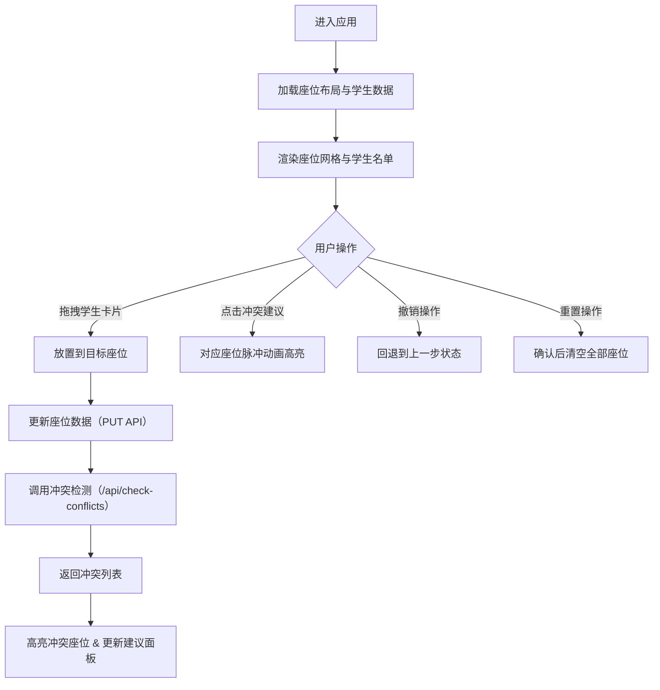

## 1. 产品概述

微型在线教室座位可视化调度与冲突检测应用，为教师和管理员提供直观的拖拽式座位编排工具，自动检测并预警视力不佳、听力障碍、吵闹学生相邻等座位冲突，并给出优化建议。

- 核心目标：通过可视化拖拽方式简化教室座位管理流程，减少人工排座的冲突与疏漏
- 目标用户：学校教师、教务管理员

## 2. 核心功能

### 2.1 功能模块

1. **座位网格可视化**：6行8列教室座位布局，支持年级颜色区分与学生信息展示
2. **拖拽排座系统**：从学生名单拖拽卡片到座位网格，实时更新座位安排
3. **冲突检测引擎**：自动检测视力/听力位置不当、吵闹学生相邻等冲突
4. **优化建议面板**：展示冲突详情与优化建议，支持点击高亮定位
5. **撤销与重置**：支持最多10步历史撤销和一键清空全部座位

### 2.2 页面详情

| 页面名称 | 模块名称 | 功能描述 |
|-----------|-------------|---------------------|
| 主页面 | 顶部工具栏 | 撤销按钮（Ctrl+Z）、重置按钮（带确认弹窗） |
| 主页面 | 座位网格区 | 6×8座位布局，拖拽放置，冲突高亮显示，脉冲动画 |
| 主页面 | 学生名单面板 | 可滚动学生卡片列表，含姓名、年级、特殊需求标签 |
| 主页面 | 冲突建议面板 | 冲突列表展示，严重程度标识，点击高亮对应座位 |

## 3. 核心流程

用户进入主页面，查看当前座位布局与学生名单。从右侧名单拖拽学生卡片至网格中空座位，放置后自动调用后端冲突检测接口，返回冲突列表并高亮显示冲突座位。用户可在右侧面板查看冲突详情和优化建议，点击建议项高亮对应座位。通过工具栏撤销或重置操作调整座位安排。

## 4. 用户界面设计

### 4.1 设计风格

- **主色调**：浅色主题，背景 #F5F5F5
- **年级色板**：大一 #42A5F5（蓝）、大二 #66BB6A（绿）、大三 #FFA726（橙）、大四 #EF5350（红）
- **冲突标识**：红色边框 #D32F2F，严重冲突红点 #D32F2F，建议调整黄点 #FBC02D
- **卡片风格**：圆角设计，白色背景，悬停浅蓝 #E3F2FD
- **字体**：主文字系统无衬线字体，姓名缩写 12px 600 字重
- **动效**：所有过渡使用 0.2s ease-in-out CSS transition

### 4.2 页面设计概览

| 页面名称 | 模块名称 | UI 元素 |
|-----------|-------------|-------------|
| 主页面 | 顶部工具栏 | 56px 高，白底，底部阴影 0 2px 4px #0000001A，撤销/重置按钮 |
|主页面 | 座位网格 | 居中显示，60×60px 座位，8px 圆角，空闲 #E0E0E0，冲突红边框+⚠图标 |
| 主页面 | 学生名单 | 右侧可滚动卡片列表，40px 高卡片，含年级色标、特殊需求标签 |
| 主页面 | 冲突面板 | 右侧下方，列表项含严重程度圆点、冲突描述、优化建议 |

### 4.3 响应式

桌面端优先设计，以 1280px 以上宽度为最佳展示尺寸，核心交互区域保持固定布局。
