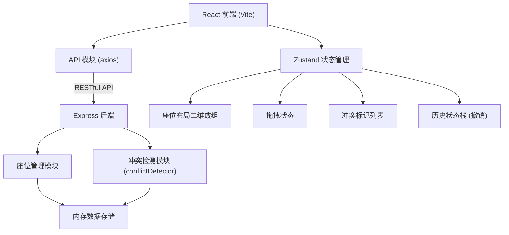
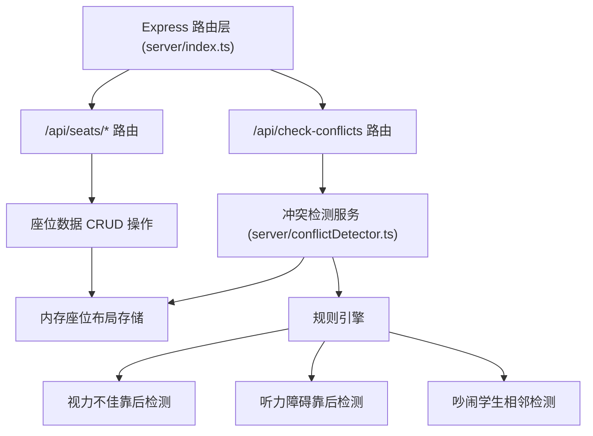

## 1. 架构设计



## 2. 技术说明

- **前端**：React 18 + TypeScript + Vite 5 + Zustand 4 + Axios
- **初始化工具**：Vite（react-ts 模板）
- **后端**：Node.js + Express 4 + TypeScript
- **数据存储**：内存存储（含初始 Mock 数据）
- **跨域处理**：Vite dev server 代理 + CORS

## 3. 路由定义

| 路由 | 用途 |
|-------|---------|
| / | 主页面（座位调度中心） |

## 4. API 定义

```typescript
// 学生特殊需求
type StudentNeed = 'vision_impaired' | 'hearing_impaired' | 'noisy' | null;

// 年级
type Grade = 'freshman' | 'sophomore' | 'junior' | 'senior';

// 学生信息
interface Student {
  id: string;
  name: string;
  grade: Grade;
  specialNeeds: StudentNeed[];
}

// 座位信息（null 表示空闲）
type Seat = Student | null;

// 座位布局 6行8列
type SeatLayout = Seat[][];

// 座位坐标
interface SeatPosition {
  row: number;
  col: number;
}

// 冲突类型
type ConflictType = 'vision_back' | 'hearing_back' | 'noisy_adjacent';

// 冲突严重程度
type Severity = 'must_fix' | 'suggest_fix';

// 冲突信息
interface Conflict {
  id: string;
  seats: [SeatPosition, SeatPosition];
  type: ConflictType;
  severity: Severity;
  description: string;
  suggestion: string;
}

// ============ API 请求/响应 ============

// GET /api/seats - 获取座位布局
interface GetSeatsResponse {
  layout: SeatLayout;
  students: Student[];
}

// PUT /api/seats/:row/:col - 更新单个座位
interface UpdateSeatRequest {
  student: Student | null;
}
interface UpdateSeatResponse {
  success: boolean;
  layout: SeatLayout;
}

// PUT /api/seats/reset - 重置全部座位
interface ResetSeatsResponse {
  success: boolean;
  layout: SeatLayout;
}

// POST /api/check-conflicts - 检测冲突
interface CheckConflictsRequest {
  layout: SeatLayout;
}
interface CheckConflictsResponse {
  conflicts: Conflict[];
}
```

## 5. 服务端架构图



## 6. 项目文件结构

```
.
├── package.json
├── vite.config.js
├── tsconfig.json
├── index.html
├── src/
│   ├── main.tsx          # React 入口
│   ├── App.tsx           # 根组件
│   ├── index.css         # 全局样式
│   ├── api.ts            # REST API 封装
│   ├── store.ts          # Zustand 状态管理
│   ├── SeatGrid.tsx      # 座位网格组件
│   ├── ConflictPanel.tsx # 冲突建议面板
│   └── types.ts          # 共享类型定义
└── server/
    ├── index.ts          # Express 服务入口
    └── conflictDetector.ts # 冲突检测模块
```
