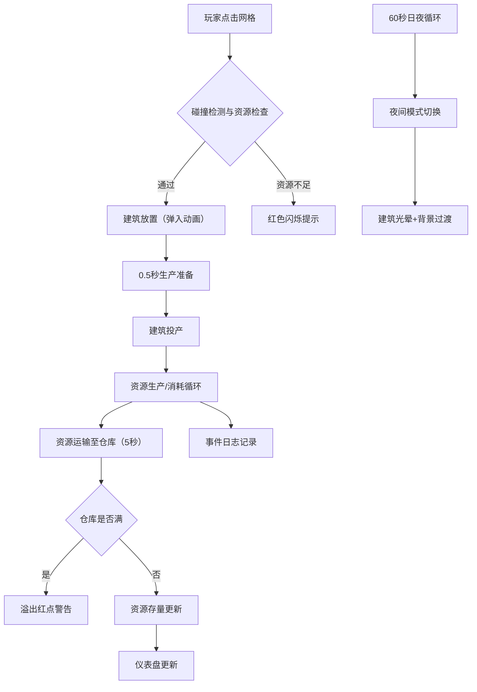

## 1. 产品概述
星球基地建设与资源管理模拟演示应用——一款以"星球基地建设与资源管理"为核心的策略模拟游戏，面向独立游戏策划人员，用于快速验证不同建筑布局对资源生产和运输效率的影响，以及夜间模式下基地灯光与生产状态的视觉反馈。
- 目标用户：独立游戏策划、策略游戏爱好者
- 核心价值：提供实时可视化的建筑布局、资源流动和生产趋势分析，帮助策划人员快速迭代设计思路

## 2. 核心功能

### 2.1 功能模块
1. **基地网格页面**：18x18 网格地图，建筑放置/拆除，资源生产与消耗，夜间模式视觉反馈
2. **资源仪表盘**：实时资源面板，生产趋势折线图，溢出警告
3. **事件日志**：游戏事件实时记录与滚动显示

### 2.2 页面详情
| 页面名称 | 模块名称 | 功能描述 |
|----------|----------|----------|
| 基地网格页面 | 网格地图渲染 | 18x18 网格，建筑图标（采矿机/发电厂/加工厂/居住舱/仓库），空地深褐色，悬停提示可放置/不可放置，建造弹入动画，夜间模式光晕效果 |
| 基地网格页面 | 建筑放置与拆除 | 点击空地放置建筑，碰撞检测，路径检查（至少1格通道），资源不足红色闪烁提示 |
| 基地网格页面 | 夜间模式切换 | 自动每60秒（30秒白天+30秒夜晚）切换，手动切换按钮，平滑过渡1秒 |
| 资源仪表盘 | 资源面板 | 能量/矿物/人口/总生产数，数值变化动画 |
| 资源仪表盘 | 生产趋势折线图 | 近30秒采样，能量线蓝色，矿物线棕色，自适应Y轴，快速下降红色闪烁警告 |
| 事件日志 | 日志列表 | 最近5条事件，不同颜色图标，右侧滑入动画，mm:ss时间戳 |

## 3. 核心流程

玩家在网格地图上选择空地放置建筑。放置前进行碰撞检测和资源检查：若资源不足，弹出红色闪烁提示框；若通过，建筑以弹入动画放置并进入0.5秒生产准备状态。建筑投产后按各自周期生产/消耗资源，资源自动经由仓库运输（5秒）。每60秒自动切换日夜模式，夜间建筑发出光晕。仪表盘实时显示资源与趋势，事件日志记录所有关键事件。

## 4. 用户界面设计

### 4.1 设计风格
- 主色调：深灰蓝 #1B1B2F（科幻深色主题）
- 辅助色：深褐色 #3E2723（网格背景）、暗蓝 #1A237E（夜间背景）
- 面板样式：毛玻璃效果（backdrop-filter: blur(12px)，rgba(255,255,255,0.08)背景，圆角12px）
- 按钮风格：悬停亮度增加20%，点击缩放0.95倍
- 图标风格：SVG 矢量图标（采矿机黄色三角、发电厂蓝色闪电、加工厂绿色齿轮、居住舱灰色房子、仓库橙色箱子）
- 动画风格：framer-motion 驱动，弹入/滑入/缩放/淡入淡出

### 4.2 页面设计概览
| 页面名称 | 模块名称 | UI 元素 |
|----------|----------|---------|
| 基地网格页面 | 网格地图 | 18x18 网格，深褐色空地，彩色建筑图标，白色高亮边框（0.3秒淡入），悬停绿/红半透明方块，夜间暗蓝背景+光晕 |
| 基地网格页面 | 日夜切换按钮 | 右上角月亮/太阳图标，点击切换，1秒过渡 |
| 资源仪表盘 | 资源面板 | 左上角固定，闪电/石头/人形图标+数值，0.2秒缩放动画 |
| 资源仪表盘 | 趋势折线图 | 右侧面板，Canvas 绘制，300x100px，蓝/棕双线，X轴时间刻度，Y轴自适应 |
| 事件日志 | 日志列表 | 最大高度150px，垂直滚动，右侧滑入动画，mm:ss时间戳，三色分类 |

### 4.3 响应式设计
- 桌面优先设计
- 视口宽度 < 768px：网格缩至 12x12，建筑图标缩至0.7倍，面板上下堆叠（仪表盘在上，事件日志在下）

### 4.4 动画规格
- 建筑放置：0.5倍→1.0倍缩放，0.3秒弹入
- 数值变化：scale 1.05→1.0，opacity 0.8→1.0，0.2秒
- 日夜切换：背景/网格线/光晕 1秒 ease-in-out 过渡
- 事件日志：初始 x=50, opacity=0，0.4秒滑入
- 按钮悬停：亮度+20%
- 按钮点击：scale 0.95，0.1秒
