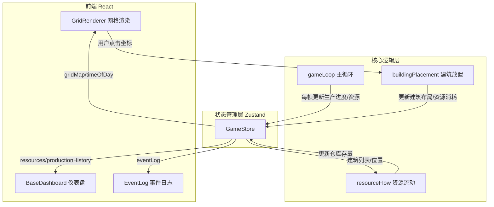

## 1. 架构设计



## 2. 技术说明
- 前端：React 18 + TypeScript + Vite
- 初始化工具：vite-init（react-ts 模板）
- 状态管理：Zustand（含 immer 中间件）
- 动画库：framer-motion
- 构建工具：Vite + @vitejs/plugin-react
- 无后端，纯前端模拟

## 3. 路由定义
| 路由 | 用途 |
|------|------|
| / | 主游戏页面（单页应用，无路由切换） |

## 4. 数据模型

### 4.1 Zustand Store 数据结构

```typescript
interface Building {
  id: string;
  type: 'miner' | 'powerplant' | 'factory' | 'habitat' | 'warehouse';
  x: number;
  y: number;
  productionProgress: number; // 0-1 生产进度
  isPreparing: boolean; // 生产准备状态
}

interface Resources {
  energy: number;
  mineral: number;
  population: number;
  processedGoods: number;
}

interface ProductionHistoryPoint {
  timestamp: number;
  energy: number;
  mineral: number;
}

interface EventLogEntry {
  id: string;
  timestamp: number;
  type: 'success' | 'warning' | 'info';
  icon: 'check' | 'exclamation' | 'arrow' | 'moon' | 'sun' | 'person';
  message: string;
}

interface GameState {
  gridMap: (Building | null)[][];
  buildings: Building[];
  resources: Resources;
  productionHistory: ProductionHistoryPoint[];
  eventLog: EventLogEntry[];
  timeOfDay: 'day' | 'night';
  dayNightTimer: number;
  selectedBuildingType: Building['type'] | null;
  gridSize: 18 | 12;
}
```

### 4.2 建筑属性定义

| 建筑类型 | 消耗资源 | 生产周期 | 产出 |
|----------|----------|----------|------|
| 采矿机 | 能量20+矿物50（放置）；1能量/周期（运行） | 3秒 | 1矿物 |
| 发电厂 | 矿物100（放置） | 2秒 | 2能量 |
| 加工厂 | 能量30+矿物80（放置）；2矿物+1能量/周期（运行） | 5秒 | 1加工品 |
| 居住舱 | 能量10+矿物30（放置）；1能量+1加工品/周期（运行） | 3秒 | 1人口（上限20） |
| 仓库 | 矿物60（放置） | - | 容量200 |

### 4.3 文件调用关系

```
src/main.tsx
  └── src/App.tsx
        ├── src/renderer/GridRenderer.tsx  ← 订阅 store.gridMap, store.timeOfDay
        ├── src/renderer/BaseDashboard.tsx ← 订阅 store.resources, store.productionHistory
        └── src/renderer/EventLog.tsx      ← 订阅 store.eventLog

src/core/gameLoop.ts       ← 读取 store.buildings, 计算后更新 store.resources, store.buildings[*].productionProgress
src/core/buildingPlacement.ts ← 读取 store.gridMap, store.resources, 更新 store.gridMap, store.resources, store.eventLog
src/core/resourceFlow.ts   ← 读取 store.buildings, 更新 store.resources, store.eventLog

src/store/gameStore.ts     ← Zustand store 定义（所有状态集中管理）
```

## 5. 性能策略
- React.memo 包裹 GridRenderer，避免不必要的重渲染
- gameLoop 每帧批量计算建筑生产进度，每60帧批量计算资源流动
- requestAnimationFrame 驱动主循环，目标帧率50fps+
- Canvas 绘制趋势折线图，避免DOM重绘开销
- Zustand 选择性订阅（selector），最小化组件更新范围
