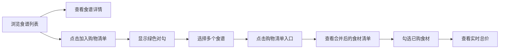

## 1. 产品概述
本项目是一个面向家庭烹饪爱好者的在线食谱收藏与智能购物清单合并应用。用户可以浏览、收藏食谱，系统自动从选中的食谱中提取食材并合并生成唯一的购物清单，支持按类别分组、勾选已购和估算总价。

### 核心价值
- 解决家庭烹饪时多菜谱食材采购清单整理繁琐的问题
- 提供智能化的食材去重和分类聚合功能
- 通过温暖的视觉设计提升用户烹饪计划体验

## 2. 核心功能

### 2.1 用户角色
| 角色 | 注册方式 | 核心权限 |
|------|----------|----------|
| 普通用户 | 无需注册（访客模式） | 浏览食谱、查看详情、添加购物清单、管理购物清单 |

### 2.2 功能模块
1. **首页列表**：食谱卡片展示、筛选、加入购物清单
2. **食谱详情页**：食谱主图、食材列表、步骤说明、食材勾选
3. **购物清单页**：食材分类展示、合并去重、勾选已购、价格计算

### 2.3 页面详情
| 页面名称 | 模块名称 | 功能描述 |
|----------|----------|----------|
| 首页列表 | 食谱卡片网格 | 展示食谱卡片，支持悬停动画、加入购物清单按钮、成功状态提示 |
| 首页列表 | 顶部导航栏 | 应用标题、购物清单入口 |
| 食谱详情页 | 主图区域 | 满宽度主图、渐变遮罩、食谱标题 |
| 食谱详情页 | 食材列表 | 每条食材带复选框，勾选后灰色背景+删除线 |
| 食谱详情页 | 步骤说明 | 带序号圆点，当前步骤高亮橙色 |
| 购物清单页 | 分类食材列表 | 按类别分组展示合并后的食材，显示总用量和小计 |
| 购物清单页 | 总价计算区域 | 底部固定总价，更新时有缩放动画 |

## 3. 核心流程

用户浏览食谱 → 点击食谱卡片查看详情 → 点击"加入购物清单"按钮 → 卡片显示绿色对勾 → 可多选多个食谱 → 点击导航栏"购物清单" → 查看按类别合并的食材清单 → 勾选已购食材 → 查看实时更新的总价

## 4. 用户界面设计

### 4.1 设计风格
- **主色调**：暖色系，米白色背景 #FDF5E6
- **强调色**：橙色 #FF8C00（高亮、按钮）、绿色（成功状态）、灰色 #E0E0E0（已完成状态）
- **卡片样式**：宽320px、圆角16px、白色背景、浅灰阴影、悬停上浮5px
- **字体**：采用温暖的衬线字体搭配现代无衬线字体
- **动效**：卡片从底部滑入入场动画、淡入淡出页面切换、缩放动画总价更新

### 4.2 页面设计概述
| 页面名称 | 模块名称 | UI元素 |
|----------|----------|--------|
| 首页列表 | 食谱卡片 | 320px宽卡片、圆角16px、悬停上浮5px、0.3秒渐显按钮、左下角绿色对勾 |
| 首页列表 | 导航栏 | 暖棕色背景、白色文字、购物清单入口 |
| 食谱详情页 | 主图区域 | 满宽度300px高、渐变遮罩、食谱标题叠加 |
| 食谱详情页 | 食材列表 | 复选框、勾选后#E0E0E0背景+删除线、0.3秒过渡 |
| 食谱详情页 | 步骤说明 | 左侧序号圆点、当前步骤#FF8C00高亮 |
| 购物清单页 | 分类列表 | 按蔬菜/肉类/调料等分组、总用量、小计价格 |
| 购物清单页 | 总价区域 | 底部固定、0.2秒缩放动画 |

### 4.3 响应式
- Desktop-first 设计，兼顾平板和移动端
- 卡片网格在小屏幕自适应为单列或双列
- 触摸设备优化点击区域

### 4.4 性能要求
- 加载超过30张食谱卡片时，滚动帧率不低于50fps
- 页面切换过渡动画0.4秒淡入淡出
- 卡片入场动画采用staggered延迟效果
