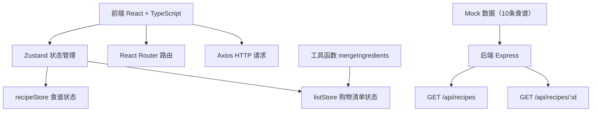
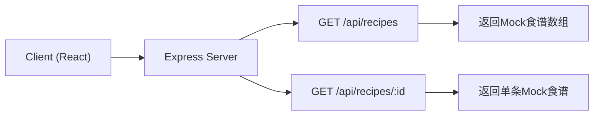
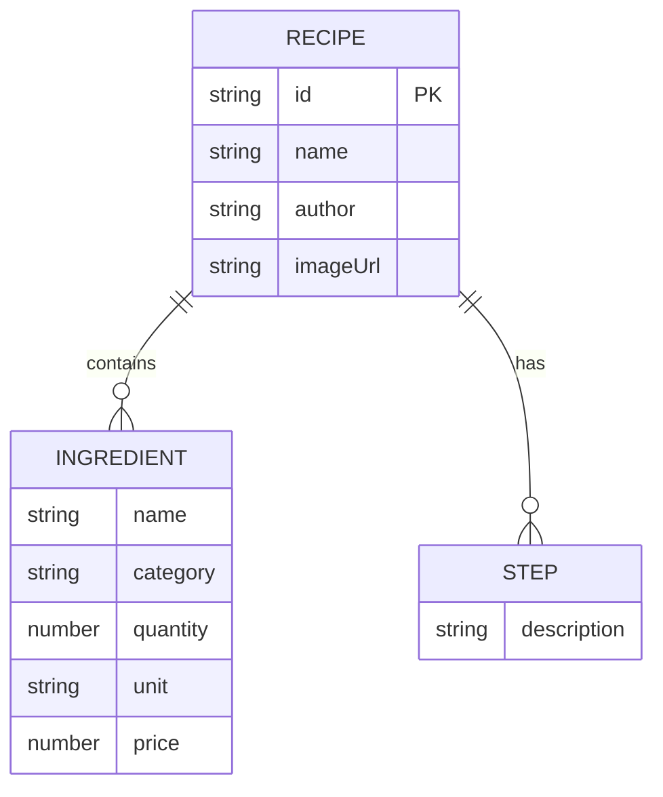

## 1. 架构设计



## 2. 技术描述

- **前端**：React 18 + TypeScript + Vite
- **状态管理**：Zustand
- **路由**：React Router DOM
- **HTTP客户端**：Axios
- **后端**：Express 4 + CORS
- **数据**：硬编码Mock数据，无需数据库
- **初始化工具**：Vite
- **UI框架**：原生CSS + CSS变量（暖色系主题）

## 3. 路由定义

| 路由 | 页面组件 | 用途 |
|------|----------|------|
| / | RecipeList | 首页食谱列表展示 |
| /recipe/:id | RecipeDetail | 食谱详情页 |
| /shopping-list | ShoppingList | 购物清单页 |

## 4. API 定义

### 类型定义

```typescript
interface Ingredient {
  name: string;
  category: string;
  quantity: number;
  unit: string;
  price: number;
}

interface Step {
  description: string;
}

interface Recipe {
  id: string;
  name: string;
  author: string;
  imageUrl: string;
  ingredients: Ingredient[];
  steps: Step[];
}

interface MergedIngredient extends Ingredient {
  totalQuantity: number;
  subtotal: number;
  checked: boolean;
}

interface ShoppingListState {
  selectedRecipeIds: string[];
  mergedIngredients: MergedIngredient[];
  checkedItems: Record<string, boolean>;
}
```

### 接口定义

**GET /api/recipes**
- 响应：`Recipe[]` - 返回所有食谱列表

**GET /api/recipes/:id**
- 参数：`id` - 食谱ID
- 响应：`Recipe` - 返回单条食谱详情

## 5. 服务器架构图



## 6. 数据模型

### 6.1 数据模型定义



### 6.2 项目文件结构

```
project/
├── package.json
├── vite.config.js
├── tsconfig.json
├── index.html
├── server.js
└── src/
    ├── main.tsx
    ├── App.tsx
    ├── stores/
    │   └── recipeStore.ts
    ├── components/
    │   ├── RecipeCard.tsx
    │   ├── RecipeDetail.tsx
    │   └── ShoppingList.tsx
    └── utils/
        └── mergeIngredients.ts
```

## 7. 核心模块说明

### Zustand Store (recipeStore.ts)
- `recipes: Recipe[]` - 食谱列表
- `selectedRecipes: string[]` - 已选食谱ID列表
- `currentRecipe: Recipe | null` - 当前查看的食谱
- `checkedIngredients: Record<string, boolean>` - 勾选的食材
- Actions: `fetchRecipes`, `selectRecipe`, `addToShoppingList`, `toggleIngredient`, `calculateTotal`

### 工具函数 (mergeIngredients.ts)
- 输入：Recipe[] - 多个食谱
- 输出：按分类排序的合并食材数组
- 逻辑：按食材名称+单位分组，累加数量，计算小计，按分类排序

### 组件结构
- `RecipeCard`：卡片展示、悬停动画、加入购物清单按钮
- `RecipeDetail`：主图、食材列表（带复选框）、步骤说明
- `ShoppingList`：分类展示、合并食材、总价计算与动画
