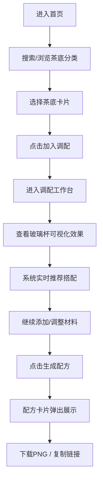

## 1. 产品概述
微型在线茶饮定制与DIY搭配推荐平台，让用户在浏览器中自由调配专属茶饮，获取智能搭配建议并生成精美的配方卡片进行保存或分享。

- 核心目标：提供沉浸式的茶饮调配体验，结合智能推荐系统帮助用户发现个性化茶饮配方
- 目标用户：茶饮爱好者、追求个性化体验的年轻用户、健康饮食关注者
- 产品价值：将线下茶饮店的DIY体验搬至线上，降低调配门槛，创造社交分享价值

## 2. 核心功能

### 2.1 用户角色
| 角色 | 注册方式 | 核心权限 |
|------|----------|----------|
| 普通用户 | 无需注册，直接使用 | 浏览茶底、调配茶饮、获取推荐、生成并分享配方卡片 |

### 2.2 功能模块
1. **首页**：渐变背景、搜索导航栏、茶底分类展示卡片
2. **调配工作台**：已选材料列表、玻璃杯可视化、智能推荐面板
3. **配方卡片**：配方生成、PNG下载、链接分享

### 2.3 页面详情
| 页面名称 | 模块名称 | 功能描述 |
|----------|----------|----------|
| 首页 | 搜索导航栏 | 支持关键词搜索茶饮，分类筛选（原叶茶、花果茶、奶茶底） |
| 首页 | 茶底卡片展示 | 展示茶底信息，悬停上浮效果，渐显"加入调配"按钮 |
| 调配工作台 | 已选材料列表 | 显示已选材料，支持拖动排序，删除时左滑过渡动画 |
| 调配工作台 | 玻璃杯可视化 | CSS绘制透明玻璃杯，液体分层动态变化，小料掉入弹跳动画 |
| 调配工作台 | 推荐面板 | 根据已选材料实时推荐搭配，脉冲高亮提示 |
| 配方卡片 | 卡片展示 | 精美配方卡片，含名称、材料、热量、温度信息 |
| 配方卡片 | 导出功能 | PNG下载（扫描线加载动画）、复制分享链接 |

## 3. 核心流程
用户进入首页，通过搜索或分类浏览茶底，选择茶底和小料加入调配，进入工作台查看玻璃杯可视化效果，系统实时推荐搭配建议，调配完成后生成配方卡片，可下载保存或分享链接。

## 4. 用户界面设计
### 4.1 设计风格
- **主色调**：#E8F5E9 到 #C8E6C9 清新绿色渐变
- **辅助色**：白色卡片、浅绿阴影、茶色装饰花纹
- **按钮风格**：圆角设计，透明到实心渐显动画（0.4秒）
- **字体**：优雅无衬线字体，标题加粗，正文清晰易读
- **布局风格**：卡片式布局，顶部导航，工作台三栏布局
- **图标风格**：简洁线性图标，与茶饮主题呼应

### 4.2 页面设计概述
| 页面名称 | 模块名称 | UI元素 |
|----------|----------|--------|
| 首页 | 搜索导航栏 | 渐变背景、搜索框、分类标签、白色卡片 |
| 首页 | 茶底卡片 | 240px宽、12px圆角、浅绿阴影、悬停上浮4px、渐显按钮 |
| 调配工作台 | 材料列表 | 可拖动排序、左滑删除过渡 |
| 调配工作台 | 玻璃杯 | CSS绘制、半透明#C8E6C9渐变、液体分层、弹跳动画 |
| 调配工作台 | 推荐面板 | 实时更新、脉冲高亮提示 |
| 配方卡片 | 卡片展示 | 600px宽、16px圆角、白色底、茶色花纹、扫描线动画 |

### 4.3 响应式设计
- Desktop-first设计，优先保证桌面端体验
- 适配平板端（768px+），三栏布局优化为双栏
- 移动端（375px+）采用单栏堆叠布局，触控优化

### 4.4 动效设计
- 卡片悬停：上浮4px + 阴影增强
- 按钮出现：透明度0→1，0.4秒渐显
- 小料添加：从上往下掉入弹跳动画
- 删除材料：向左滑出过渡
- 推荐提示：轻微脉冲高亮
- 下载加载：扫描线动画（1.5秒）
