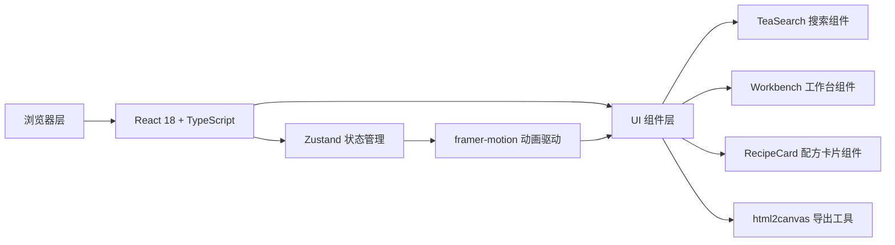

## 1. 架构设计


## 2. 技术描述
- **前端框架**：React 18 + TypeScript 5
- **构建工具**：Vite 5 + @vitejs/plugin-react
- **状态管理**：Zustand 4
- **动画库**：framer-motion 11
- **图片导出**：html2canvas 1
- **项目初始化**：Vite React TypeScript 模板

## 3. 项目结构
```
auto387/
├── index.html
├── package.json
├── vite.config.ts
├── tsconfig.json
└── src/
    ├── types.ts        # 类型定义
    ├── store.ts        # Zustand状态管理
    ├── TeaSearch.tsx   # 搜索与茶底选择组件
    ├── Workbench.tsx   # 调配工作台组件
    ├── RecipeCard.tsx  # 配方卡片组件
    └── main.tsx        # 应用入口
```

## 4. 数据模型定义

### 4.1 核心类型

```typescript
// 材料类型
type MaterialCategory = 'tea' | 'topping' | 'syrup';
type TeaSubCategory = 'original' | 'flower' | 'milk';

interface Material {
  id: string;
  name: string;
  category: MaterialCategory;
  subCategory?: TeaSubCategory;
  color: string;        // 液体/材料颜色
  calories: number;     // 每份量卡路里
  description: string;
  icon: string;
}

// 已选材料
interface SelectedMaterial extends Material {
  instanceId: string;   // 实例唯一ID
  order: number;        // 排序
}

// 推荐搭配
interface Recommendation {
  id: string;
  materialId: string;
  reason: string;
  type: 'topping' | 'syrup' | 'tea';
}

// 配方卡片
interface RecipeCard {
  id: string;
  name: string;
  materials: SelectedMaterial[];
  totalCalories: number;
  servingTemperature: string;
  createdAt: number;
}

// 应用状态
interface TeaStore {
  materials: Material[];
  selectedMaterials: SelectedMaterial[];
  recommendations: Recommendation[];
  searchQuery: string;
  activeCategory: TeaSubCategory | 'all';
  currentRecipe: RecipeCard | null;
  isCardGenerating: boolean;
  showWorkbench: boolean;
}
```

## 5. 状态管理设计

### 5.1 Zustand Store Actions
- `setSearchQuery(query: string)` - 设置搜索关键词
- `setActiveCategory(category)` - 设置当前分类
- `addMaterial(materialId: string)` - 添加材料到调配台
- `removeMaterial(instanceId: string)` - 移除材料
- `reorderMaterials(fromIndex, toIndex)` - 重排材料
- `generateRecommendations()` - 生成推荐搭配
- `generateRecipeCard(name: string)` - 生成配方卡片
- `toggleWorkbench()` - 切换工作台显示
- `setCardGenerating(status: boolean)` - 设置卡片生成状态

## 6. 性能要求
- 调配工作台UI响应延迟 < 50ms
- 配方卡片生成 < 2秒
- 动画帧率 ≥ 60fps
- 使用 CSS transform 和 opacity 实现高性能动画
