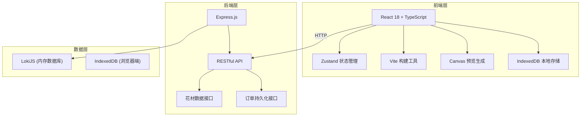
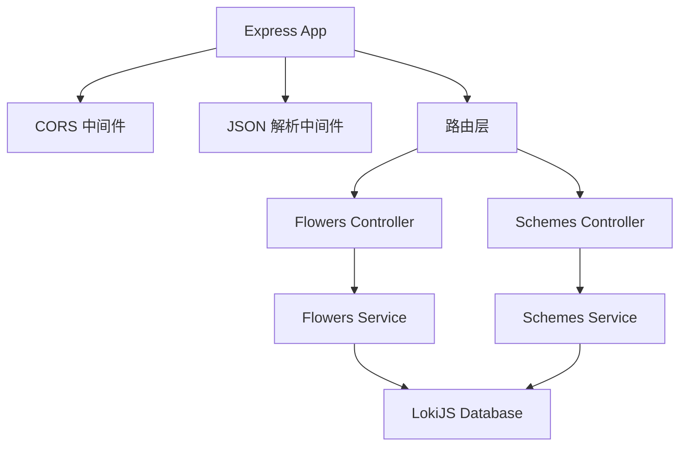
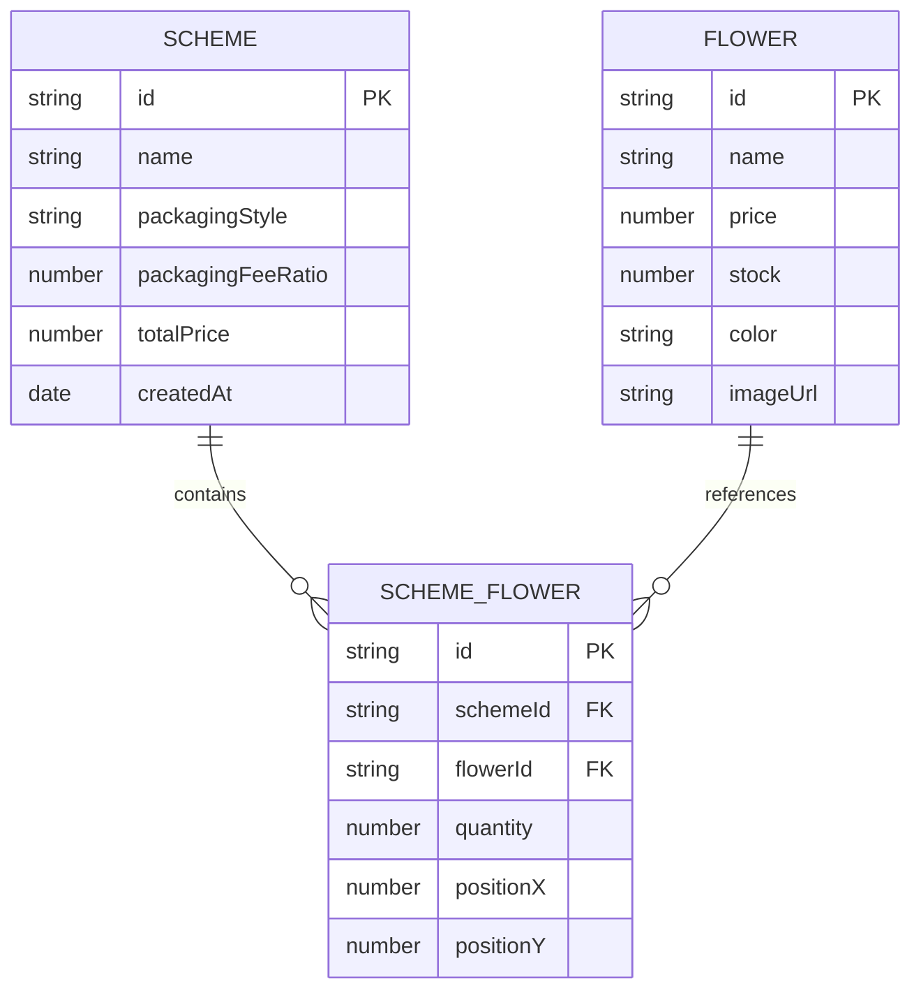

## 1. 架构设计



## 2. 技术说明

- **前端**：React 18 + TypeScript + Vite
- **状态管理**：Zustand
- **后端**：Express 4 + LokiJS（内存数据库）
- **本地存储**：IndexedDB（浏览器端方案保存）
- **HTTP客户端**：Axios
- **开发服务器代理**：Vite server proxy → localhost:3001

## 3. 路由定义
| 路由 | 用途 |
|------|------|
| / | 主页面（花材库 + 工作台 + 方案列表） |

## 4. API 定义

### 4.1 花材接口

**GET /api/flowers**
- 描述：获取所有花材列表
- 响应：
```typescript
interface Flower {
  id: string;
  name: string;
  price: number;
  stock: number;
  color: string;
  imageUrl: string;
}
```

### 4.2 订单方案接口

**GET /api/schemes**
- 描述：获取所有保存的方案
- 响应：`Scheme[]`

**POST /api/schemes**
- 描述：保存新方案
- 请求体：
```typescript
interface SaveSchemeRequest {
  name: string;
  flowers: { flowerId: string; quantity: number; position: { x: number; y: number } }[];
  packagingStyle: string;
  packagingFeeRatio: number;
  totalPrice: number;
}
```

**DELETE /api/schemes/:id**
- 描述：删除指定方案

## 5. 服务器架构图



## 6. 数据模型

### 6.1 数据模型定义



### 6.2 前端状态模型

```typescript
// Zustand Store
interface FlowerStore {
  flowers: Flower[];
  selectedFlowers: WorkbenchFlower[];
  packagingStyle: string;
  packagingFeeRatio: number;
  savedSchemes: Scheme[];
  isModalOpen: boolean;
  selectedFlower: Flower | null;
  
  // actions
  fetchFlowers: () => void;
  addFlower: (flower: Flower, quantity: number) => void;
  removeFlower: (id: string) => void;
  updateFlowerPosition: (id: string, x: number, y: number) => void;
  setPackagingStyle: (style: string) => void;
  setPackagingFeeRatio: (ratio: number) => void;
  saveScheme: (name: string) => void;
  deleteScheme: (id: string) => void;
  fetchSchemes: () => void;
  openModal: (flower: Flower) => void;
  closeModal: () => void;
}
```

## 7. 项目文件结构

```
.
├── package.json
├── index.html
├── vite.config.js
├── tsconfig.json
├── server.js
└── src/
    ├── main.tsx
    ├── App.tsx
    ├── store.ts
    ├── components/
    │   ├── FlowerCard.tsx
    │   ├── FlowerModal.tsx
    │   ├── Workbench.tsx
    │   ├── PackagingPanel.tsx
    │   ├── CanvasPreview.tsx
    │   └── SchemeList.tsx
    └── utils/
        └── canvasPreview.ts
```
