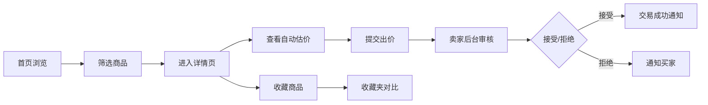

## 1. 产品概述

微型在线二手乐器交易与自动匹配估价平台，连接乐器爱好者，支持闲置乐器发布、智能估价与交易互动。
- 解决二手乐器交易中价格不透明、信息不对称的痛点，面向乐器爱好者、音乐从业者
- 通过自动估价算法提供客观的市场参考价，提升交易效率与信任度

## 2. 核心功能

### 2.1 功能模块
1. **首页**：商品网格列表、多维度筛选栏、收藏夹抽屉入口、发布入口
2. **商品详情页**：商品图片展示、详细信息、自动估价卡片、出价议价区、收藏/对比操作
3. **发布页面**：商品信息表单、图片上传组件、实时校验、期望售价输入
4. **收藏对比页**：收藏商品列表、最多3件商品对比表格、差异高亮
5. **卖家后台**：出价列表管理、接受/拒绝操作、交易通知

### 2.2 页面详情
| 页面名称 | 模块名称 | 功能描述 |
|---------|---------|----------|
| 首页 | 筛选栏 | 按乐器类型（吉他/键盘/管乐/弦乐）、价格区间、成色等级筛选 |
| 首页 | 商品网格 | 卡片式布局，含缩略图、品牌型号、成色进度条、价格、收藏按钮 |
| 首页 | 收藏抽屉 | 右侧滑入，展示收藏商品，支持勾选对比 |
| 商品详情页 | 估价卡片 | 醒目橙色边框卡片，展示建议价、浮动范围、估价依据 |
| 商品详情页 | 出价模块 | 输入框+验证，出价需>期望价60%，错误提示带抖动动画 |
| 发布页 | 表单模块 | 品牌/型号下拉、年份/年限输入、成色1-10分、拖拽上传图片、描述、期望售价 |
| 对比页 | 对比表格 | 并排展示品牌、型号、成色、价格、估价，成色差异用渐变背景突出 |

## 3. 核心流程

用户访问首页 → 浏览/筛选商品 → 点击卡片进入详情 → 查看自动估价 → 提交出价/收藏商品 → 卖家处理出价 → 交易成功通知

## 4. 用户界面设计

### 4.1 设计风格
- **主色调**：橙色 #FF9800（强调色）、深灰 #1E1E1E（顶栏）、米白 #F5F0E8（页面背景）
- **辅助色**：成色渐变 红→橙→绿，收藏金 #FFD700
- **按钮样式**：圆角8px，悬停背景变深10%，点击缩放0.95
- **字体层级**：标题粗体、正文常规、价格加粗 #333，统一使用现代无衬线字体
- **布局风格**：卡片式网格布局、顶栏导航、右侧抽屉收藏夹
- **动效设计**：卡片入场上滑（translateY 20→0，0.4s）、筛选淡入（0.3s）、通知滑入滑出

### 4.2 页面设计概览
| 页面名称 | 模块名称 | UI元素 |
|---------|---------|--------|
| 首页 | 顶栏 | 深灰背景、Logo、发布按钮、收藏图标带数量徽章 |
| 首页 | 商品卡片 | 280x320px、圆角12px、白色背景、#E0E0E0阴影、彩色成色进度条 |
| 首页 | 筛选栏 | 三列筛选（类型/价格/成色）、骨架屏加载态、移动端汉堡菜单 |
| 详情页 | 估价卡片 | 100%宽、#FFF3E0背景、圆角12px、左侧4px橙色边框 #FF9800 |
| 详情页 | 出价输入 | #FAFAFA背景、圆角6px、红色错误文字+0.3s抖动动画 |
| 详情页 | 成功通知 | 绿色顶部条、从上方滑入、停留3秒自动滑出 |
| 发布页 | 图片上传 | 拖拽+点击、120x120px缩略图、圆角8px、默认占位图 |
| 对比页 | 对比表格 | 成色列渐变背景、差异单元格高亮、并排字段对比 |

### 4.3 响应式设计
- 桌面端（≥1024px）：商品卡片多列网格、完整筛选栏展开
- 平板端（768-1023px）：减少卡片列数、筛选栏保持展开
- 移动端（<768px）：商品卡片两列布局、筛选栏折叠为汉堡菜单、收藏抽屉全宽展示

### 4.4 性能指标
- 首页首屏加载时间 ≤ 1.5秒（含图片资源）
- 估价API响应时间 ≤ 800ms
- 图片懒加载 + 缩略图优化
