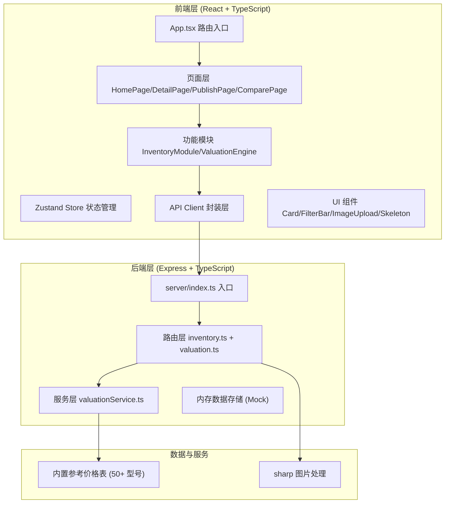
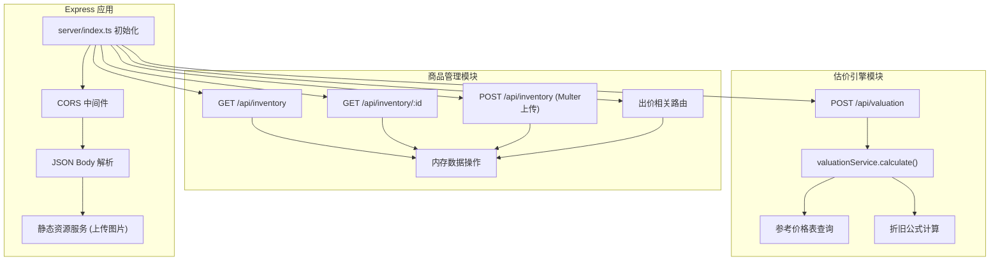
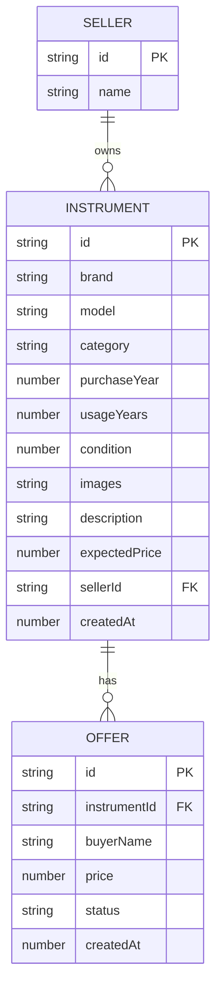

## 1. 架构设计



## 2. 技术说明

- **前端框架**: React 18 + TypeScript + Vite 5
- **状态管理**: Zustand 4 (全局商品列表、选中商品、收藏状态)
- **路由**: React Router DOM 6
- **HTTP客户端**: Axios 1.6 (统一实例、拦截器)
- **后端框架**: Express 4 + TypeScript
- **图片处理**: Sharp (图片压缩、缩略图生成)
- **中间件**: CORS (跨域支持)
- **样式方案**: 原生CSS + CSS Variables (主题色系统)
- **图标**: lucide-react
- **数据存储**: 后端内存存储 (内置Mock数据，无需数据库)

## 3. 路由定义

| 前端路由 | 页面组件 | 用途 |
|---------|---------|------|
| / | HomePage | 首页商品列表与筛选 |
| /detail/:id | DetailPage | 商品详情与估价、出价 |
| /publish | PublishPage | 发布二手乐器表单 |
| /compare | ComparePage | 收藏商品对比页面 |
| /seller-dashboard | SellerDashboard | 卖家后台出价管理 |

| 后端API | 方法 | 用途 |
|--------|------|------|
| /api/inventory | GET | 获取商品列表（支持筛选参数） |
| /api/inventory/:id | GET | 获取单个商品详情 |
| /api/inventory | POST | 发布新商品（含图片上传） |
| /api/inventory/:id/offers | POST | 提交出价 |
| /api/inventory/:id/offers | GET | 获取商品出价列表 |
| /api/offers/:offerId/accept | POST | 接受出价 |
| /api/offers/:offerId/reject | POST | 拒绝出价 |
| /api/valuation | POST | 根据参数计算估价 |

## 4. API 类型定义

```typescript
// 商品类型
interface Instrument {
  id: string;
  brand: string;
  model: string;
  category: 'guitar' | 'keyboard' | 'wind' | 'string';
  purchaseYear: number;
  usageYears: number;
  condition: number; // 1-10
  images: string[];
  description: string;
  expectedPrice: number;
  createdAt: number;
  seller: { id: string; name: string; };
}

// 出价类型
interface Offer {
  id: string;
  instrumentId: string;
  buyerName: string;
  price: number;
  status: 'pending' | 'accepted' | 'rejected';
  createdAt: number;
}

// 估价请求
interface ValuationRequest {
  brand: string;
  model: string;
  usageYears: number;
  condition: number;
}

// 估价响应
interface ValuationResponse {
  suggestedPrice: number;
  priceRangeMin: number;
  priceRangeMax: number;
  basis: string;
  marketReference: number;
  depreciationRate: number;
}
```

## 5. 后端服务架构



## 6. 数据模型

### 6.1 实体关系



### 6.2 参考价格表结构 (50+ 型号)

```typescript
const referencePrices: Record<string, Record<string, number>> = {
  "雅马哈": {
    "FG830": 2800, "F310": 850, "LL16": 6500, "C40": 600,
    "P-125": 4200, "P-45": 3000, "YDP-144": 6800, "PSR-E373": 1800,
    "YAS-280": 9800, "YTS-280": 12000, "YFL-222": 3200, "YCL-255": 3800
  },
  "芬达": {
    "Player Strat": 8500, "Player Tele": 8200, "American Pro II": 18000,
    "Vintera 60s": 12000, "CD-60S": 1800, "FA-125": 1200
  },
  "吉布森": {
    "Les Paul Standard": 28000, "SG Standard": 18000, "ES-335": 25000,
    "J-45 Standard": 22000, "Hummingbird": 26000
  },
  "卡西欧": {
    "CDP-S160": 2800, "PX-S7000": 8500, "PX-870": 7200,
    "CT-S1": 1200, "CTK-3500": 1500
  },
  "罗兰": {
    "FP-30X": 5200, "FP-90X": 15000, "RD-88": 12000,
    "RP-701": 9800, "LX705": 22000, "GO:KEYS": 3200
  },
  "马丁": {
    "D-28": 38000, "HD-28": 42000, "D-18": 28000,
    "000-15M": 15000, "LX1": 4500
  },
  "泰勒": {
    "114ce": 8500, "214ce": 12000, "314ce": 22000,
    "814ce": 45000, "GS Mini": 5500
  },
  "塞尔玛": {
    "SA80 II Alto": 55000, "Series III Tenor": 78000, "Supreme Alto": 68000
  }
};
```
