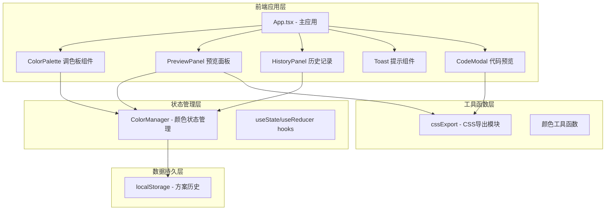

## 1. 架构设计



## 2. 技术选型

- **框架**：React 18 + TypeScript
- **构建工具**：Vite
- **拖拽库**：@dnd-kit/core, @dnd-kit/sortable
- **颜色选择器**：react-colorful
- **状态管理**：React hooks + 自定义ColorManager模块
- **样式**：原生CSS（CSS Modules），利用CSS变量实现主题切换

## 3. 目录结构

```
src/
├── main.tsx                 # 应用入口
├── App.tsx                  # 主应用组件
├── styles/
│   └── globals.css          # 全局样式
└── modules/
    ├── color/
    │   ├── colorManager.ts  # 颜色管理模块（状态+持久化）
    │   └── colorPalette.tsx # 调色板组件
    ├── preview/
    │   └── previewPanel.tsx # 预览面板组件
    ├── export/
    │   └── cssExport.ts     # CSS导出模块
    └── history/
        └── historyPanel.tsx # 历史记录组件
```

## 4. 核心数据模型

### 4.1 颜色方案

```typescript
interface ColorScheme {
  id: string;
  name: string;
  createdAt: number;
  colors: string[]; // HEX格式颜色数组
}
```

### 4.2 颜色管理器状态

```typescript
interface ColorManagerState {
  currentColors: string[];
  savedSchemes: ColorScheme[];
  selectedColorIndex: number;
}
```

## 5. 模块职责

| 模块 | 职责 |
|-----|------|
| colorManager.ts | 管理颜色列表的增删改查、排序、持久化到localStorage，对外暴露状态和操作方法 |
| colorPalette.tsx | 渲染色块工具栏，集成@dnd-kit实现拖拽排序，集成react-colorful选择颜色，调用colorManager更新数据 |
| previewPanel.tsx | 接收颜色数据，实时渲染按钮/卡片/进度条预览组件，调用cssExport生成代码 |
| cssExport.ts | 将颜色列表格式化为CSS变量字符串，提供复制到剪贴板功能 |
| historyPanel.tsx | 管理已保存方案列表，响应式切换侧边栏/底部抽屉模式，调用colorManager加载方案 |
