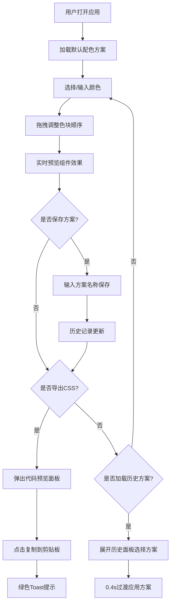

## 1. 产品概述

CSS调色板在线预览与调整应用，专为前端设计师打造，解决配色时反复切换页面查看效果、难以统一管理配色方案的痛点。通过实时预览、拖拽排序、方案管理和一键导出等功能，提升设计师的配色效率和体验。

## 2. 核心功能

### 2.1 功能模块

1. **调色板工具栏**：色块展示、拖拽排序、颜色选择器、手动输入HEX
2. **实时预览面板**：按钮预览、卡片预览、进度条预览，即时响应颜色变化
3. **历史记录管理**：方案保存、侧边栏/抽屉展示、方案加载
4. **CSS导出功能**：CSS变量代码生成、代码预览面板、一键复制

### 2.2 功能详情

| 模块名称 | 功能描述 |
|-----------|----------|
| 调色板工具栏 | 圆形色块排列（48px直径），flex-wrap布局，拖拽时缩小带0.3s弹性阴影动画，释放后对齐网格，支持颜色选择器弹出和HEX手动输入 |
| 实时预览面板 | 按钮带悬停加深效果，卡片含标题正文（主色背景+对比色文字），进度条用辅色渐变填充，所有组件即时重绘无闪烁 |
| 历史记录管理 | 保存为JSON（名称+时间+颜色列表），按时间倒序，每条显示名称和缩略色块组，点击加载0.4s过渡应用 |
| CSS导出功能 | 格式`--primary: #...; --secondary: #...;`，上方弹出代码面板（0.3s淡入），复制触发绿色Toast提示 |

## 3. 核心流程

## 4. 用户界面设计

### 4.1 设计风格
- **主题色**：浅色主题，背景#F8F9FA
- **卡片样式**：白色卡片，8px圆角，轻度阴影
- **边框**：light灰色边框，12px内边距
- **色块**：圆形，直径48px，0.2s颜色过渡
- **动画**：0.3s弹性阴影动画，0.4s宽度过渡

### 4.2 页面布局

| 区域 | 模块名称 | UI元素 |
|-----|---------|--------|
| 左侧 | 历史面板 | 收起40px/展开280px，列表项48px高，悬停#E9ECEF，底部小色块缩略图 |
| 顶部 | 调色板工具栏 | flex-wrap色块区域，添加按钮，保存按钮，导出按钮 |
| 右侧 | 预览面板 | 按钮、卡片、进度条上下排列，间距24px，每个12px内边距和灰色边框 |

### 4.3 响应式设计
- **桌面端（>1024px）**：左侧历史侧边栏 + 顶部工具栏 + 右侧预览区
- **平板端（768px-1024px）**：历史面板改为底部抽屉模式
- **移动端（<768px）**：色块缩小到36px，每行显示6个

### 4.4 性能指标
- 颜色切换和CSS变量生成：≤10ms渲染更新
- 交互帧率：≥50fps
