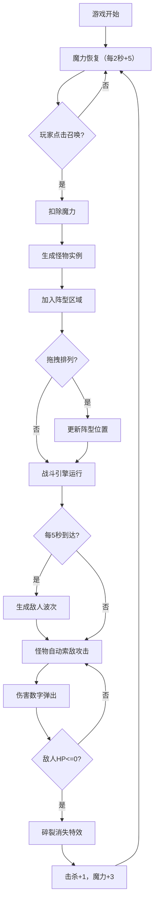

## 1. 产品概述

一款以"地下城怪物召唤与编队作战"为核心的策略养成游戏原型，玩家通过消耗魔力召唤不同种族的怪物并拖拽排列阵型，怪物自动攻击从屏幕右侧涌来的敌人波次。目标用户为策略游戏爱好者，核心价值在于验证"召唤→编队→自动战斗"的核心循环是否具有趣味性。

## 2. 核心功能

### 2.1 功能模块
1. **战斗主界面**: 魔力条、召唤按钮面板、阵型拖拽区域、敌人出现区域、战斗统计面板

### 2.2 页面详情
| 页面名称 | 模块名称 | 功能描述 |
|----------|----------|----------|
| 战斗主界面 | 魔力条 | 显示当前魔力值（上限100），蓝色渐变条带脉冲光效，击杀奖励闪光 |
| 战斗主界面 | 召唤按钮面板 | 6个怪物图标按钮，显示消耗魔力值，点击扣魔力和缩小回弹动画 |
| 战斗主界面 | 阵型拖拽区域 | 底部半透明磨砂面板，怪物卡片支持拖拽重排，位移0.3s过渡 |
| 战斗主界面 | 敌人战斗区域 | 屏幕中央偏右，每5秒刷新敌人波次，敌人ease-out滑入 |
| 战斗主界面 | 战斗统计面板 | 右侧固定180px面板，显示击杀数、波次、当前魔力 |
| 战斗主界面 | 战斗信息HUD | 左上角显示当前波次（白色24px）和击杀数（绿色18px） |

## 3. 核心流程

玩家在战斗主界面中，通过点击召唤按钮消耗魔力召唤怪物，怪物出现在底部阵型区域，玩家可拖拽调整位置。每5秒从右侧刷新一波敌人，阵型中的怪物自动攻击最近的敌人，造成伤害弹出数字，敌人死亡时播放碎裂特效。魔力每2秒自动恢复5点，击杀敌人额外奖励3点。

## 4. 用户界面设计

### 4.1 设计风格
- 主色调：深色奇幻风（#1a1a2e到#16213e径向渐变）
- 辅助色：蓝色魔力条（#1E90FF到#00BFFF）、金色消耗数字（#FFD700）、红色伤害数字（#FF4500）、绿色击杀统计（#32CD32）
- 按钮风格：圆角方形图标按钮，带消耗数字标注
- 字体：像素风格（'Courier New', monospace），统计面板颜色#E0E0E0
- 布局：全屏无滚动，左侧战斗区域，右侧180px信息面板，底部阵型区域

### 4.2 页面设计概览
| 页面名称 | 模块名称 | UI元素 |
|----------|----------|--------|
| 战斗主界面 | 背景 | 径向渐变#1a1a2e→#16213e，敌人区域略亮#0f3460 |
| 战斗主界面 | 魔力条 | 蓝色渐变条，0.5s动画变化，脉冲光效0.3s，击杀闪光0.2s |
| 战斗主界面 | 召唤按钮 | 6个图标按钮，#FFD700消耗数字，0.2s缩小回弹 |
| 战斗主界面 | 阵型区域 | 半透明磨砂面板rgba(255,255,255,0.07)，圆角16px，边框#4a4a6a 1px |
| 战斗主界面 | 怪物卡片 | 48x48px方形头像，圆角8px，拖拽跟随鼠标 |
| 战斗主界面 | 敌人单位 | 从右侧滑入，ease-out 1s |
| 战斗主界面 | 伤害数字 | #FF4500，0.6s出现到消失动画 |
| 战斗主界面 | 碎裂特效 | 0.4s缩放+透明度消失 |
| 战斗主界面 | HUD信息 | 波次白色24px，击杀数绿色18px |
| 战斗主界面 | 统计面板 | 右侧180px，Courier New字体，#E0E0E0颜色 |

### 4.3 响应式
- 桌面优先设计，固定布局比例
- 全屏容器无滚动
- 拖拽操作需响应延迟低于100ms

### 4.4 6种可召唤怪物
| 怪物名称 | 消耗魔力 | 种族 | 攻击力 | 攻击间隔 | 特色 |
|----------|----------|------|--------|----------|------|
| 哥布林 | 10 | 地精族 | 8 | 1.0s | 便宜快速 |
| 骷髅兵 | 15 | 亡灵族 | 12 | 1.2s | 均衡输出 |
| 狼人 | 25 | 兽族 | 20 | 1.5s | 高伤害 |
| 暗影法师 | 30 | 元素族 | 15 | 0.8s | 攻速快 |
| 石像鬼 | 35 | 恶魔族 | 25 | 2.0s | 重击 |
| 吸血鬼 | 45 | 不死族 | 30 | 1.8s | 最强单体 |
