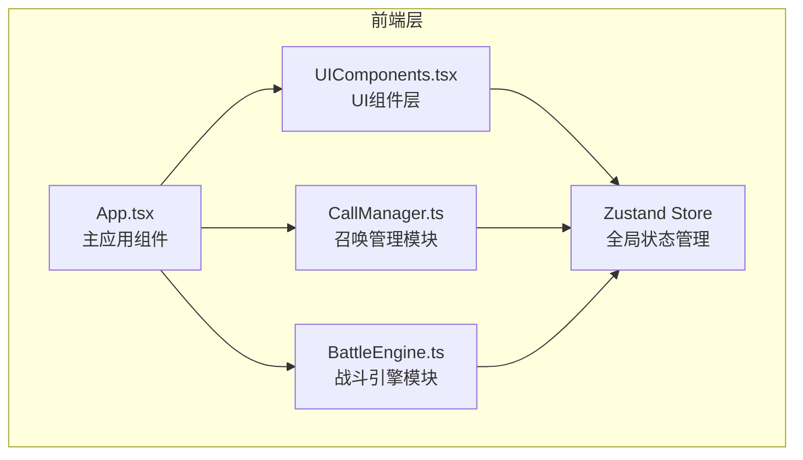

## 1. 架构设计



## 2. 技术说明
- 前端：React@18 + TypeScript + Vite
- 状态管理：Zustand
- 动画：Framer Motion
- 初始化工具：vite-init（react-ts模板）
- 后端：无
- 数据库：无（纯前端原型）

## 3. 路由定义
| 路由 | 用途 |
|------|------|
| / | 战斗主界面（单页应用，无路由） |

## 4. API定义
无后端API，所有数据在前端内存中管理。

## 5. 数据模型

### 5.1 核心数据结构

```typescript
interface Monster {
  id: string
  name: string
  race: string
  cost: number
  attack: number
  attackInterval: number
  emoji: string
}

interface MonsterInstance {
  id: string
  templateId: string
  x: number
  y: number
  lastAttackTime: number
  hp: number
}

interface Enemy {
  id: string
  hp: number
  maxHp: number
  x: number
  y: number
  speed: number
  enterTime: number
  isDying: boolean
}

interface DamageNumber {
  id: string
  value: number
  x: number
  y: number
  createdAt: number
}

interface BattleState {
  mana: number
  maxMana: number
  wave: number
  killCount: number
  formation: MonsterInstance[]
  enemies: Enemy[]
  damageNumbers: DamageNumber[]
}
```

### 5.2 数据流向

1. **召唤流程**: 用户点击召唤按钮 → CallManager检查魔力是否足够 → 扣除魔力 → 创建MonsterInstance → 写入Store.formation
2. **战斗流程**: BattleEngine每帧通过requestAnimationFrame运行 → 读取Store.formation和Store.enemies → 计算索敌与攻击 → 更新敌人HP → 输出DamageNumber → 写入Store
3. **波次生成**: BattleEngine每5秒生成3-5个Enemy → 设置初始位置在屏幕右侧外 → 写入Store.enemies
4. **魔力恢复**: CallManager每2秒恢复5点魔力 → 写入Store.mana；击杀敌人时+3魔力
5. **UI渲染**: UIComponents通过zustand订阅Store → 响应式更新UI → framer-motion处理动画

## 6. 文件调用关系

```
App.tsx
  ├── 导入并组合 UIComponents.tsx 中的所有UI组件
  ├── 导入 CallManager.ts 提供的召唤逻辑函数
  ├── 导入 BattleEngine.ts 提供的战斗循环启动函数
  └── 使用 Zustand Store 作为共享状态层

CallManager.ts
  ├── 读取 Store.mana（判断魔力是否足够）
  ├── 写入 Store.mana（扣除/恢复魔力）
  ├── 写入 Store.formation（添加怪物实例）
  └── 被UIComponents中的召唤按钮调用

BattleEngine.ts
  ├── 读取 Store.formation（获取阵型怪物列表）
  ├── 读取 Store.enemies（获取敌人列表）
  ├── 写入 Store.enemies（更新敌人HP/位置/生成新波次）
  ├── 写入 Store.damageNumbers（输出伤害数字）
  ├── 写入 Store.killCount（击杀计数）
  └── 写入 Store.mana（击杀奖励魔力）

UIComponents.tsx
  ├── 读取 Store 所有状态（魔力、阵型、敌人、统计）
  ├── 调用 CallManager 的召唤函数
  └── 写入 Store.formation（拖拽更新位置）
```

## 7. 性能策略
- 使用requestAnimationFrame驱动战斗循环，目标55fps+
- 敌人与怪物位置更新使用直接DOM操作或framer-motion批量更新
- 阵型拖拽使用framer-motion的drag约束，响应延迟<100ms
- Store更新使用zustand的浅比较避免不必要的重渲染
