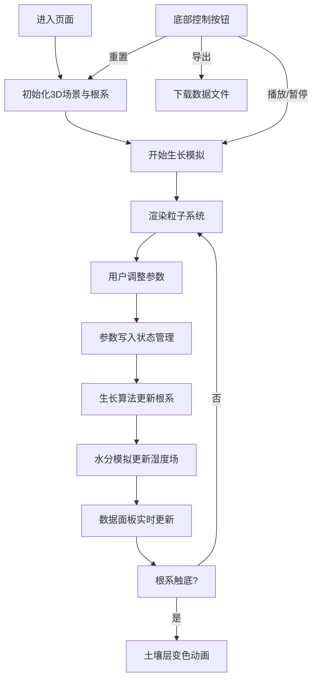

## 1. 产品概述
植物根系生长动态与土壤湿度可视化系统，为植物学研究者和游戏场景设计师提供在网页端实时模拟三维空间中植物根系生长过程的工具。用户可通过调节参数观察不同土壤条件下根系的延伸路径、分支密度和水分吸收过程，具有高度的交互性和可视化表现力。

## 2. 核心功能

### 2.1 用户角色
| 角色 | 注册方式 | 核心权限 |
|------|----------|----------|
| 研究者/设计师 | 无需注册，直接使用 | 调整参数、观察模拟、导出数据 |

### 2.2 功能模块
1. **3D根系场景**：粒子系统渲染根系、布朗运动抖动、土壤剖面背景
2. **参数控制面板**：湿度、营养浓度、分支概率、生长速度滑块
3. **实时数据面板**：总根长、分支数量、最深深度、水分吸收速率波形图
4. **底部控制栏**：播放/暂停、重置、导出数据按钮

### 2.3 页面详情
| 页面名称 | 模块名称 | 功能描述 |
|----------|----------|----------|
| 主页 | 3D根系场景 | 800粒子半透明根系网格，主根向下延伸5单位，侧根递减20%，颜色从嫩黄到深棕渐变，布朗运动抖动，≥50fps |
| 主页 | 参数控制面板 | 半透明毛玻璃效果，背景模糊10px，圆角16px，四个滑块带数值显示和动态色彩，把手弹性回弹0.3s |
| 主页 | 数据面板 | 纯黑半透明背景#00000080，圆角12px，四项实时数据，分支数跳动动画，水分吸收10秒波形图，触底土壤变色动画2s |
| 主页 | 底部控制栏 | 三个圆形按钮φ48px，背景#4E342E，悬停#6D4C41放大1.1倍0.2s，按下凹陷效果 |

## 3. 核心流程
用户进入页面后，自动开始根系生长模拟。用户可通过左下角滑块调整参数实时影响生长，通过右侧面板观察数据变化，通过底部按钮控制模拟状态。根系触底时触发地下水层变色效果。

## 4. 用户界面设计

### 4.1 设计风格
- **主色调**：深棕 #3E2723 / #1B0F0C 渐变背景，根系嫩黄 #FFF176 到深棕 #5D4037 渐变
- **强调色**：蓝色系（湿度滑块）、绿色系（营养滑块）
- **按钮风格**：圆形按钮，按下凹陷效果，悬停放大
- **字体**：现代无衬线字体，清晰易读
- **布局风格**：沉浸式全屏3D场景，浮动控制面板，卡片式信息展示
- **动效风格**：毛玻璃模糊、弹性回弹、平滑过渡、数字跳动

### 4.2 页面设计概述
| 页面名称 | 模块名称 | UI元素 |
|----------|----------|--------|
| 主页 | 3D场景 | 全屏立体土壤剖面，渐变背景，800粒子根系系统，布朗运动抖动 |
| 主页 | 参数面板 | 左下角毛玻璃卡片，四组滑块+数值，渐变填充色，弹性把手 |
| 主页 | 数据面板 | 右侧黑色半透明卡片，四项指标，数字跳动动画，波形小图 |
| 主页 | 控制栏 | 底部居中三个圆形按钮，播放/暂停/重置/导出图标 |

### 4.3 响应式
- 桌面端：场景全屏，参数面板左下角，数据面板右侧，控制栏底部
- 移动端（<768px）：参数面板折叠为顶部可拖动浮动条，数据面板自适应宽度

### 4.4 3D场景指引
- **环境**：垂直渐变背景 #3E2723 → #1B0F0C，模拟土壤剖面
- **光照**：柔和环境光 + 方向光，突出根系粒子的立体感
- **相机**：透视相机，初始视角略微倾斜俯视，支持轨道控制
- **粒子系统**：800个半透明粒子组成根系，颜色从根尖到根茎渐变
- **动画**：每帧叠加随机布朗运动，生长过程平滑过渡
- **性能**：≥50fps，优化粒子渲染，使用BufferGeometry
