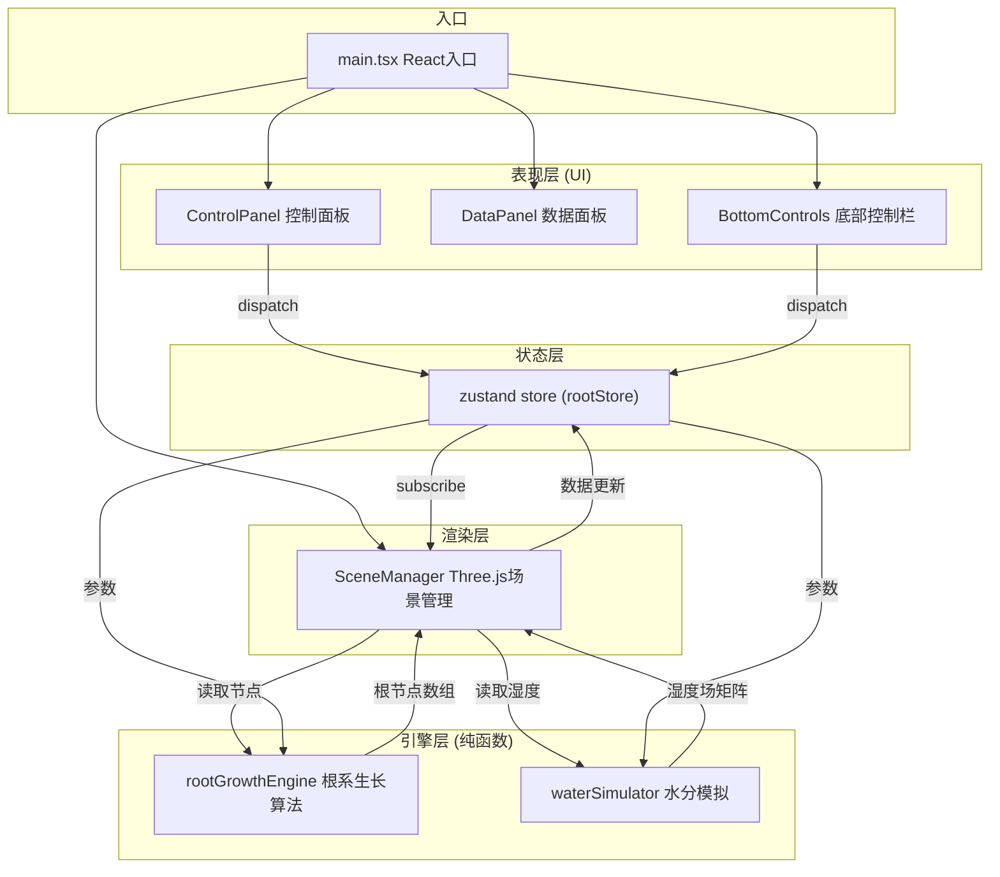

## 1. 架构设计



## 2. 技术描述
- **前端框架**：React 18 + TypeScript
- **构建工具**：Vite（启用 Three.js tree-shaking）
- **3D渲染**：Three.js + @types/three
- **状态管理**：zustand
- **动画库**：framer-motion
- **样式方案**：全局 CSS + CSS 变量 + 毛玻璃效果
- **项目初始化**：vite react-ts 模板

## 3. 目录结构
```
src/
├── main.tsx              # React 渲染入口
├── styles/
│   └── global.css        # 全局样式
├── store/
│   └── rootStore.ts      # zustand 状态管理
├── engine/
│   ├── rootGrowthEngine.ts  # 根系生长算法（纯函数）
│   └── waterSimulator.ts    # 水分模拟（纯函数）
├── scene/
│   └── SceneManager.ts   # Three.js 场景管理
└── components/
    ├── ControlPanel.tsx   # 参数滑块面板
    ├── DataPanel.tsx      # 实时数据面板
    └── BottomControls.tsx # 底部控制按钮
```

## 4. 数据模型

### 4.1 RootNode 根节点
```typescript
interface RootNode {
  id: string;
  position: [number, number, number];
  direction: [number, number, number];
  length: number;
  depth: number;
  generation: number;
  isTip: boolean;
  growthRate: number;
}
```

### 4.2 状态 Store
```typescript
interface RootState {
  // 参数
  humidity: number;          // 0-100
  nutrition: number;         // 0.5-2.0
  branchProbability: number; // 0-1.0
  growthSpeed: number;       // 0.5-2.0
  
  // 生长状态
  isPlaying: boolean;
  rootNodes: RootNode[];
  totalLength: number;
  branchCount: number;
  maxDepth: number;
  waterAbsorptionRate: number;
  waterHistory: number[];    // 最近10秒数据
  hasReachedBottom: boolean;
  
  // Actions
  setHumidity: (v: number) => void;
  setNutrition: (v: number) => void;
  setBranchProbability: (v: number) => void;
  setGrowthSpeed: (v: number) => void;
  togglePlay: () => void;
  reset: () => void;
  exportData: () => void;
  updateGrowth: (delta: number) => void;
}
```

### 4.3 湿度场
```typescript
// 3D 网格湿度场
interface HumidityField {
  size: [number, number, number];
  resolution: number;
  data: Float32Array; // 0-1 湿度值
}
```

## 5. 核心算法

### 5.1 根系生长算法
- L系统分支规则 + 随机游走结合
- 主根向下生长，侧根从主根两侧随机生出
- 每代分支长度递减 20%
- 湿度和营养影响生长速度和分支概率
- 每帧叠加布朗运动扰动

### 5.2 水分扩散模拟
- 简化扩散方程：∂h/∂t = D·∇²h
- 根系吸收作为汇项
- 底部边界恒定高湿度（地下水）
- 显式有限差分求解

## 6. 性能优化
- Three.js BufferGeometry 批量渲染粒子
-  requestAnimationFrame 驱动渲染循环
- 算法层与渲染层分离，纯函数易于优化
- 粒子数量上限 800，确保 ≥50fps
