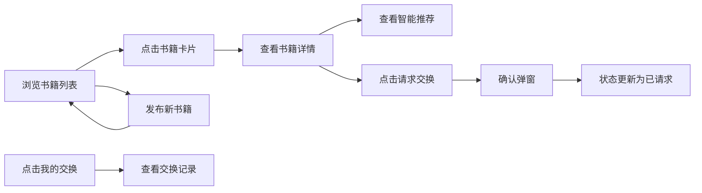

## 1. 产品概述

在线书籍交换与智能匹配推荐平台，为书友提供闲置书籍发布、浏览交换、智能匹配推荐的一站式服务，解决书籍闲置浪费问题，促进知识共享。

- 核心价值：让闲置书籍流动起来，通过智能匹配算法帮助用户找到最适合的交换对象
- 目标用户：热爱阅读、有闲置书籍、希望以书换书的书友群体
- 市场定位：轻量级、社区化的书籍交换垂直平台

## 2. 核心功能

### 2.1 用户角色
| 角色 | 注册方式 | 核心权限 |
|------|----------|----------|
| 普通用户 | 无需注册（匿名使用） | 发布书籍、浏览列表、请求交换、查看推荐、管理交换记录 |

### 2.2 功能模块
1. **书籍发布模块**：表单录入书籍信息，支持标题、作者、类别、标签
2. **书籍列表展示**：卡片式布局展示所有可交换书籍
3. **书籍详情页**：完整信息展示、大图占位、交换请求功能
4. **智能推荐引擎**：基于余弦相似度匹配3本最相关书籍
5. **交换记录管理**：查看发起和收到的交换请求状态

### 2.3 页面详情
| 页面名称 | 模块名称 | 功能描述 |
|-----------|-------------|---------------------|
| 首页 | 书籍发布表单 | 用户填写书籍信息并发布 |
| 首页 | 书籍卡片列表 | 网格布局展示所有书籍，支持点击进入详情 |
| 书籍详情页 | 书籍信息展示 | 大图、标题、作者、类别、标签完整展示 |
| 书籍详情页 | 智能推荐区 | 右侧固定展示3本匹配书籍及匹配度 |
| 书籍详情页 | 交换请求按钮 | 点击发起交换请求，带确认弹窗 |
| 我的交换页 | 交换记录表格 | 展示所有交换请求及状态 |

## 3. 核心流程

用户在首页浏览书籍卡片，可通过表单发布新书籍。点击任意卡片进入详情页，查看完整信息和智能推荐。点击"请求交换"按钮发起交换，确认后状态更新。通过导航栏"我的交换"可查看所有交换记录状态。

## 4. 用户界面设计

### 4.1 设计风格
- **主色调**：暖橙色 #FFCC80，辅色 #FFE0B2
- **背景色**：米白色 #FFF8E1
- **按钮样式**：圆角设计，交换按钮 #4CAF50，我的交换按钮 #FF9800
- **卡片样式**：宽280px，圆角10px，白色背景带浅灰阴影
- **字体**：采用温暖舒适的无衬线字体，标题加粗
- **动效**：所有交互配0.3-0.5秒缓动动画，cubic-bezier(0.4, 0, 0.2, 1)
- **图标风格**：使用lucide-react线性图标，与整体暖色调协调

### 4.2 页面设计概述
| 页面名称 | 模块名称 | UI元素 |
|-----------|-------------|-------------|
| 首页 | 导航栏 | 固定顶部60px，浅阴影，右侧"我的交换"按钮 |
| 首页 | 发布表单 | 输入框、下拉选择、标签输入，整洁有序 |
| 首页 | 书籍列表 | 左右分栏（左60%列表，右35%推荐），响应式堆叠 |
| 书籍详情页 | 大图区域 | 宽100%高240px，深色渐变遮罩 |
| 书籍详情页 | 推荐区域 | 右侧固定320px，3张推荐卡片带匹配度进度条 |
| 我的交换页 | 记录表 | 表格布局，状态标签彩色区分 |

### 4.3 响应式设计
- 桌面端：左右分栏布局，左侧列表区60%，右侧推荐区35%
- 移动端（<768px）：自动堆叠为上下排列
- 触摸优化：增大点击区域，确保移动端友好

### 4.4 动画与交互
- 卡片悬停：上浮4px，阴影加深，0.3s过渡
- 匹配度进度条：绿色渐变动画，0.6s从0增长到目标值
- 弹窗：淡入动画0.3s
- 页面滚动：平滑锚点滚动效果
- 按钮状态切换：平滑过渡效果
