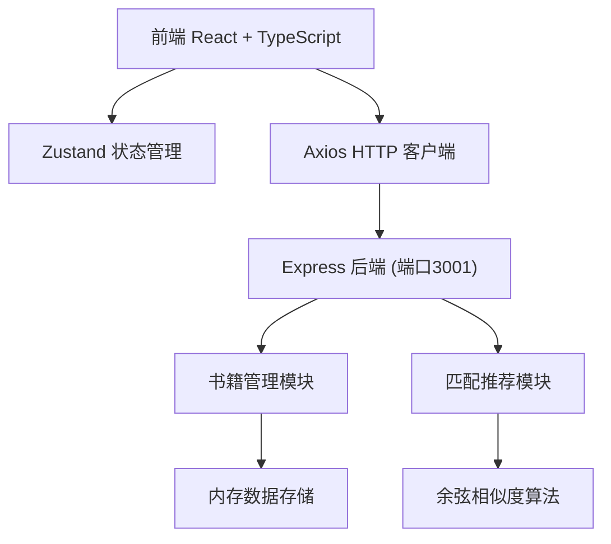
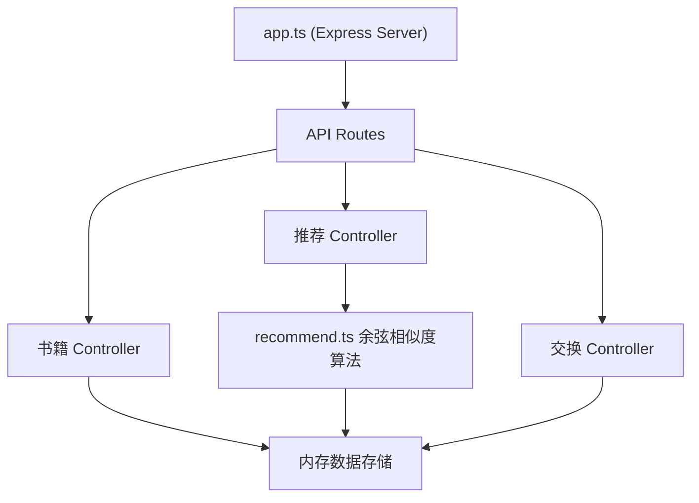
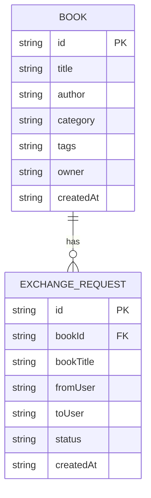

## 1. 架构设计



## 2. 技术描述

- **前端**：React 18 + TypeScript + Vite
- **状态管理**：Zustand
- **HTTP客户端**：Axios
- **后端**：Express 4 + TypeScript
- **推荐算法**：基于标签的余弦相似度计算
- **构建工具**：Vite
- **样式方案**：CSS Modules / 内联样式（根据需求自定义）
- **图标库**：lucide-react

## 3. 目录结构

```
.
├── package.json
├── vite.config.js
├── tsconfig.json
├── index.html
├── server/
│   └── src/
│       ├── app.ts          # Express服务入口
│       └── recommend.ts    # 匹配算法模块
└── client/
    └── src/
        ├── main.tsx        # React入口
        ├── App.tsx         # 主应用组件
        └── store.ts        # Zustand状态管理
```

## 4. 路由定义

| 路由 | 页面 | 功能 |
|------|------|------|
| / | 首页 | 书籍发布表单 + 书籍列表 + 推荐区域 |
| /book/:id | 书籍详情页 | 书籍详情 + 智能推荐 + 交换请求 |
| /exchanges | 我的交换页 | 交换记录列表 |

## 5. API 定义

### 5.1 类型定义

```typescript
interface Book {
  id: string;
  title: string;
  author: string;
  category: string;
  tags: string[];
  cover?: string;
  description?: string;
  owner: string;
  createdAt: string;
}

interface ExchangeRequest {
  id: string;
  bookId: string;
  bookTitle: string;
  fromUser: string;
  toUser: string;
  status: 'pending' | 'accepted' | 'rejected';
  createdAt: string;
}

interface Recommendation {
  book: Book;
  similarity: number;
}
```

### 5.2 接口列表

| 方法 | 路径 | 描述 | 请求 | 响应 |
|------|------|------|------|------|
| GET | /api/books | 获取所有书籍 | - | Book[] |
| GET | /api/books/:id | 获取单本书籍 | - | Book |
| POST | /api/books | 创建书籍 | { title, author, category, tags } | Book |
| PUT | /api/books/:id | 更新书籍 | Partial<Book> | Book |
| DELETE | /api/books/:id | 删除书籍 | - | { success: boolean } |
| GET | /api/recommend/:bookId | 获取推荐书籍 | - | Recommendation[] |
| GET | /api/exchanges | 获取交换记录 | - | ExchangeRequest[] |
| POST | /api/exchanges | 发起交换请求 | { bookId, fromUser, toUser } | ExchangeRequest |
| PUT | /api/exchanges/:id | 更新交换状态 | { status } | ExchangeRequest |

## 6. 服务端架构



## 7. 数据模型

### 7.1 ER图



### 7.2 初始化数据

应用启动时预置10本示例书籍数据，包含不同类别和标签，用于演示推荐算法效果。

## 8. 核心算法

### 8.1 余弦相似度匹配

1. 将所有书籍标签转换为词向量空间
2. 计算目标书籍与其他所有书籍的余弦相似度
3. 按相似度降序排序，返回前3本
4. 相似度转换为百分比显示，配合进度条动画

## 9. 性能指标

- 网络请求响应时间：< 300ms（本地测试）
- 列表渲染时间：< 100ms（100本书以内）
- 内存占用：< 80MB
- 动画帧率：60fps 无掉帧

## 10. 运行方式

```bash
# 安装依赖
npm install

# 启动开发服务器（前端）
npm run dev

# 启动后端服务器
npm start
```
