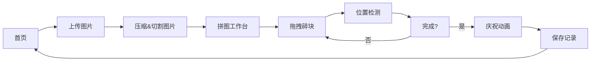

## 1. 产品概述

拼图工坊是一个浏览器端的微型在线拼图挑战应用，支持用户上传自定义图片生成拼图游戏，通过拖拽碎块完成拼图挑战。

- 核心价值：让用户享受拼图乐趣，支持自定义图库，记录完成时间，提供流畅的交互体验
- 目标用户：休闲游戏爱好者，喜欢个性化体验的用户

## 2. 核心功能

### 2.1 功能模块

1. **首页**：上传图片按钮、最近拼图记录四宫格展示
2. **拼图工作台**：拼图区、碎块拖拽、计时器、步数统计、提示功能、洗牌功能、完成庆祝动画

### 2.2 页面详情

| 页面名称 | 模块名称 | 功能描述 |
|-----------|-------------|---------------------|
| 首页 | 上传按钮 | 点击上传本地图片，自动压缩到800px以内 |
| 首页 | 最近拼图 | 四宫格展示最近4张拼图缩略图，悬停显示完成时间 |
| 拼图工作台 | 拼图区 | 600x500px拼图区域，3x3切割碎块 |
| 拼图工作台 | 拖拽交互 | 拖拽碎块上浮+阴影增强，正确位置自动吸附+弹性过冲 |
| 拼图工作台 | 状态显示 | MM:SS格式计时器、步数计数器 |
| 拼图工作台 | 提示功能 | 点击后正确位置闪烁白色光晕2秒 |
| 拼图工作台 | 洗牌功能 | 碎块重新随机排列，带翻转动画0.5秒 |
| 拼图工作台 | 完成庆祝 | 碎块自动拼合，150个彩色方块彩带粒子效果2秒 |

## 3. 核心流程

用户进入首页 → 点击上传按钮选择本地图片 → 系统自动压缩并切割成3x3碎块 → 进入拼图工作台 → 拖拽碎块到正确位置 → 系统检测完成状态 → 播放庆祝动画 → 保存拼图记录到首页四宫格

## 4. 用户界面设计

### 4.1 设计风格

- 主色调：深蓝渐变 `#0B192C` → `#1A3A5C`
- 辅助色：浅蓝色 `#64B5F6`（按钮）、`#42A5F5`（按钮悬停）、`#37474F`（拼图区背景）
- 文字色：`#B0BEC5`（计时器）、白色（正文）
- 按钮风格：圆角8px，带波纹点击动画
- 卡片风格：圆角12px，白色背景带浅蓝阴影
- 字体：使用现代无衬线字体，确保清晰可读
- 动效：拖拽上浮、吸附闪光、弹性过冲、翻转动画、彩带粒子

### 4.2 页面设计概述

| 页面名称 | 模块名称 | UI元素 |
|-----------|-------------|-------------|
| 首页 | 整体布局 | 深蓝渐变背景，居中布局，顶部按钮+下方四宫格 |
| 首页 | 上传按钮 | 圆角8px，#64B5F6背景，悬停变#42A5F5，波纹动画0.3s |
| 首页 | 缩略图卡片 | 200px宽，圆角12px，白底浅蓝阴影，悬停放大1.05倍显示完成时间 |
| 拼图工作台 | 整体布局 | 顶部状态栏+中央拼图区+右侧功能按钮 |
| 拼图工作台 | 拼图区 | 600x500px，#37474F背景，网格布局 |
| 拼图工作台 | 碎块 | 正方形，拖拽时上浮5px+深阴影，吸附时淡蓝闪光0.5s+弹性过冲10% |
| 拼图工作台 | 功能按钮 | 提示按钮、洗牌按钮，风格统一 |
| 拼图工作台 | 庆祝动画 | 150个彩色方块从底部上升飘落，持续2秒 |

### 4.3 响应式

- 桌面端优先设计，确保在1280px及以上屏幕完美展示
- 拼图区固定尺寸600x500px，居中显示
- 移动端可适当缩小拼图区尺寸，保持交互可用性

### 4.4 性能要求

- 拖拽帧率 ≥ 50fps
- 动画帧率 ≥ 55fps
- 图片上传后自动压缩到800px以内，确保加载流畅
