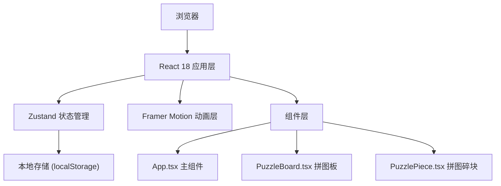

## 1. 架构设计



## 2. 技术描述

- 前端框架：React 18 + TypeScript 5
- 构建工具：Vite 5
- 状态管理：Zustand 4
- 动画库：Framer Motion 11
- 初始化工具：Vite 脚手架
- 后端：无（纯前端应用）
- 数据存储：localStorage 存储最近拼图记录

## 3. 路由定义

| 路由 | 用途 |
|-------|---------|
| / | 首页 - 上传按钮 + 最近拼图四宫格 |
| /puzzle | 拼图工作台 - 拖拽拼图交互 |

## 4. 数据模型

### 4.1 拼图记录 (PuzzleRecord)

```typescript
interface PuzzleRecord {
  id: string;
  imageDataUrl: string;
  completedAt: number;
  completionTime: number; // 秒
  thumbnail: string;
}
```

### 4.2 拼图碎块 (PuzzlePiece)

```typescript
interface PuzzlePiece {
  id: number;
  originalIndex: number;
  currentIndex: number;
  isPlaced: boolean;
  x: number; // 原始位置
  y: number;
}
```

### 4.3 游戏状态 (GameState)

```typescript
interface GameState {
  image: string | null;
  pieces: PuzzlePiece[];
  gridSize: number; // 3x3
  moves: number;
  time: number;
  isCompleted: boolean;
  isPlaying: boolean;
  recentPuzzles: PuzzleRecord[];
}
```

## 5. 核心文件结构

```
src/
├── App.tsx              # 主组件，路由管理，页面切换
├── puzzleStore.ts       # Zustand store，游戏状态管理
├── PuzzleBoard.tsx      # 拼图板组件，拖拽逻辑
├── PuzzlePiece.tsx      # 单个碎块组件，渲染与交互
└── main.tsx             # 入口文件
```

## 6. 性能优化策略

1. **图片压缩**：上传后使用 Canvas API 将图片压缩至最长边 800px
2. **GPU 加速**：使用 `transform` 和 `will-change` 优化拖拽性能
3. **动画优化**：Framer Motion 自动使用 GPU 加速动画
4. **按需渲染**：仅渲染当前可见的碎块
5. **事件节流**：拖拽事件使用 requestAnimationFrame 节流
6. **内存管理**：拼图完成后及时释放大图数据

## 7. 动画实现方案

| 动画效果 | 实现方式 |
|---------|---------|
| 按钮波纹 | Framer Motion + 伪元素缩放 |
| 卡片悬停放大 | scale(1.05) + transition |
| 拖拽上浮 | y: -5 + box-shadow 增强 |
| 吸附闪光 | box-shadow 发光动画 0.5s |
| 弹性过冲 | 弹簧动画 type: "spring", bounce: 0.4 |
| 碎块翻转 | rotateY(180deg) + 3D 透视 |
| 彩带粒子 | AnimatePresence + 150 个 motion.div |
| 提示闪烁 | opacity 脉冲动画 2s |
