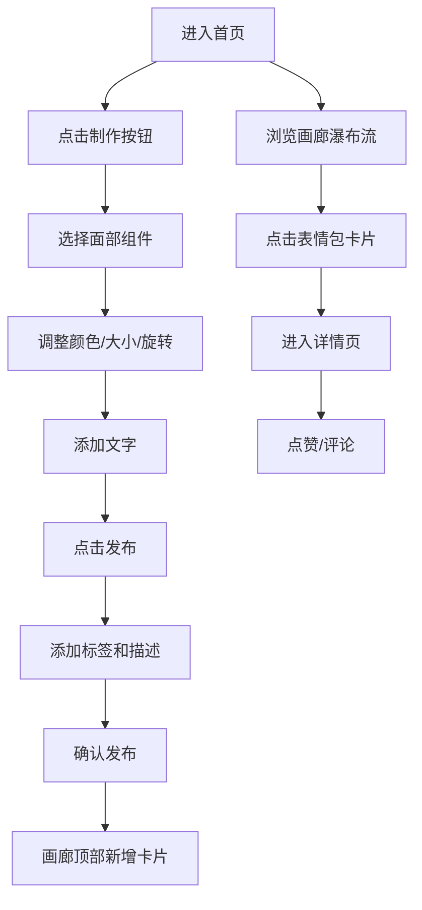

## 1. 产品概述

微型在线原创表情包制作与分享画廊，用户可自由组合卡通面部组件生成原创表情包，并发布到公共画廊供他人点赞评论。

- 目标用户：喜欢创作和分享个性化表情包的年轻用户群体
- 产品价值：提供零门槛的表情包创作工具，打造轻松有趣的社区分享氛围

## 2. 核心功能

### 2.1 用户角色

| 角色 | 注册方式 | 核心权限 |
|------|----------|----------|
| 普通用户 | 无需登录即可浏览 | 浏览画廊、制作表情包 |
| 注册用户 | 用户名/密码注册 | 发布表情包、点赞、评论 |

### 2.2 功能模块

1. **画廊首页**：瀑布流表情包展示、无限滚动加载、点赞与评论预览
2. **制作室**：面部组件选择、颜色/大小/旋转调整、画布拖拽、文字添加
3. **发布流程**：标签添加、描述编辑、发布确认
4. **详情页**：表情包详情展示、点赞功能、评论区

### 2.3 页面详情

| 页面名称 | 模块名称 | 功能描述 |
|----------|----------|----------|
| 画廊首页 | 顶部导航 | Logo旋转动效、登录/注册按钮、制作入口 |
| 画廊首页 | 瀑布流画廊 | 骨架屏加载、卡片悬浮动效、点赞脉冲动画、无限滚动 |
| 制作室 | 组件面板 | 可折叠手风琴、6个预设组件选项、选中状态高亮放大 |
| 制作室 | 画布区 | 组件实时渲染、拖拽移动、双指缩放 |
| 制作室 | 调整面板 | 颜色取色器、大小滑块、旋转旋钮、文字样式调整 |
| 制作室 | 文字工具 | 15字限制输入框、样式调整 |
| 发布弹窗 | 发布确认 | 标签管理（最多5个）、80字描述、成功滑入提示 |
| 详情页 | 评论区 | 评论输入、消息追加、自动滚动到底部 |

## 3. 核心流程

用户浏览画廊 → 点击制作按钮进入制作室 → 选择面部组件并调整样式 → 添加文字 → 点击发布 → 添加标签和描述 → 确认发布 → 表情包出现在画廊顶部 → 其他用户点赞评论

## 4. 用户界面设计

### 4.1 设计风格

- 主色调：粉色 #FF80AB、浅蓝 #64B5F6
- 背景色：浅粉到浅蓝渐变 #FCE4EC → #E3F2FD
- 辅助色：白色 #FFFFFF、浅灰 #F5F5F5/#E0E0E0、深粉 #C2185B、红色 #FF5252
- 按钮风格：圆角设计、水墨扩散波纹效果、悬停填充过渡
- 字体：圆润可爱风格，采用无衬线字体
- 布局：卡片式布局，顶部导航栏
- 动效：缓出函数过渡、脉冲动画、旋转效果、半透明阴影拖拽反馈

### 4.2 页面设计概述

| 页面名称 | 模块名称 | UI元素 |
|----------|----------|--------|
| 画廊首页 | 导航栏 | 50px圆形Logo(#FF80AB，悬停旋转90度/0.5s缓动)、登录按钮(圆角20px，透明背景1px#C2185B边框，悬停填粉白字) |
| 画廊首页 | 卡片 | 宽280px、圆角16px、白底#BDBDBD柔灰阴影、悬停上浮8px阴影加深/0.3s缓动 |
| 画廊首页 | 骨架屏 | 浅灰#E0E0E0闪烁动画1.5秒 |
| 画廊首页 | 点赞 | 红色爱心#FF5252，点击缩小放大脉冲0.2秒 |
| 制作室 | 组件面板 | 宽220px、白底、右边框#EEEEEE、手风琴折叠、60px圆形组件、选中1.1倍放大+粉边框 |
| 制作室 | 画布区 | 500x400px、纯白#FFFFFF、圆角8px、拖拽抓取光标+半透明阴影 |
| 制作室 | 调整面板 | 宽250px、白底、左边框#EEEEEE、15px取色圆点、圆角滑块、圆形旋钮 |
| 制作室 | 文字输入 | 300x40px、边框#E0E0E0聚焦变#FF80AB、15字限制 |
| 发布弹窗 | 确认框 | 半透明黑#00000080、淡入0.3s、400px白卡圆角16px |
| 发布弹窗 | 标签 | 圆角矩形#FF80AB白字、叉号删除、最多5个 |
| 消息提示 | 发布成功 | 顶部滑入、2秒自动消失 |
| 加载动画 | 无限滚动 | 三颗弹跳小圆点 |

### 4.3 响应式

- 桌面优先设计
- 768px断点：画廊变两列布局
- 768px断点：制作室三栏叠成单列
- 移动端触摸优化（双指缩放画布）

### 4.4 性能要求

- 画廊滚动加载帧率不低于55fps
- 表情包图片压缩至最大200KB
- 图片懒加载与骨架屏优化
