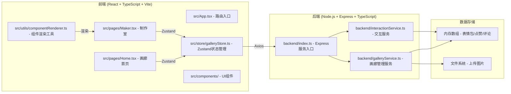
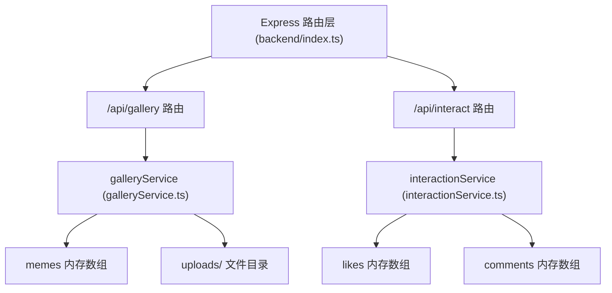
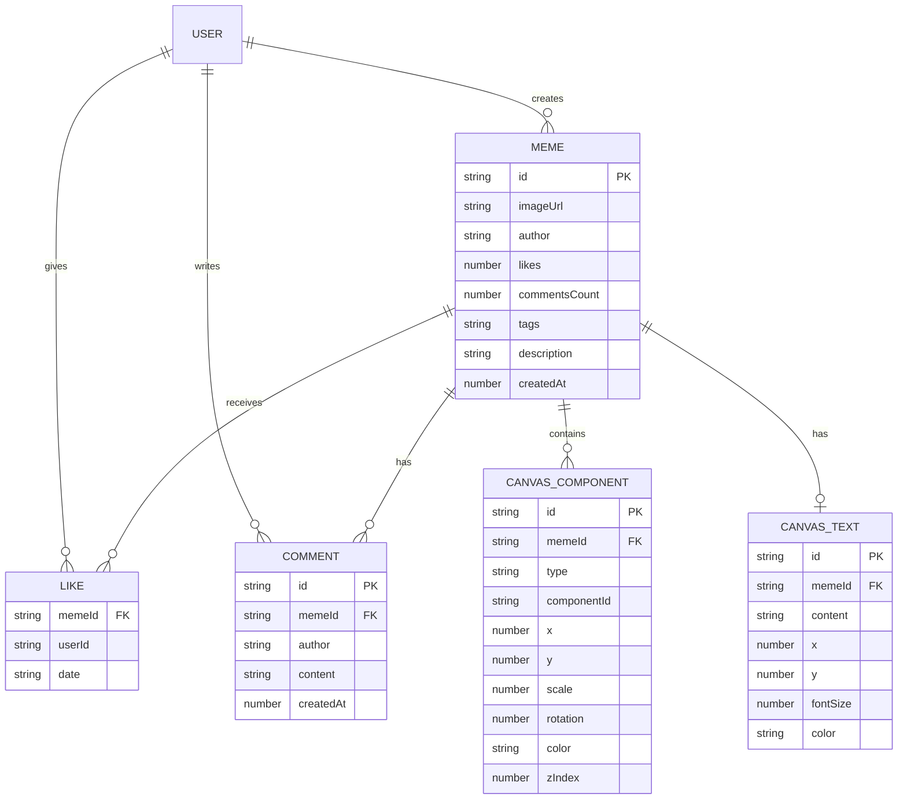

## 1. 架构设计



## 2. 技术描述

- **前端框架**：React 18 + TypeScript
- **构建工具**：Vite 5 + @vitejs/plugin-react
- **状态管理**：Zustand 4
- **HTTP客户端**：Axios
- **UI样式**：CSS Modules + 全局CSS变量
- **路由**：React Router DOM 6
- **后端框架**：Express 4
- **文件上传**：Multer
- **ID生成**：uuid
- **跨域**：cors
- **数据存储**：内存数组（开发演示用）

## 3. 路由定义

| 路由路径 | 用途 | 对应组件 |
|----------|------|----------|
| / | 画廊首页（瀑布流展示表情包） | Home.tsx |
| /maker | 表情包制作室 | Maker.tsx |
| /detail/:id | 表情包详情页 | Detail.tsx |

## 4. API 定义

### 4.1 类型定义

```typescript
// 面部组件类型
interface FaceComponent {
  id: string;
  type: 'eyes' | 'mouth' | 'blush' | 'hair';
  name: string;
  previewUrl: string;
  svgPath: string;
}

// 画布上的组件实例
interface CanvasComponent {
  id: string;
  type: string;
  componentId: string;
  x: number;
  y: number;
  scale: number;
  rotation: number;
  color: string;
  zIndex: number;
}

// 文字元素
interface CanvasText {
  id: string;
  content: string;
  x: number;
  y: number;
  fontSize: number;
  color: string;
  fontFamily: string;
}

// 表情包数据
interface Meme {
  id: string;
  imageUrl: string;
  author: string;
  authorAvatar: string;
  likes: number;
  commentsCount: number;
  tags: string[];
  description: string;
  createdAt: number;
  components: CanvasComponent[];
  text: CanvasText | null;
}

// 评论
interface Comment {
  id: string;
  memeId: string;
  author: string;
  content: string;
  createdAt: number;
}

// 点赞记录
interface LikeRecord {
  memeId: string;
  userId: string;
  date: string;
}
```

### 4.2 API 端点

| 方法 | 路径 | 描述 | 请求体 | 响应 |
|------|------|------|--------|------|
| GET | /api/gallery | 获取表情包列表（分页） | query: page, limit | { memes: Meme[], hasMore: boolean } |
| GET | /api/gallery/:id | 获取单个表情包详情 | - | Meme |
| POST | /api/gallery | 发布新表情包（含图片上传） | multipart/form-data: image, components, text, tags, description, author | Meme |
| POST | /api/interact/like/:id | 点赞表情包 | { userId } | { liked: boolean, likes: number } |
| GET | /api/interact/comments/:id | 获取表情包评论列表 | - | Comment[] |
| POST | /api/interact/comments/:id | 发表评论 | { author, content } | Comment |

## 5. 服务端架构图



## 6. 数据模型

### 6.1 实体关系图



### 6.2 项目文件结构

```
auto397/
├── package.json
├── index.html
├── vite.config.js
├── tsconfig.json
├── src/
│   ├── App.tsx              # 根组件，路由配置
│   ├── pages/
│   │   ├── Home.tsx         # 画廊首页
│   │   └── Maker.tsx        # 制作室
│   ├── store/
│   │   └── galleryStore.ts  # Zustand状态管理
│   ├── utils/
│   │   └── componentRenderer.ts  # 组件渲染工具
│   ├── components/
│   │   ├── Navbar.tsx
│   │   ├── MemeCard.tsx
│   │   ├── ComponentPanel.tsx
│   │   ├── Canvas.tsx
│   │   ├── AdjustPanel.tsx
│   │   ├── PublishModal.tsx
│   │   └── Toast.tsx
│   └── styles/
│       └── global.css
└── backend/
    ├── index.ts             # Express服务入口
    ├── galleryService.ts    # 画廊管理服务
    └── interactionService.ts # 交互服务
```
