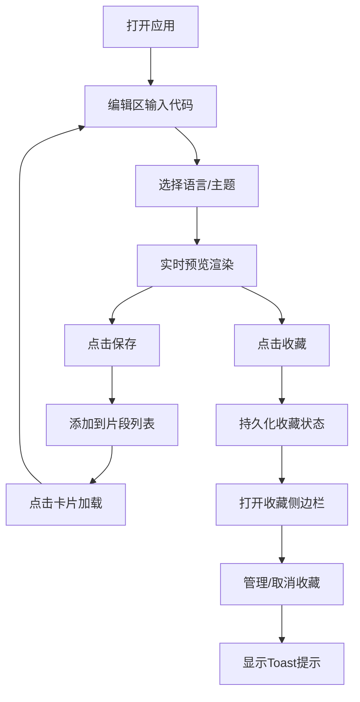

## 1. 产品概述

在线代码片段分享与语法高亮预览应用，为开发者提供快速编辑、预览、保存和收藏代码片段的工具平台。

- 主要用途：代码片段的实时编辑、语法高亮预览、本地保存和收藏管理
- 目标用户：需要快速编写和分享代码片段的开发者、学习者
- 市场价值：轻量、高效、美观的代码片段管理工具，提升开发效率

## 2. 核心功能

### 2.1 用户角色

| 角色 | 注册方式 | 核心权限 |
|------|----------|----------|
| 普通用户 | 无需注册（本地使用） | 编辑、预览、保存、收藏代码片段 |

### 2.2 功能模块

1. **主编辑区**：代码输入、语言选择、主题切换
2. **代码预览区**：语法高亮渲染、行号显示、当前行高亮
3. **片段列表区**：已保存片段的横向滚动展示、卡片交互
4. **收藏侧边栏**：收藏片段管理、筛选排序、滑入动画
5. **本地持久化**：使用 localStorage 保存片段和收藏数据

### 2.3 页面详情

| 页面名称 | 模块名称 | 功能描述 |
|----------|----------|----------|
| 主页 | 代码编辑器 | 多行代码输入、Tab键支持、实时内容更新 |
| 主页 | 语言选择器 | 下拉选择 JavaScript/TypeScript/Python/HTML/CSS/Java/Go |
| 主页 | 主题切换器 | 三种主题切换（Monokai/Dracula/One Dark） |
| 主页 | 分隔线 | 左右面板可拖拽分隔，范围30%-70% |
| 主页 | 操作按钮 | 保存按钮、收藏按钮，带动效 |
| 主页 | 片段列表 | 横向滚动卡片，按时间倒序，点击加载 |
| 主页 | 收藏侧边栏 | 右侧滑入，支持筛选排序，移除动画 |

## 3. 核心流程

用户打开应用 → 在编辑区输入/粘贴代码 → 选择语言和主题 → 实时查看预览效果 → 点击保存按钮添加到片段列表 → 点击收藏按钮收藏当前片段 → 在底部片段列表点击卡片加载内容 → 打开收藏侧边栏管理收藏 → 取消收藏显示Toast提示

## 4. 用户界面设计

### 4.1 设计风格

- 主色调：深色背景 #1e1e2e，卡片背景 #282840
- 强调色：#89b4fa（蓝色），收藏红色
- 文本色：主文本 #cdd6f4，次级文本 #a6adc8，行号 #585b70
- 按钮样式：圆角按钮，悬停变色 0.2s，按下缩放 0.95
- 字体：等宽字体（JetBrains Mono、Fira Code 或系统等宽）
- 布局：左右分栏（60%/40%），底部横向滚动列表，右侧滑入收藏栏
- 图标风格：简洁线形图标，心形收藏图标

### 4.2 页面设计概述

| 页面名称 | 模块名称 | UI元素 |
|----------|----------|--------|
| 主页 | 代码编辑器 | 深色等宽字体、行号背景#16161e、当前行淡蓝色高亮 |
| 主页 | 分隔线 | 默认1px实线、悬停col-resize光标、拖拽时2px蓝色虚线 |
| 主页 | 操作按钮 | 保存按钮蓝色背景、收藏按钮心形图标带缩放动画 |
| 主页 | 片段卡片 | 宽280px、间距16px、悬停升起6px加深阴影、语言标签圆角 |
| 主页 | 收藏侧边栏 | 宽320px、0.3s滑入动画、卡片移除动画0.2s左滑淡出 |
| 主页 | Toast提示 | 顶部绿色提示、react-hot-toast组件 |

### 4.3 响应式

桌面端优先，支持最小宽度1024px。核心交互区域保持可用状态。

### 4.4 性能要求

- 编辑区输入响应 < 16ms（60fps）
- 代码渲染（200+行）< 30ms
- 拖拽分隔线面板更新 < 50ms
- 使用 React.memo 和 useMemo 优化重渲染
