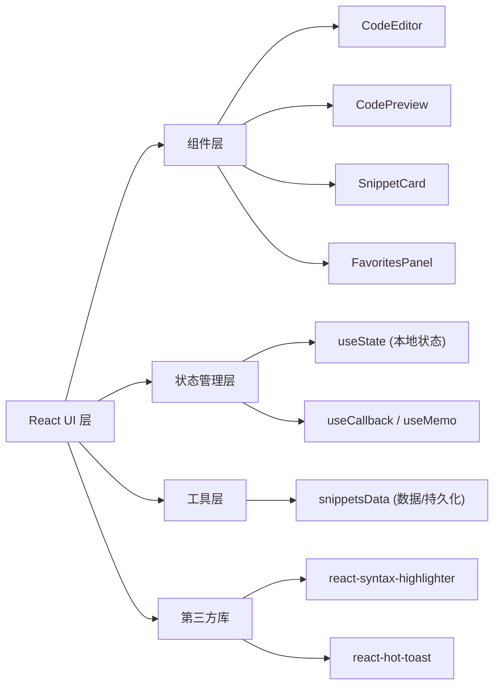
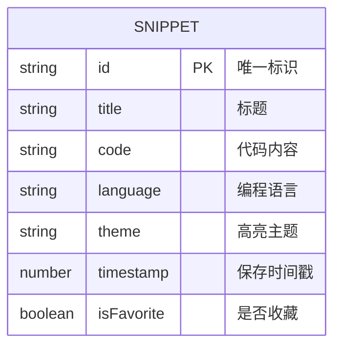

## 1. 架构设计



## 2. 技术说明

- 前端：React@18 + TypeScript@5 + Vite@5
- 构建工具：Vite + @vitejs/plugin-react
- 语法高亮：react-syntax-highlighter
- Toast 提示：react-hot-toast
- 数据持久化：localStorage（浏览器本地存储）
- 状态管理：React Hooks（useState、useCallback、useMemo、React.memo）

## 3. 文件结构

```
auto40/
├── package.json
├── vite.config.ts
├── tsconfig.json
├── index.html
└── src/
    ├── main.tsx
    ├── App.tsx
    ├── components/
    │   ├── CodeEditor.tsx
    │   ├── CodePreview.tsx
    │   ├── SnippetCard.tsx
    │   └── FavoritesPanel.tsx
    └── utils/
        └── snippetsData.ts
```

## 4. 数据模型

### 4.1 数据模型定义



### 4.2 TypeScript 类型定义

```typescript
interface Snippet {
  id: string;
  title: string;
  code: string;
  language: 'javascript' | 'typescript' | 'python' | 'html' | 'css' | 'java' | 'go';
  theme: 'monokai' | 'dracula' | 'oneDark';
  timestamp: number;
  isFavorite: boolean;
}

type LanguageType = Snippet['language'];
type ThemeType = Snippet['theme'];
```

## 5. 组件职责说明

| 组件 | 输入Props | 输出/回调 | 职责 |
|------|-----------|-----------|------|
| CodeEditor | code, language, theme | onCodeChange, onLanguageChange, onThemeChange | 代码编辑、语言/主题选择 |
| CodePreview | code, language, theme | - | 语法高亮渲染、行号显示 |
| SnippetCard | snippet | onLoad, onToggleFavorite | 片段卡片展示与交互 |
| FavoritesPanel | snippets, isOpen, filterLanguage | onClose, onLoad, onRemoveFavorite, onFilterChange | 收藏侧边栏管理 |
| App | - | - | 主应用布局、状态管理、拖拽分隔线 |
