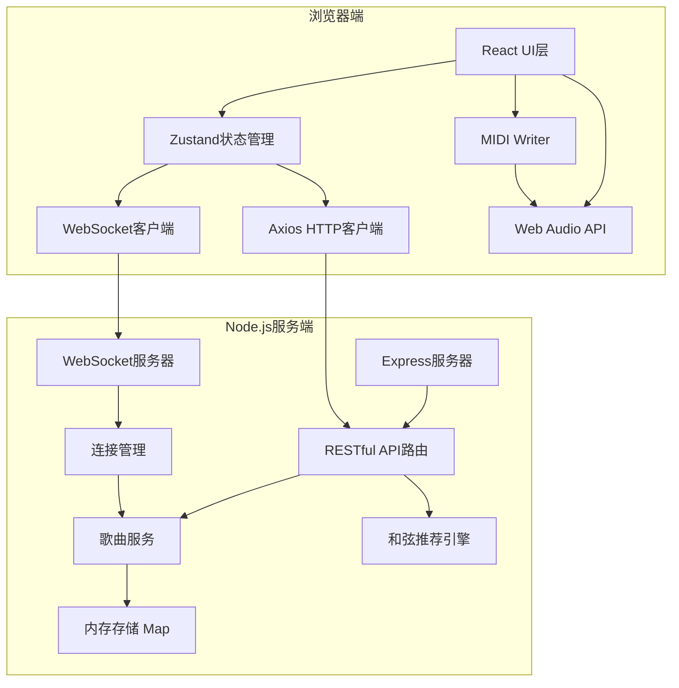
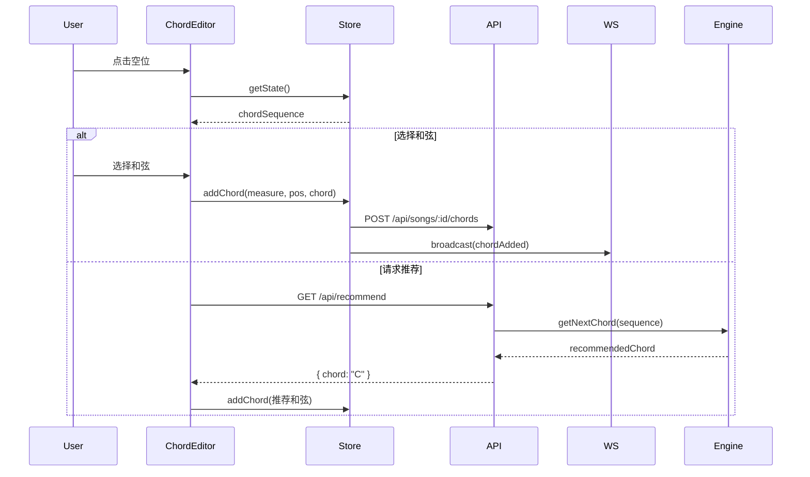
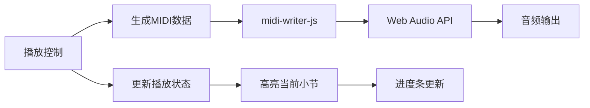
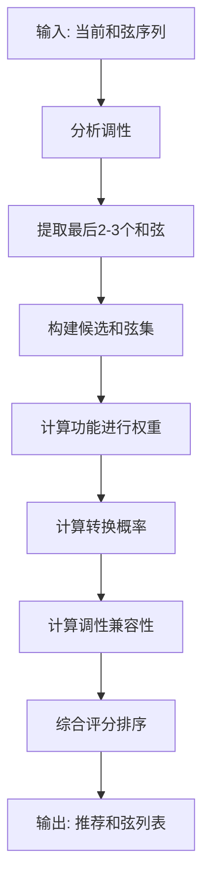

# 在线歌曲创作协作应用 - 技术架构文档

## 1. 总体架构设计

### 1.1 架构模式
前后端分离架构，通过RESTful API + WebSocket进行通信。



### 1.2 目录结构

```
auto400/
├── package.json
├── index.html
├── vite.config.ts
├── tsconfig.json
├── src/
│   ├── client/                    # 前端代码
│   │   ├── App.tsx                # 根组件，路由管理
│   │   ├── main.tsx               # 入口文件
│   │   ├── store/
│   │   │   └── useSongStore.ts    # Zustand状态管理
│   │   ├── components/
│   │   │   ├── ChordEditor.tsx    # 和弦编辑组件
│   │   │   ├── MidiPlayer.tsx     # MIDI播放组件
│   │   │   ├── LyricEditor.tsx    # 歌词编辑组件
│   │   │   ├── CollaborativeCursor.tsx  # 协作光标
│   │   │   ├── ChordSelector.tsx  # 和弦选择器
│   │   │   └── PlaybackControl.tsx # 播放控制条
│   │   ├── pages/
│   │   │   ├── SongList.tsx       # 歌曲列表页
│   │   │   └── SongEditor.tsx     # 歌曲编辑页
│   │   ├── services/
│   │   │   ├── api.ts             # API封装
│   │   │   ├── chordRecommender.ts # 和弦推荐客户端
│   │   │   └── websocket.ts       # WebSocket封装
│   │   ├── types/
│   │   │   └── index.ts           # 类型定义
│   │   └── styles/
│   │       └── globals.css        # 全局样式
│   └── server/                    # 后端代码
│       ├── index.ts               # Express入口
│       ├── routes/
│       │   └── songRoutes.ts      # 路由定义
│       ├── services/
│       │   ├── songService.ts     # 歌曲服务
│       │   ├── chordTheoryEngine.ts # 和弦推荐引擎
│       │   └── websocketService.ts # WebSocket服务
│       ├── store/
│       │   └── songStore.ts       # 内存存储
│       └── types/
│           └── index.ts           # 后端类型
```

---

## 2. 前端架构设计

### 2.1 状态管理（Zustand）

#### 状态切片设计
```typescript
interface SongState {
  // 当前歌曲数据
  currentSong: Song | null;
  songs: Song[];
  
  // 编辑数据
  chordSequence: Chord[][];  // 二维数组：[小节][和弦]
  lyricBlocks: LyricBlock[];
  key: string;               // 调性
  timeSignature: '4/4' | '3/4';
  bpm: number;
  
  // 协作数据
  collaborators: User[];
  remoteCursors: Cursor[];
  
  // 播放状态
  isPlaying: boolean;
  currentMeasure: number;
  
  // 历史记录
  history: HistoryEntry[];
  historyIndex: number;
  
  // Actions
  setSong: (song: Song) => void;
  addChord: (measure: number, position: number, chord: string) => void;
  removeChord: (measure: number, position: number) => void;
  updateLyric: (blockId: string, content: string) => void;
  requestRecommendation: (measure: number) => Promise<string>;
  startPlayback: () => void;
  stopPlayback: () => void;
  undo: () => void;
  redo: () => void;
}
```

### 2.2 核心组件数据流



### 2.3 MIDI播放流程



---

## 3. 后端架构设计

### 3.1 RESTful API 设计

| 方法 | 路径 | 描述 | 请求体 | 响应 |
|------|------|------|--------|------|
| GET | /api/songs | 获取歌曲列表 | - | `{ songs: Song[] }` |
| POST | /api/songs | 创建新歌曲 | `{ name, timeSignature }` | `{ song: Song }` |
| GET | /api/songs/:id | 获取歌曲详情 | - | `{ song: Song }` |
| PUT | /api/songs/:id | 更新歌曲信息 | `{ name, bpm, key }` | `{ song: Song }` |
| POST | /api/songs/:id/chords | 添加和弦 | `{ measure, position, chord }` | `{ success: boolean }` |
| DELETE | /api/songs/:id/chords | 删除和弦 | `{ measure, position }` | `{ success: boolean }` |
| PUT | /api/songs/:id/lyrics | 更新歌词 | `{ blockId, content }` | `{ success: boolean }` |
| GET | /api/songs/:id/recommend | 获取和弦推荐 | - | `{ recommended: string, alternatives: string[] }` |

### 3.2 WebSocket 消息协议

```typescript
// 客户端发送消息
type ClientMessage = 
  | { type: 'join'; songId: string; userId: string; userName: string }
  | { type: 'leave'; songId: string; userId: string }
  | { type: 'chord_add'; songId: string; payload: ChordOp }
  | { type: 'chord_remove'; songId: string; payload: ChordOp }
  | { type: 'lyric_update'; songId: string; payload: LyricOp }
  | { type: 'cursor_move'; songId: string; payload: CursorPosition };

// 服务端广播消息
type ServerMessage = 
  | { type: 'user_joined'; user: User }
  | { type: 'user_left'; userId: string }
  | { type: 'chord_added'; payload: ChordOp & { userId: string } }
  | { type: 'chord_removed'; payload: ChordOp & { userId: string } }
  | { type: 'lyric_updated'; payload: LyricOp & { userId: string } }
  | { type: 'cursor_moved'; payload: CursorPosition & { userId: string } };
```

### 3.3 和弦推荐引擎设计

#### 核心算法

**和弦功能进行规则（以C大调为例）：**

| 和弦 | 级数 | 功能 | 常见后续和弦 |
|------|------|------|--------------|
| C | I | 主和弦 | F, G, Am, Em |
| Dm | ii | 下属功能 | G, G7 |
| Em | iii | 过渡功能 | Am, F |
| F | IV | 下属和弦 | G, C, Am |
| G | V | 属和弦 | C, Am |
| Am | vi | 小主和弦 | F, G, Em |
| Bdim | vii° | 导和弦 | C |

**推荐权重计算：**
```
score(chord) = 
  functional_weight * 0.5 +    // 功能进行权重
  transition_prob * 0.3 +      // 和弦转换概率
  key_compatibility * 0.2      // 调性兼容性
```

#### 推荐流程



### 3.4 内存存储设计

```typescript
// 歌曲存储
const songs = new Map<string, Song>();

// 连接管理
const connections = new Map<string, Map<string, WebSocket>>();
// key: songId, value: Map<userId, websocket>

// 限制配置
const MAX_SONGS = 10;
const MAX_USERS_PER_SONG = 4;
```

---

## 4. 数据模型设计

### 4.1 核心类型定义

```typescript
// 歌曲
interface Song {
  id: string;
  name: string;
  timeSignature: '4/4' | '3/4';
  bpm: number;
  key: string;
  chordSequence: Chord[][];
  lyricBlocks: LyricBlock[];
  createdAt: number;
  updatedAt: number;
  members: string[];
}

// 和弦
interface Chord {
  id: string;
  name: string;        // "C", "Am", "G7", etc.
  duration: number;    // 拍数
}

// 歌词块
interface LyricBlock {
  id: string;
  content: string;
  measureIndex: number;  // 对应小节
  formatting: Formatting;
}

// 协作用户
interface User {
  id: string;
  name: string;
  color: string;
  songId: string;
}

// 光标位置
interface Cursor {
  userId: string;
  userName: string;
  color: string;
  measure: number;
  position: number;
  type: 'lyric' | 'chord';
}

// 历史记录
interface HistoryEntry {
  type: 'chord_add' | 'chord_remove' | 'lyric_update';
  payload: any;
  timestamp: number;
}
```

---

## 5. 关键技术实现方案

### 5.1 协作编辑冲突解决

**策略：最近修改优先（Last-Write-Wins）+ 操作转换**

```typescript
function applyOperation(op: Operation, state: SongState): SongState {
  const existingOp = findConflictingOp(op, state.pendingOps);
  
  if (existingOp && existingOp.timestamp > op.timestamp) {
    // 丢弃较早的操作
    return state;
  }
  
  // 应用操作
  return applyOpToState(op, state);
}
```

### 5.2 性能优化

**前端：**
- 使用 React.memo 优化重渲染
- 和弦推荐使用 useMemo 缓存结果
- WebSocket 消息使用 requestAnimationFrame 批量处理
- MIDI 数据预生成缓存

**后端：**
- 和弦推荐算法使用预计算的转换矩阵
- 内存操作 O(1) 复杂度
- WebSocket 消息压缩

### 5.3 响应式设计

```css
/* 断点设计 */
@media (max-width: 768px) {
  .editor-layout {
    flex-direction: column;
  }
  .lyric-area, .chord-area {
    width: 100%;
  }
}
```

---

## 6. 安全考量

1. **输入验证**：所有用户输入进行XSS过滤
2. **ID验证**：操作前验证用户是否为歌曲成员
3. **并发控制**：限制单用户连接数
4. **消息大小限制**：WebSocket消息体最大10KB

---

## 7. 部署与运行

### 7.1 开发模式
```bash
npm install
npm run dev    # 启动Vite开发服务器
npm run server # 启动Express服务器（单独终端）
```

### 7.2 生产构建
```bash
npm run build
npm run server
```
