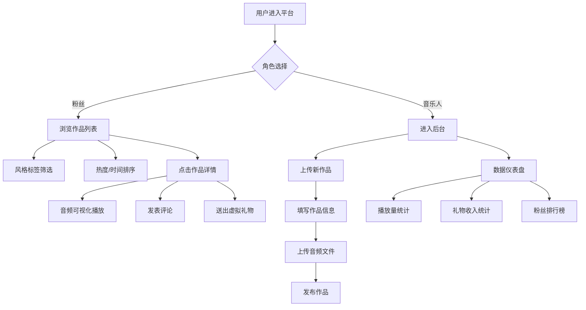

## 1. 产品概述

独立音乐人作品展示与粉丝互动平台，为独立音乐人提供作品上传、试听权限管理和数据统计功能，为粉丝提供作品浏览、评论互动和虚拟礼物打赏服务，构建音乐人-粉丝的完整互动生态。

## 2. 核心功能

### 2.1 用户角色

| 角色 | 描述 | 核心权限 |
|------|------|----------|
| 音乐人 | 内容创作者 | 上传作品、管理试听权限、查看数据仪表盘、查看礼物排行榜 |
| 粉丝 | 内容消费者 | 浏览作品、试听音乐、发表评论、送出虚拟礼物、筛选排序 |

### 2.2 功能模块

1. **作品展示区**：作品卡片列表、风格标签筛选、热度排序、播放控制
2. **作品详情页**：音频可视化频谱、评论区、虚拟礼物打赏
3. **音乐人后台**：作品管理、上传作品、数据仪表盘、粉丝排行榜
4. **导航系统**：左侧固定导航栏、移动端汉堡菜单

### 2.3 页面详情

| 页面名称 | 模块名称 | 功能描述 |
|-----------|-------------|---------------------|
| 作品列表页 | 作品卡片 | 随机渐变封面、试听次数、礼物总数、播放按钮 |
| 作品列表页 | 筛选排序 | 风格标签横向滚动筛选、按热度/时间排序 |
| 作品详情页 | 音频可视化 | FFT频谱图、256条柱状条、蓝紫渐变 |
| 作品详情页 | 评论区 | 评论列表、表情选择、@用户功能 |
| 作品详情页 | 礼物系统 | 星星/音符/爱心三种礼物、动画效果 |
| 后台仪表盘 | 数据统计 | 总播放量折线图、总收入折线图、粉丝增长面积图 |
| 后台仪表盘 | 排行榜 | 累计礼物前10名粉丝、金银铜奖牌 |
| 作品上传页 | 表单 | 作品名称、多风格标签、简介、音频上传进度条 |

## 3. 核心流程

### 3.1 粉丝浏览流程
粉丝进入首页 → 浏览作品卡片列表 → 通过标签筛选/排序 → 点击作品进入详情页 → 试听音乐（波形动画） → 发表评论/送礼物 → 返回列表继续浏览

### 3.2 音乐人创作流程
音乐人登录 → 进入后台 → 创建新作品 → 填写作品信息 → 上传音频文件 → 提交发布 → 查看数据仪表盘 → 根据数据调整策略

### 3.3 Mermaid 流程图

## 4. 用户界面设计

### 4.1 设计风格

- **设计基调**：深色霓虹主题，音乐沉浸感
- **背景**：从 #1A1A2E 到 #16213E 的径向渐变
- **主色调**：#0F3460（深海蓝）
- **高亮色**：#E94560（霓虹粉红）
- **渐变配色**：蓝色到紫色渐变用于频谱图、进度条等
- **卡片风格**：半透明玻璃质感、圆角卡片、发光描边悬停效果
- **字体**：Google Fonts - 现代无衬线字体
- **动效**：所有交互元素悬停发光描边（0.4s过渡）、平滑过渡动画

### 4.2 页面设计概述

| 页面名称 | 模块名称 | UI 元素 |
|-----------|-------------|-------------|
| 作品列表页 | 导航栏 | 左侧固定240px、图标+文字、激活项渐变背景 |
| 作品列表页 | 筛选栏 | 横向滚动标签、选中高亮下划线滑动（0.3s） |
| 作品列表页 | 作品卡片 | 随机渐变封面、圆角、悬停发光、播放按钮 |
| 作品详情页 | 频谱面板 | 全宽、256柱条、中心向两边蓝紫渐变、0.1s平滑过渡 |
| 作品详情页 | 评论区 | 圆形首字母头像、emoji面板、@提及 |
| 作品详情页 | 礼物按钮 | 星星闪烁（0.3s周期）、音符浮动（0.8s周期）、爱心粒子 |
| 后台仪表盘 | 统计卡片 | 底部滑入动画、每张延迟0.1s、渐变填充图表 |
| 后台仪表盘 | 排行榜 | 金银铜奖牌、头像+昵称、前10名 |
| 作品上传页 | 标签选择 | 圆角背景、悬停缩放1.1倍加深颜色、选中实心填充0.2s过渡 |
| 作品上传页 | 进度条 | 蓝紫渐变动效、颜色随时间均匀过渡 |

### 4.3 响应式设计

- **桌面端**：左右分栏布局，左侧240px固定导航栏，右侧自适应内容区
- **平板端**：导航栏保持，内容区域自适应
- **移动端**：导航栏折叠为汉堡菜单，全屏内容区，底部播放条固定

### 4.4 动画与交互细节

1. **标签悬停**：缩放1.1倍 + 颜色加深 + 0.2s过渡
2. **发光描边**：所有交互元素悬停时发光效果，0.4s glow过渡
3. **卡片入场**：数据仪表盘卡片从底部滑入，依次延迟0.1s
4. **表情面板**：0.2s缩放入场动画
5. **礼物动画**：
   - 星星：金色闪烁，0.3s周期
   - 音符：上下浮动5px，0.8s周期
   - 爱心：从底部向上飞出缩小消失，30粒子系统
6. **下划线滑动**：选中标签时下划线0.3s滑动动画
7. **频谱柱条**：每帧更新0.1s平滑过渡
8. **进度条**：蓝紫渐变随时间均匀过渡
