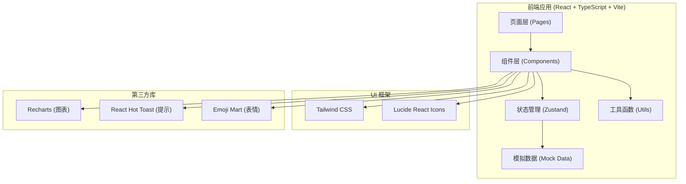

## 1. 架构设计



## 2. 技术栈说明

- **前端框架**：React 18 + TypeScript 5
- **构建工具**：Vite 5
- **样式方案**：Tailwind CSS 3 + 自定义 CSS 动画
- **状态管理**：Zustand
- **图表库**：Recharts
- **图标库**：Lucide React
- **提示组件**：react-hot-toast
- **表情选择器**：@emoji-mart/react + emoji-mart
- **路由**：React Router DOM

## 3. 目录结构

```
src/
├── components/          # 可复用组件
│   ├── WorksList.tsx       # 作品列表展示
│   ├── PlayerBar.tsx       # 迷你播放控制条
│   ├── CommentSection.tsx  # 评论区组件
│   ├── AnalyticsDashboard.tsx  # 数据仪表盘
│   ├── Sidebar.tsx         # 侧边导航栏
│   ├── WorkCard.tsx        # 作品卡片
│   ├── GiftButton.tsx      # 礼物按钮
│   └── AudioVisualizer.tsx # 音频可视化
├── pages/              # 页面组件
│   ├── HomePage.tsx       # 首页/作品列表
│   ├── WorkDetailPage.tsx # 作品详情页
│   ├── DashboardPage.tsx  # 数据仪表盘页
│   └── UploadPage.tsx     # 作品上传页
├── data/               # 模拟数据
│   └── mockData.ts        # 初始数据和辅助函数
├── hooks/              # 自定义 Hooks
│   ├── useAudioPlayer.ts  # 音频播放 hook
│   └── useGiftAnimation.ts # 礼物动画 hook
├── utils/              # 工具函数
│   ├── colors.ts          # 颜色/渐变工具
│   └── hash.ts            # hash 工具（头像背景色）
├── store/              # 状态管理
│   └── useAppStore.ts     # 全局状态
├── types/              # 类型定义
│   └── index.ts           # 通用类型
├── App.tsx             # 应用入口组件
├── main.tsx            # React 渲染入口
└── index.css           # 全局样式
```

## 4. 核心数据模型

### 4.1 类型定义

```typescript
// 作品
interface Work {
  id: string;
  title: string;
  artistId: string;
  artistName: string;
  styles: string[];      // 风格标签
  description: string;
  audioUrl: string;
  coverGradient: string; // 封面渐变
  playCount: number;
  giftCount: number;
  giftValue: number;     // 礼物总价值
  createdAt: Date;
  isPublic: boolean;
}

// 评论
interface Comment {
  id: string;
  workId: string;
  userId: string;
  username: string;
  content: string;
  createdAt: Date;
  mentions: string[];    // @的用户
}

// 用户
interface User {
  id: string;
  name: string;
  role: 'artist' | 'fan';
  avatarColor: string;
}

// 礼物
interface Gift {
  type: 'star' | 'note' | 'heart';
  name: string;
  price: number;
  icon: string;
}

// 统计数据
interface DailyStats {
  date: string;
  playCount: number;
  giftRevenue: number;
  newFans: number;
}

// 粉丝排行
interface FanRanking {
  userId: string;
  username: string;
  totalGiftValue: number;
  rank: number;
}
```

## 5. 路由定义

| 路由路径 | 页面名称 | 说明 |
|----------|----------|------|
| `/` | 首页 | 作品列表展示，支持筛选和排序 |
| `/work/:id` | 作品详情页 | 音频播放、评论、礼物打赏 |
| `/dashboard` | 数据仪表盘 | 音乐人后台数据统计 |
| `/upload` | 作品上传 | 创建和上传新作品 |

## 6. 核心组件说明

### 6.1 WorksList 组件
- **Props**：筛选条件（风格标签）、排序方式（时间/热度）
- **功能**：作品卡片网格布局、分页加载、筛选排序逻辑
- **子组件**：WorkCard、FilterBar

### 6.2 PlayerBar 组件
- **功能**：音频播放状态管理、进度控制、音量控制
- **暴露接口**：play/pause/toggle/setProgress
- **动画**：Canvas 波形动画，频率随音频实时变化

### 6.3 CommentSection 组件
- **功能**：评论列表渲染、新增评论、表情选择器、@用户
- **状态**：评论列表、输入框内容、表情面板显隐

### 6.4 AnalyticsDashboard 组件
- **功能**：播放量折线图、礼物收入折线图、粉丝增长面积图
- **动画**：卡片从底部滑入，依次延迟0.1s
- **图表**：Recharts 实现，渐变色填充

## 7. 性能优化策略

1. **虚拟滚动**：长列表使用虚拟滚动优化渲染性能
2. **图片懒加载**：作品封面和用户头像懒加载
3. **组件懒加载**：非首屏组件使用 React.lazy 动态导入
4. **Memo 优化**：使用 React.memo/useMemo/useCallback 减少重渲染
5. **Canvas 动画优化**：使用 requestAnimationFrame 高效渲染
6. **防抖节流**：搜索、滚动等高频操作防抖处理

## 8. 动画实现方案

| 动画类型 | 实现方式 |
|----------|----------|
| 标签悬停缩放 | CSS transform: scale() + transition |
| 发光描边效果 | CSS box-shadow + transition |
| 下划线滑动 | CSS ::after 伪元素 + transform |
| 卡片入场动画 | CSS animation + animation-delay |
| 星星闪烁 | CSS @keyframes opacity 动画 |
| 音符浮动 | CSS @keyframes translateY 动画 |
| 爱心粒子 | Canvas 粒子系统 + requestAnimationFrame |
| 频谱柱条过渡 | CSS transition: height 0.1s |
| 表情面板缩放入场 | CSS transform: scale() + opacity |
| 进度条渐变 | CSS background: linear-gradient + 动画 |
