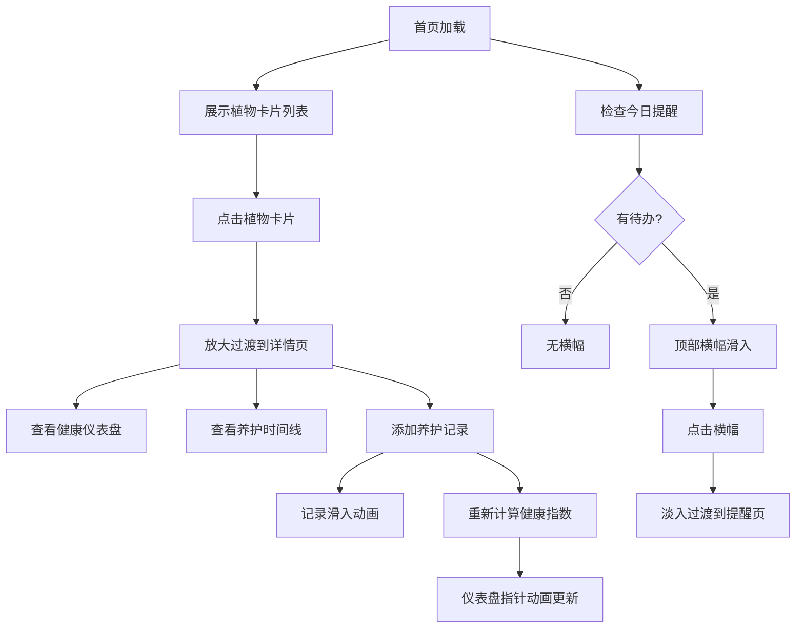

## 1. 产品概述
个人迷你植物园管理与生长模拟应用，帮助植物爱好者记录养护信息、设置提醒、可视化植物健康状态。
- 核心价值：通过数字化管理和健康模拟，让用户更好地照顾绿植，提升养护体验
- 目标用户：家庭植物爱好者、新手养植者

## 2. 核心特性

### 2.1 用户角色
| 角色 | 注册方式 | 核心权限 |
|------|----------|----------|
| 普通用户 | 无需注册（本地数据） | 添加/编辑植物、记录养护、查看健康状态、设置提醒 |

### 2.2 功能模块
1. **首页**：植物卡片列表、顶部提醒横幅、添加植物按钮
2. **详情页**：植物信息展示、健康仪表盘、养护记录时间线、添加记录表单
3. **提醒页**：今日待办提醒列表、按紧急程度排序

### 2.3 页面详情
| 页面名称 | 模块名称 | 功能描述 |
|-----------|-------------|---------------------|
| 首页 | 植物卡片 | 竖向卡片展示，包含种类图标（圆形彩色背景）、植物名称、购买天数（超1年金色高亮）、浇水/施肥日期（过期红色脉冲闪烁） |
| 首页 | 提醒横幅 | 顶部滑入，渐变色背景，显示今日待办数量，点击跳转提醒页 |
| 首页 | 添加植物 | 弹窗表单，填写名称、种类、购买日期、养护难度 |
| 详情页 | 健康仪表盘 | 半圆弧形渐变仪表盘，0-100分健康指数，指针摆动动画 |
| 详情页 | 养护时间线 | 倒序排列记录，小圆点+文字卡片，新记录滑入动画 |
| 详情页 | 添加记录 | 表单选择操作类型（浇水/施肥/修剪/换盆/其他）、填写备注（150字限制） |
| 提醒页 | 提醒列表 | 卡片式，按紧急程度排序，过期超3天左边框加粗闪烁 |

## 3. 核心流程
用户打开首页 → 查看植物卡片和今日提醒 → 点击卡片进入详情页（放大过渡动画）→ 查看健康状态和历史记录 → 添加养护记录 → 系统计算更新健康指数 → 系统每日检查提醒 → 首页展示通知横幅

## 4. 用户界面设计

### 4.1 设计风格
- **主色调**：植物绿 #4CAF50
- **次要强调色**：橙色 #FF9800
- **背景色**：浅米色 #FEFAF0
- **卡片背景**：白色，圆角8px，阴影0-2px（悬停4px）
- **按钮风格**：圆角矩形（20px圆角），主色填充
- **字体**：系统默认无衬线字体
- **图标风格**：Lucide图标，种类图标配圆形彩色背景
- **动画过渡**：所有交互0.2-0.3s过渡，页面切换0.3-0.5s动画

### 4.2 页面设计概览
| 页面名称 | 模块名称 | UI元素 |
|-----------|-------------|-------------|
| 首页 | 植物卡片 | 圆形种类图标（多肉#88B04B/绿植#6B8E23/开花#FF6B6B/仙人掌#2E8B57/蕨类#8FBC8F）、名称、购买天数（金色高亮）、提醒日期（红色脉冲）、悬停阴影提升 |
| 首页 | 提醒横幅 | 渐变#FFD700到#FFA500，上方滑入0.4s动画，点击交互 |
| 详情页 | 健康仪表盘 | 180度半圆形，红-黄-绿渐变填充，指针小幅摆动（0.5度/0.5s周期） |
| 详情页 | 养护时间线 | 时间倒序，小圆点标记，文字卡片，新记录从底部滑入0.3s |
| 提醒页 | 提醒卡片 | 按紧急程度排序，过期超3天左边框6px红色闪烁 |

### 4.3 响应式设计
- 桌面端：网格布局，每行3-4张卡片
- 移动端：单列布局，卡片自适应宽度
- 触摸优化：按钮最小44x44px，卡片点击区域充足

### 4.4 性能要求
- 首页100棵植物首次渲染 < 1.5秒
- 卡片滚动60fps流畅
- 提醒检查使用后台任务，不阻塞主线程
