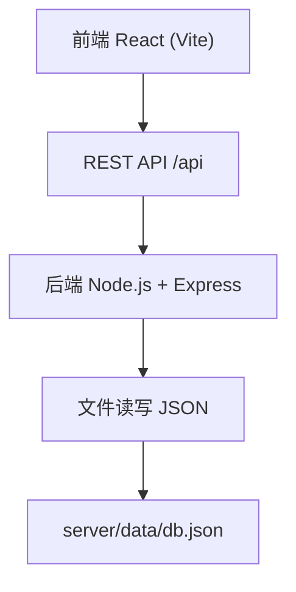
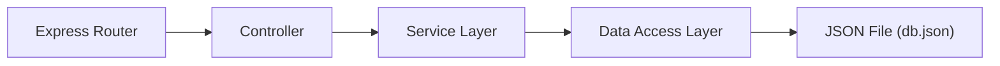
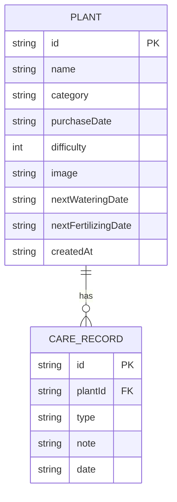

## 1. 架构设计



## 2. 技术描述
- **前端**：React@18 + TypeScript + Vite@5 + React Router@6
- **状态管理**：React Hooks + 自定义 usePlants hook
- **样式**：CSS Modules / CSS Variables（不使用Tailwind，按用户指定的颜色系统）
- **图标**：lucide-react
- **后端**：Express@4 + TypeScript
- **数据库**：本地JSON文件（server/data/db.json）
- **ID生成**：uuid
- **CORS**：cors中间件

## 3. 路由定义
| 路由 | 用途 |
|-------|---------|
| / | 首页 - 植物卡片列表 |
| /plant/:id | 详情页 - 植物健康仪表盘和养护记录 |
| /reminders | 提醒页 - 今日待办提醒列表 |

## 4. API 定义

```typescript
// 植物类型
interface Plant {
  id: string;
  name: string;
  category: 'succulent' | 'green' | 'flowering' | 'cactus' | 'fern';
  purchaseDate: string;
  difficulty: 1 | 2 | 3;
  image?: string;
  nextWateringDate?: string;
  nextFertilizingDate?: string;
  createdAt: string;
}

// 养护记录类型
interface CareRecord {
  id: string;
  plantId: string;
  type: 'water' | 'fertilize' | 'prune' | 'repot' | 'other';
  note?: string;
  date: string;
}

// 提醒类型
interface Reminder {
  plantId: string;
  plantName: string;
  type: 'water' | 'fertilize';
  dueDate: string;
  daysOverdue: number;
}

// API Endpoints
GET    /api/plants                    // 获取所有植物
GET    /api/plants/:id                // 获取单棵植物
POST   /api/plants                    // 添加植物
PUT    /api/plants/:id                // 更新植物信息
DELETE /api/plants/:id                // 删除植物
GET    /api/plants/:id/records        // 获取植物养护记录
POST   /api/plants/:id/records        // 添加养护记录
GET    /api/reminders/today           // 获取今日待办提醒
```

## 5. 服务端架构



- **server/index.ts**：Express服务入口，路由配置，中间件
- **数据存储**：plants数组和records数组分开存储
- **健康指数计算**：后端API根据养护记录频率和类型动态计算

## 6. 数据模型

### 6.1 ER图



### 6.2 初始数据结构

```json
{
  "plants": [],
  "records": []
}
```

## 7. 文件结构

```
.
├── package.json
├── vite.config.ts
├── tsconfig.json
├── index.html
├── server/
│   ├── index.ts
│   └── data/
│       └── db.json
└── src/
    ├── main.tsx
    ├── App.tsx
    ├── components/
    │   ├── PlantCard.tsx
    │   ├── DetailPage.tsx
    │   └── ReminderBanner.tsx
    └── hooks/
        └── usePlants.ts
```

## 8. 性能优化策略
- 虚拟滚动（如有需要）处理100+卡片
- React.memo 优化卡片重渲染
- requestAnimationFrame 用于动画
- setTimeout/setInterval 在后台检查提醒
- CSS transform/opacity 实现高性能动画
