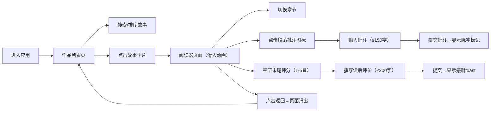

## 1. 产品概述

微小说创作与读者反馈收集平台，为作者提供短篇故事创作与管理工具，为读者提供沉浸式阅读体验与段落级互动反馈功能。

- 核心价值：连接作者与读者，通过精细的段落级批注和评分系统，帮助作者获得高质量的读者反馈
- 目标用户：独立作者、短篇小说爱好者、文学读者
- 市场定位：轻量级、专注于短篇文学创作与深度阅读互动的垂直平台

## 2. 核心特性

### 2.1 用户角色

| 角色 | 注册方式 | 核心权限 |
|------|----------|----------|
| 读者 | 无需注册（访客模式） | 浏览故事列表、阅读章节、提交段落批注、章节评分、撰写读后评价 |
| 作者 | 未来扩展 | 管理作品、创建/编辑章节、查看读者反馈数据 |

### 2.2 功能模块

1. **作品列表页**：故事卡片展示、搜索过滤、时间排序、渐入动画
2. **故事阅读器**：章节导航、正文渲染、段落级批注、阅读进度条
3. **互动反馈系统**：1-5星评分、读后评价、段落批注、toast提示

### 2.3 页面详情

| 页面名称 | 模块名称 | 功能描述 |
|----------|----------|----------|
| 作品列表页 | 故事卡片网格 | 竖向排列卡片，emoji封面、标题、作者、章节数、毛玻璃背景、悬停动效 |
| 作品列表页 | 搜索与排序 | 标题关键字搜索、发布时间排序切换 |
| 故事阅读器 | 章节侧边栏 | 章节列表、当前章节高亮、悬停指示条、平滑切换 |
| 故事阅读器 | 正文区域 | 衬线字体、首行缩进、行高1.8、段落间距、居中800px宽度 |
| 故事阅读器 | 批注系统 | 段落批注图标、输入框淡入、字符计数、蓝色脉冲标记、悬停气泡提示 |
| 故事阅读器 | 评分模块 | 星形评分、涟漪动画、平均分显示、评价输入框 |
| 故事阅读器 | 进度条 | 顶部渐变色进度条、滚动实时更新 |
| 故事阅读器 | 返回导航 | 左箭头按钮、页面滑出动画 |

## 3. 核心流程

## 4. 用户界面设计

### 4.1 设计风格

**设计调性**：优雅、柔和、专注阅读，营造沉浸的文学氛围

- **主色调**：蓝色系 #4A90D9（主色）、#6CB4EE（辅助色）、#2C6BB0（强调色）
- **背景色**：柔和米白色 #FAF8F5，温润不刺眼
- **卡片风格**：半透明白色毛玻璃效果（backdrop-filter: blur 10px），圆角8px，细腻阴影
- **按钮风格**：极简扁平，圆角4px，悬停时背景色过渡0.2s，焦点时2px蓝色外发光
- **字体**：
  - 界面文字：系统默认无衬线字体（-apple-system, BlinkMacSystemFont）
  - 正文字体：Georgia 衬线字体，行高1.8，首行缩进2字
- **图标风格**：react-icons 线性图标，简洁统一
- **动画风格**：cubic-bezier 缓动函数，过渡自然不突兀

### 4.2 页面设计概览

| 页面名称 | 模块名称 | UI 元素 |
|----------|----------|---------|
| 作品列表页 | 顶部搜索栏 | 搜索输入框（带放大镜图标）、排序切换按钮、圆角设计 |
| 作品列表页 | 故事卡片 | emoji封面（80×80px居中）、标题（18px加粗）、作者（14px灰色）、章节数标签、渐入动画（staggered 0.1s延迟） |
| 故事阅读器 | 顶部导航 | 返回按钮（左箭头）、阅读进度条（4px高度，蓝紫渐变） |
| 故事阅读器 | 章节侧边栏 | 固定宽度240px、章节项（padding 12px）、当前项蓝色圆角背景、悬停左侧2px蓝色竖条 |
| 故事阅读器 | 正文段落 | 相对定位、右侧批注图标（绝对定位）、批注标记脉冲动画、悬停气泡提示 |
| 故事阅读器 | 评分模块 | 星星图标（点击涟漪扩散）、平均分（16px加粗）、评分人数（12px灰色） |
| 故事阅读器 | 评价输入框 | 多行文本框、字符计数器、提交按钮、toast提示（右下角淡入淡出） |

### 4.3 响应式设计

**桌面优先，渐进适配**：

- **≥1200px**：最大宽度1200px居中，左右留白≥20px
- **768px-1199px**：卡片2列布局，阅读器侧边栏宽度自适应
- **480px-767px**：卡片2列，正文宽度95%，侧边栏可折叠
- **<480px**：卡片单列，正文宽度95%，侧边栏改为顶部横向滚动章节导航

**触摸优化**：
- 触摸目标最小44×44px
- 批注图标扩大点击热区
- 评分星星间距加大，便于触摸操作

### 4.4 动效细节

**微交互设计**：

1. **卡片悬停**：向上平移8px + 阴影加深 + 0.3s cubic-bezier(0.4, 0, 0.2, 1)
2. **章节切换**：当前章节背景色过渡 + 0.2s ease
3. **批注图标**：悬停变蓝 + 放大1.1倍 + 0.2s过渡
4. **脉冲标记**：scale 1→1.5→1，opacity 1→0.5→1，1.5s循环
5. **星星评分**：点击时从中心向外scale 0→1.2→1，0.3s涟漪
6. **页面过渡**：进入从右滑入、退出向左滑出，0.3s ease
7. **toast提示**：底部滑入 + 停留2s + 滑出，0.3s过渡
