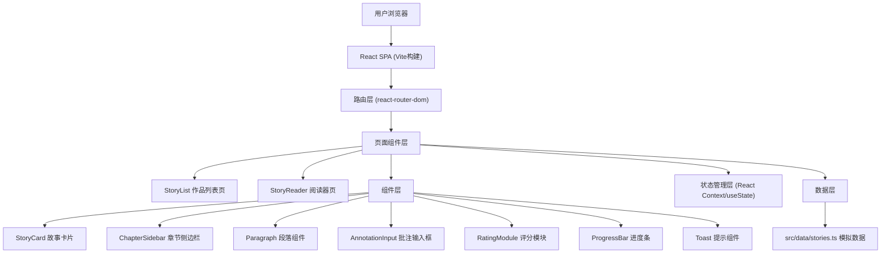

## 1. 架构设计



## 2. 技术栈描述

- **前端框架**：React 18 + TypeScript 5
- **构建工具**：Vite 5 + @vitejs/plugin-react
- **路由管理**：react-router-dom 6
- **图标库**：react-icons
- **样式方案**：原生 CSS（CSS Modules 内联在组件中），CSS 变量管理主题
- **数据方案**：前端模拟数据（TypeScript 定义类型，stories.ts 提供静态数据）
- **状态管理**：React 内置 useState + useContext + URL 参数
- **开发语言**：TypeScript（严格模式 strict: true）

## 3. 路由定义

| 路由 | 页面 | 说明 |
|------|------|------|
| `/` | StoryList | 作品列表页，展示所有故事卡片 |
| `/story/:id` | StoryReader | 故事阅读器，URL参数 id 标识故事 |
| `/story/:id/chapter/:chapterId` | StoryReader | 阅读器直接定位到指定章节 |

## 4. 数据模型

### 4.1 类型定义

```typescript
interface Story {
  id: string;
  title: string;
  author: string;
  coverEmoji: string;
  description: string;
  publishedAt: string;
  chapters: Chapter[];
  averageRating: number;
  ratingCount: number;
}

interface Chapter {
  id: string;
  title: string;
  content: string[]; // 每个元素是一个段落
  averageRating: number;
  ratingCount: number;
}

interface Annotation {
  id: string;
  storyId: string;
  chapterId: string;
  paragraphIndex: number;
  content: string;
  createdAt: string;
}

interface Rating {
  id: string;
  storyId: string;
  chapterId: string;
  score: number; // 1-5
  review?: string;
  createdAt: string;
}
```

### 4.2 模拟数据规范

- `src/data/stories.ts` 导出 `stories: Story[]` 数组
- 包含 3 个完整故事，每个故事 2-3 个章节
- 每个章节 5-8 个段落，每段 100-200 字
- 章节内容为原创微小说，主题多样（悬疑、温情、科幻）

## 5. 目录结构

```
auto45/
├── package.json
├── vite.config.ts
├── tsconfig.json
├── index.html
└── src/
    ├── App.tsx              # 主应用，路由配置，全局状态
    ├── types/
    │   └── index.ts         # TypeScript 类型定义
    ├── data/
    │   └── stories.ts       # 模拟数据
    ├── components/
    │   ├── StoryList.tsx    # 作品列表组件
    │   ├── StoryReader.tsx  # 阅读器组件
    │   ├── StoryCard.tsx    # 故事卡片（拆分自StoryList）
    │   ├── ChapterSidebar.tsx # 章节侧边栏
    │   ├── Paragraph.tsx    # 段落组件（含批注功能）
    │   ├── RatingModule.tsx # 评分模块
    │   ├── ProgressBar.tsx  # 阅读进度条
    │   └── Toast.tsx        # 全局提示
    ├── hooks/
    │   ├── useReadingProgress.ts # 阅读进度Hook
    │   └── useAnnotations.ts     # 批注管理Hook
    ├── context/
    │   └── AppContext.tsx   # 全局Context（批注、评分状态）
    └── index.css            # 全局样式，CSS变量
```

## 6. 性能优化方案

### 6.1 渲染性能

- **列表虚拟化**：故事列表使用 `React.memo` 包裹卡片组件，避免不必要重渲染
- **分页/懒加载**：20张卡片时一次性渲染，但使用 `content-visibility: auto` 优化离屏渲染
- **章节切换**：预加载相邻章节内容，DOM diff 最小化更新
- **动画优化**：所有动画使用 `transform` 和 `opacity`，避免触发 reflow

### 6.2 关键指标

- 列表滚动帧率：≥60fps（使用 `will-change: transform` 提升合成层）
- 章节切换时间：≤200ms（数据预加载 + CSS transition）
- 动画帧率：≥50fps（使用 CSS 动画而非 JS 动画）

### 6.3 代码优化

- 组件粒度控制：单组件 ≤300 行，大组件拆分为小组件
- 状态提升合理：批注、评分状态提升至 AppContext，避免 prop drilling
- 事件防抖：搜索输入框使用 200ms 防抖，减少过滤计算
- 内存管理：`useEffect` 清理事件监听器（滚动监听等）

## 7. 无障碍支持

- 所有交互元素支持键盘导航（Tab 键）
- 按钮、输入框有适当的 `aria-label`
- 颜色对比度符合 WCAG AA 标准
- 焦点状态清晰可见（2px 蓝色外发光）
- 语义化 HTML 标签（`<main>`, `<article>`, `<nav>`, `<aside>`）
