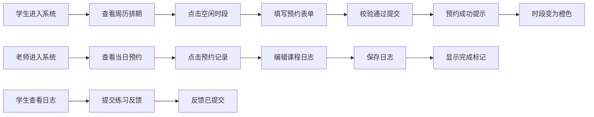

## 1. 产品概述
社区音乐教室预约平台，连接学生与老师，实现在线乐器课程预约、教学管理与课后反馈的全流程数字化运营平台。
- 核心目标：为学生提供便捷的课程预约与练习反馈渠道，为老师提供高效的排期管理与教学记录工具
- 目标用户：音乐教室运营者、乐器老师、音乐学生

## 2. 核心功能

### 2.1 用户角色

| 角色 | 登录方式 | 核心权限 |
|------|----------|----------|
| 学生 | 角色切换 | 浏览周历排期、预约一对一课程、查看课程日志、提交课后练习反馈 |
| 老师 | 角色切换 | 查看当日预约列表、记录课程日志、查看学生练习反馈 |

### 2.2 功能模块
1. **周历排期页面**：7天周历视图、按小时时段展示、预约发起入口
2. **预约表单模块**：学生信息录入、乐器类型选择、表单校验
3. **老师仪表盘**：当日预约列表、课程日志编辑器、星级评分
4. **学生反馈模块**：课程日志摘要列表、练习反馈表单

### 2.3 页面详情

| 页面名称 | 模块名称 | 功能描述 |
|-----------|-----------|----------------|
| 周历排期页面 | 周历视图 | 7列×10行(9-18点)时段网格，空闲绿色，已预约橙色，悬停显示预约按钮 |
| 预约表单模块 | 模态框表单 | 姓名(3-20字)、手机号(11位校验)、乐器下拉(5种)选择，动画效果 |
| 老师仪表盘 | 预约列表 | 当日所有预约卡片，点击展开日志面板 |
| 老师仪表盘 | 日志编辑器 | 课程内容(500字)、星级评分(1-5星)、课后建议，滑入动画 |
| 学生反馈模块 | 日志摘要列表 | 最近5条日志卡片，显示日期、评价、星级 |
| 学生反馈模块 | 反馈表单 | 文字反馈(500字)、练习时长选择(15/30/45/60分钟) |

## 3. 核心流程

## 4. 用户界面设计

### 4.1 设计风格
- **主色调**：暖色调体系，主背景 #FDF5E6（旧米色），侧边栏 #FAEBD7（古董白）
- **色彩语义**：空闲时段 #E8F5E9（浅绿），悬停 #C8E6C9（深绿），已预约 #FFF3E0（浅橙）
- **按钮样式**：圆角设计，点击 scale(0.95) 按下效果，弹起 scale(1)
- **Logo样式**：圆形渐变图标（#4A90D9 到 #9B59B6 蓝紫渐变）
- **卡片风格**：白色背景，圆角 12px，阴影 rgba(0,0,0,0.06)
- **动效风格**：平滑过渡、毛玻璃、渐入渐出、滑入滑出

### 4.2 页面设计概览

| 页面名称 | 模块名称 | UI 元素 |
|-----------|-----------|-----------|
| 全局导航 | 顶部导航栏 | 固定64px高度，毛玻璃效果，Logo + 角色切换按钮 |
| 全局布局 | 侧边栏 + 主区域 | 280px 侧边栏，底部响应式折叠 |
| 周历排期 | 时段格子 | 悬停渐入预约按钮，颜色区分状态 |
| 预约表单 | 下拉选择 | 箭头旋转90度动画 |
| 老师仪表盘 | 日志面板 | 右侧滑入 0.35s ease-out |
| 星级评分 | 星星动画 | 中心放大 + 涟漪效果 |
| 学生反馈 | 内嵌表单 | 高度折叠展开 0.3s ease |

### 4.3 响应式布局
- 桌面端：左侧 280px 侧边栏 + 右侧主内容区
- 移动端（<768px）：侧边栏折叠为底部 5 个 Tab 图标栏，主内容区满宽，周历改为单日滚动
- 列表/卡片条目加载 stagger 延迟 0.1s 渐入

### 4.4 动画细节
- **导航栏毛玻璃**：backdrop-filter: blur(8px)
- **角色切换按钮**：背景渐变方向切换 0.3s 过渡
- **预约成功提示**：顶部绿色提示 3s 自动消失
- **星星点击**：从中心放大 0.2s 涟漪
