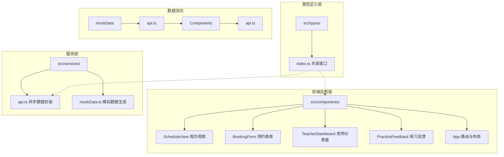

## 1. 架构设计



## 2. 技术说明
- **前端框架**：React@18 + TypeScript@5 + Vite@5
- **路由管理**：react-router-dom@6
- **样式方案**：原生 CSS + CSS Modules（内联样式与 className 结合）
- **提示组件**：react-hot-toast@2
- **日期处理**：date-fns@3
- **状态管理**：React useState/useEffect（组件内状态管理）
- **数据层**：Promise 封装 mock 数据（模拟异步操作）

## 3. 路由定义

| 路由 | 页面/组件 | 用途 |
|-------|------------|------|
| / | ScheduleView | 周历排期与预约（学生首页） |
| /teacher | TeacherDashboard | 老师仪表盘（老师首页） |
| /feedback | PracticeFeedback | 学生练习反馈页面 |

## 4. 数据服务定义

### 4.1 类型定义 src/types/index.ts

```typescript
// 老师信息
interface Teacher { id, name, instrument[] }
// 时段信息
interface TimeSlot { id, teacherId, date, startTime, endTime, status, bookingId? }
// 预约信息
interface Booking { id, teacherId, studentName, studentPhone, instrument, date, startTime, endTime }
// 课程日志
interface LessonLog { id, bookingId, content, rating(1-5), suggestion, createdAt }
// 学生反馈
interface PracticeFeedback { id, logId, feedbackText, duration(15/30/45/60, submittedAt }
```

### 4.2 API 方法签名 src/services/api.ts

```typescript
getSchedules(): Promise<TimeSlot[]>
submitBooking(data): Promise<Booking>
getTodayBookings(teacherId): Promise<Booking[]>
saveLessonLog(data): Promise<LessonLog>
getRecentLogs(studentName): Promise<LessonLog[]>
submitFeedback(data): Promise<PracticeFeedback>
```

## 5. 项目文件结构

```
auto46/
├── package.json
├── vite.config.ts
├── tsconfig.json
├── index.html
└── src/
    ├── types/
    │   └── index.ts          # 共享类型定义
    ├── services/
    │   ├── api.ts             # 异步数据操作封装
    │   └── mockData.ts       # 初始模拟数据
    ├── components/
    │   ├── ScheduleView.tsx     # 周历排期视图
    │   ├── BookingForm.tsx      # 预约表单
    │   ├── TeacherDashboard.tsx # 老师仪表盘
    │   └── PracticeFeedback.tsx # 练习反馈
    ├── App.tsx                # 应用根组件 + 路由 + 布局
    └── main.tsx                # React 入口
```

## 6. 模块调用关系

**数据流向：
1. mockData.ts 生成初始数据 → api.ts 内部持有
2. api.ts 包装 Promise 函数 → Components 调用获取数据
3. Components 用户交互 → api.ts 更新数据 → Components 重新获取刷新
