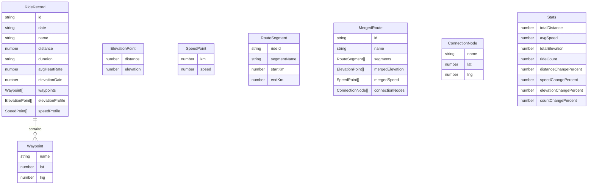

## 1. 架构设计

```mermaid
flowchart TD
    "前端 React+TypeScript" --> "数据服务层 src/data/rides.ts"
    "数据服务层" --> "模拟JSON数据"
    "前端" --> "组件层"
    "组件层" --> "RideCard 骑行卡片"
    "组件层" --> "RideList 记录列表"
    "组件层" --> "RouteMerger 路线拼接"
    "组件层" --> "App 主入口+路由"
```

纯前端架构，无后端服务，数据存储使用模拟JSON文件。

## 2. 技术说明

- 前端：React@18 + TypeScript + Vite
- 初始化工具：vite-init (react-ts 模板)
- 状态管理：React useState/useReducer（轻量级，无需zustand）
- 图表库：recharts（海拔剖面图 + 速度分析图）
- 图标库：react-icons
- 路由：react-router-dom
- 数据存储：模拟JSON文件（src/data/rides.ts）
- 样式：CSS Modules / 内联样式（无需Tailwind，保持轻量）

## 3. 路由定义

| 路由 | 用途 |
|-----|------|
| / | 骑行记录列表页（含统计卡片、筛选、排序） |
| /merger | 路线拼接页（路段选取、海拔剖面图、速度分析） |

## 4. 数据模型

### 4.1 数据模型定义



### 4.2 类型定义 (TypeScript)

```typescript
interface Waypoint {
  name: string;
  lat: number;
  lng: number;
}

interface ElevationPoint {
  distance: number;
  elevation: number;
}

interface SpeedPoint {
  km: number;
  speed: number;
}

interface RideRecord {
  id: string;
  date: string;
  name: string;
  distance: number;
  duration: string;
  avgHeartRate: number;
  elevationGain: number;
  waypoints: Waypoint[];
  elevationProfile: ElevationPoint[];
  speedProfile: SpeedPoint[];
}

interface RouteSegment {
  rideId: string;
  segmentName: string;
  startKm: number;
  endKm: number;
}

interface ConnectionNode {
  name: string;
  lat: number;
  lng: number;
}

interface MergedRoute {
  id: string;
  name: string;
  segments: RouteSegment[];
  mergedElevation: ElevationPoint[];
  mergedSpeed: SpeedPoint[];
  connectionNodes: ConnectionNode[];
}

interface Stats {
  totalDistance: number;
  avgSpeed: number;
  totalElevation: number;
  rideCount: number;
  distanceChangePercent: number;
  speedChangePercent: number;
  elevationChangePercent: number;
  countChangePercent: number;
}
```

## 5. 文件结构

```
├── package.json
├── index.html
├── vite.config.ts
├── tsconfig.json
├── src/
│   ├── types/
│   │   └── index.ts          # 共享类型定义
│   ├── data/
│   │   └── rides.ts          # 模拟数据服务模块
│   ├── components/
│   │   ├── RideCard.tsx       # 骑行卡片组件
│   │   ├── RideList.tsx       # 骑行记录列表组件
│   │   └── RouteMerger.tsx    # 路线拼接组件
│   └── App.tsx               # 主组件+路由
```

## 6. 性能目标

- 列表滚动保持60fps
- 页面最差加载时间≤1.2s
- 模拟数据不超过50条记录
