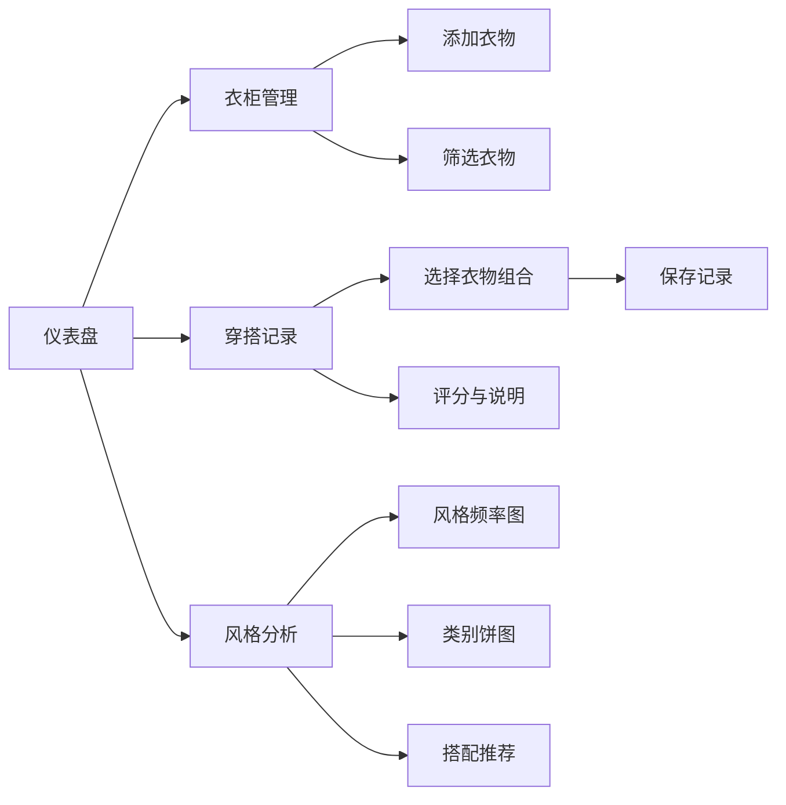

## 1. 产品概述

个人每日穿搭记录与搭配推荐应用，帮助用户记录每天穿着的衣物，自动分析个人风格偏好并给出搭配建议。目标用户为注重个人形象、希望科学管理衣橱的时尚爱好者。

## 2. 核心功能

### 2.1 用户角色
| 角色 | 注册方式 | 核心权限 |
|------|----------|----------|
| 普通用户 | 无需注册，本地存储 | 衣物管理、穿搭记录、风格分析、搭配推荐 |

### 2.2 功能模块
1. **衣柜管理**：衣物的增删改查与分类筛选
2. **每日穿搭记录**：组合上下装并保存记录，评分与说明
3. **风格分析**：图表展示风格占比和使用频率
4. **仪表盘**：整合所有模块，展示推荐搭配

### 2.3 页面详情
| 页面名称 | 模块名称 | 功能描述 |
|---------|----------|----------|
| 仪表盘 | 今日推荐 | 基于历史记录推荐今日搭配方案 |
| 仪表盘 | 快捷入口 | 快速导航到各功能模块 |
| 衣柜管理 | 衣物列表 | 虚拟滚动展示衣物卡片，支持分类筛选 |
| 衣柜管理 | 添加衣物 | 表单填写衣物信息（名称、类别、颜色、风格标签、照片URL） |
| 穿搭记录 | 记录列表 | 按日期倒序展示穿搭记录卡片 |
| 穿搭记录 | 创建记录 | 选择衣物组合、评分、写说明 |
| 风格分析 | 风格频率柱状图 | 最近30天不同风格标签使用频率 |
| 风格分析 | 类别使用饼图 | 不同类别衣物使用次数占比 |
| 风格分析 | 最常搭配组合 | 频率最高的3套搭配推荐 |

## 3. 核心流程

用户打开应用 → 在仪表盘查看今日推荐 → 在衣柜管理添加/管理衣物 → 在穿搭记录模块选择衣物组合并保存 → 在风格分析页面查看统计数据 → 根据分析优化穿搭

## 4. 用户界面设计

### 4.1 设计风格
- **主色调**：#F7F1E3（暖米色背景）
- **辅色调**：#E8D5C4（浅棕色）
- **强调色**：#C0392B（深红色）
- **导航背景**：#2C3E50（深蓝灰色）
- **类别颜色**：上衣#4A90D9、下装#50C878、外套#E67E22、鞋#9B59B6、配饰#F1C40F
- **卡片圆角**：12px
- **阴影**：0 2px 8px rgba(0,0,0,0.1) 柔和阴影
- **字体**：使用优雅的衬线字体搭配现代无衬线字体

### 4.2 页面设计概述
| 页面名称 | 模块名称 | UI元素 |
|---------|----------|-------|
| 仪表盘 | 今日推荐卡片 | 大卡片展示推荐搭配，缩略图横向排列，一键使用按钮 |
| 仪表盘 | 数据概览 | 衣物总数、记录数、风格标签云 |
| 衣柜管理 | 衣物卡片 | 竖向卡片，顶部类别图标，中部颜色色块，底部风格标签 |
| 衣柜管理 | 筛选栏 | 类别筛选、颜色筛选、风格筛选 |
| 穿搭记录 | 记录卡片 | 日期、衣物缩略图横向排列、星级评分 |
| 穿搭记录 | 创建表单 | 衣物选择器、星级评分、说明输入框 |
| 风格分析 | 柱状图 | 渐变色柱子，从底部升起动画 |
| 风格分析 | 饼图 | 扇区可点击放大，显示占比数字 |

### 4.3 响应式
- 桌面端（>768px）：左右分栏布局，左侧固定宽度260px导航栏
- 移动端（<768px）：导航栏折叠为顶部汉堡菜单，从左向右滑出动画（0.3s）
- 所有内容区域最大宽度1200px，居中显示
- 触控优化，确保点击区域足够大

### 4.4 动效设计
- 卡片悬停：向上浮动8px，阴影加深（0.3s ease）
- 标签选中：填充颜色，0.2s缩放过渡
- 星级评分：星星缩放，金色闪光动画（0.2s）
- 柱状图：从底部升起动画（0.5s）
- 按钮点击：涟漪效果
- 页面切换：淡入淡出（0.2s）
- 移动端菜单：从左向右滑出（0.3s）
