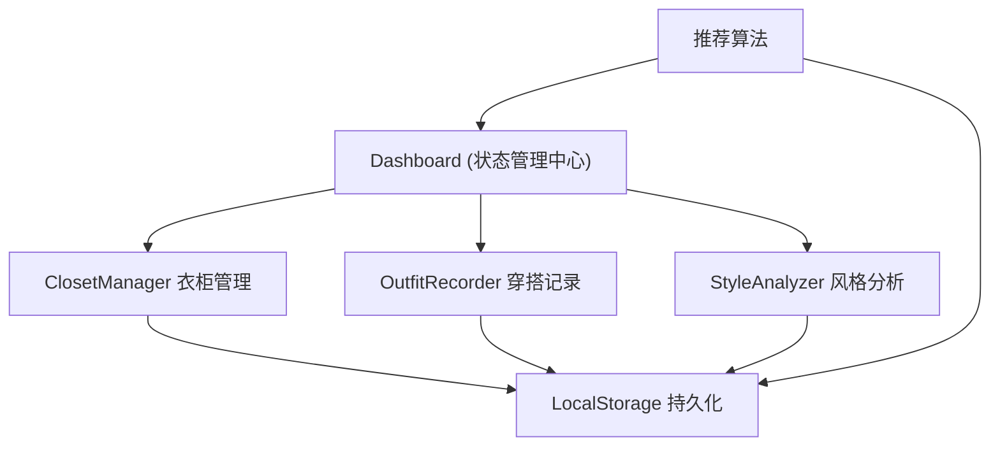

## 1. 架构设计



## 2. 技术描述

- **前端框架**：React@18 + TypeScript
- **构建工具**：Vite@5 + @vitejs/plugin-react
- **图表库**：recharts
- **状态管理**：React useState/useEffect + 自定义hooks
- **数据持久化**：LocalStorage
- **样式方案**：原生CSS + CSS Modules/CSS变量

## 3. 文件结构

```
src/
├── types/
│   └── index.ts          # 共享类型定义
├── components/
│   ├── ClosetManager.tsx # 衣柜管理模块
│   ├── OutfitRecorder.tsx # 穿搭记录模块
│   ├── StyleAnalyzer.tsx  # 风格分析模块
│   └── Dashboard.tsx      # 仪表盘主入口
├── hooks/
│   ├── useLocalStorage.ts # LocalStorage hook
│   └── useRecommendation.ts # 搭配推荐算法
├── utils/
│   └── styleUtils.ts      # 样式工具函数
├── App.tsx
├── main.tsx
└── index.css
```

## 4. 数据模型

### 4.1 衣物项 (ClothingItem)
```typescript
interface ClothingItem {
  id: string;
  name: string;
  category: 'top' | 'bottom' | 'outerwear' | 'shoes' | 'accessory';
  color: string;
  styleTags: string[];
  photoUrl?: string;
  createdAt: number;
}
```

### 4.2 穿搭记录 (OutfitRecord)
```typescript
interface OutfitRecord {
  id: string;
  date: string;
  topId?: string;
  bottomId?: string;
  outerwearId?: string;
  shoesId?: string;
  accessoryIds: string[];
  rating: number;
  note: string;
  createdAt: number;
}
```

### 4.3 搭配推荐 (OutfitRecommendation)
```typescript
interface OutfitRecommendation {
  id: string;
  items: ClothingItem[];
  reason: string;
  score: number;
}
```

## 5. 核心算法

### 5.1 风格分析算法
- 统计最近30天穿搭记录中各风格标签出现次数
- 计算各类别衣物使用频率
- 找出最常出现的衣物组合（支持度计数）

### 5.2 搭配推荐算法
- **规则1**：优先推荐本周未穿过的衣物组合
- **规则2**：若所有衣物都已穿过，推荐历史评分最高的组合
- **规则3**：考虑风格标签的协调性

## 6. 性能优化

### 6.1 虚拟滚动
- 使用 react-window 或自定义虚拟滚动方案
- 支持500+件衣物流畅滚动
- 仅渲染可视区域内的卡片

### 6.2 图表优化
- 使用 recharts 的性能优化配置
- 图表渲染时间控制在200ms以内
- 数据计算使用 useMemo 缓存

### 6.3 动画优化
- 使用 CSS transform 和 opacity 实现动画
- 确保60fps帧率
- 避免 layout thrashing
