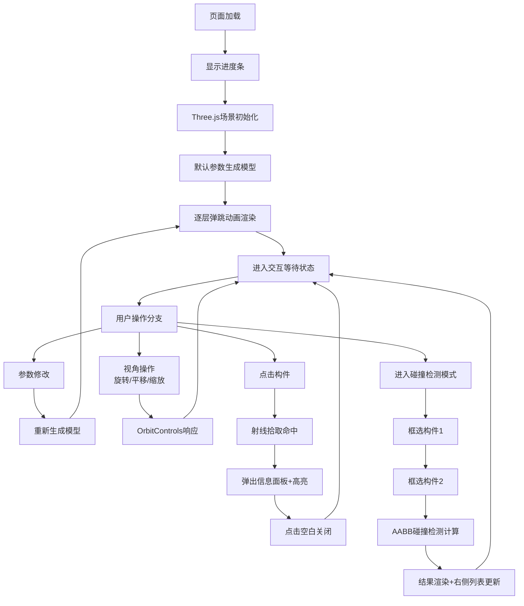

## 1. 产品概述

基于Three.js的三维建筑模型BIM交互式可视化工具，解决建筑师与施工方在项目中无法直观预览结构细节与碰撞检测的问题。通过参数化建模快速生成建筑框架，结合实时碰撞检测提升项目协作效率。

- **目标用户**：建筑师、结构工程师、施工管理人员、BIM技术人员
- **核心价值**：快速可视化建筑结构、直观识别构件碰撞、提升跨角色沟通效率

---

## 2. 核心功能

### 2.1 用户角色

| 角色 | 使用场景 | 核心操作权限 |
|------|----------|--------------|
| 建筑师 | 方案阶段快速验证结构布局 | 参数输入、模型操作、构件查看 |
| 结构工程师 | 梁柱板布置合理性检查 | 碰撞检测、构件详情查看 |
| 施工方 | 施工前冲突预判 | 碰撞检测、视角操作、结果导出 |

### 2.2 功能模块

1. **三维场景主界面**：模型渲染区、坐标网格、光照阴影
2. **参数化建模模块**：输入楼层/层高/柱间距/材料自动生成模型
3. **模型交互模块**：自由旋转、平移、缩放、重置视角
4. **构件信息模块**：点击构件弹出详情面板（编号/类型/尺寸/材料）
5. **碰撞检测模块**：框选两个构件检测空间重叠、结果列表展示

### 2.3 页面详情

| 页面名称 | 模块名称 | 功能描述 |
|----------|----------|----------|
| 主界面 | 顶部工具栏 | 浮动半透明毛玻璃风格，含旋转/平移/缩放/重置视角圆形按钮，悬停放大1.1倍+tooltip |
| 主界面 | 左侧构件列表面板 | 按柱/梁/板/墙分组折叠，展开时0.3s滑入动画 |
| 主界面 | 中央三维场景 | Three.js渲染，背景#1A1A2E，底部坐标网格+阴影 |
| 主界面 | 右侧面板 | 标签切换：构件详情 / 碰撞检测结果列表 |
| 主界面 | 加载进度条 | 页面初始加载动画，模型加载完成后隐藏 |
| 主界面 | 参数输入区 | 初始弹窗/侧边栏输入建筑参数触发模型生成 |
| 主界面 | 信息浮层 | 点击构件弹出，缩放进入动画0.2s ease-out |
| 碰撞检测 | 框选模式 | 拖拽出现半透明蓝色选框动画，选中构件高亮 |
| 碰撞检测 | 结果展示 | 碰撞红色闪烁+重叠百分比，不碰撞绿色对勾，右侧列表含对比缩略图 |

---

## 3. 核心流程

### 3.1 主用户流程

1. 用户打开页面，显示加载进度条
2. 加载完成后显示默认参数的建筑模型（或空白+参数输入弹窗）
3. 用户修改建筑参数（楼层/层高/柱间距/外墙材料），点击生成
4. 模型逐层弹跳出现（每层间隔0.3s，弹跳幅度8px）
5. 用户拖拽旋转（0.15x速度）、滚轮/双指缩放（0.5-5倍）、平移查看模型
6. 点击任意构件 → 弹出信息面板，对应元素高亮发光(#4FC3F7, 强度0.5)
7. 点击空白处 → 关闭信息面板，取消高亮
8. 进入碰撞检测模式，框选两个构件
9. 系统100ms内完成AABB碰撞检测，显示结果
10. 结果同步展示在右侧面板列表，含对比缩略图

### 3.2 Mermaid 流程图

---

## 4. 用户界面设计

### 4.1 设计风格

- **配色方案（暗色科技感）**：
  - 背景主色：`#1A1A2E`（深空蓝紫）
  - 面板主色：`#16213E`（深蓝灰）
  - 高亮强调：`#0F3460`（宝石蓝）
  - 构件高亮发光：`#4FC3F7`（冰蓝）
  - 碰撞警示：`#FF5252`（红色闪烁）
  - 正常通过：`#4CAF50`（绿色对勾）
  - 选框提示：半透明蓝 `rgba(79, 195, 247, 0.25)`

- **控件风格**：
  - 顶部工具栏：浮动半透明毛玻璃 `rgba(22, 33, 62, 0.8)` + backdrop-filter blur
  - 按钮：圆形图标按钮，悬停 `scale(1.1)`，过渡 `0.2s`
  - 面板：圆角 `10px`，轻微边框，透明度分层

- **字体选择**：
  - 标题/数字：`JetBrains Mono` / `SF Mono` 等宽科技感字体
  - 正文：`PingFang SC` / `Microsoft YaHei UI` 清晰易读
  - 尺寸：标题16px，正文13px，数字14px

- **布局风格**：
  - 三栏浮动布局：左构件列表+中3D场景+右详情/结果
  - 层级通过透明度和阴影区分（玻璃质感）
  - 顶部工具栏悬浮居中，不占主区域

- **图标风格**：
  - 线性描边图标，统一圆角，科技简约
  - 按钮图标与文字tooltip联动

### 4.2 页面设计概览

| 页面区域 | 模块名称 | UI元素与动效 |
|----------|----------|-------------|
| 全屏背景 | 坐标网格 | 浅灰→透明径向渐变，网格交点小圆点标记 |
| 顶部 | 工具栏 | 浮动毛玻璃条，6个圆形图标按钮（旋转/平移/缩放/重置/生成/检测），悬停放大+tooltip |
| 左侧 | 构件列表 | 4个可折叠分组（柱/梁/板/墙），展开0.3s ease-out滑入，每项含缩略色块+编号 |
| 中央 | 3D场景 | Three.js Canvas，建筑模型半透明楼板+深灰柱+浅灰墙，底部投影 |
| 中央浮层 | 信息面板 | 缩放进入动画0.2s，构件信息四字段，左上关闭按钮 |
| 中央浮层 | 框选矩形 | 蓝色半透明边框+填充，随鼠标拖拽实时更新 |
| 右侧 | 双标签面板 | 「详情」「碰撞结果」标签切换，碰撞项含缩略图+状态色标+百分比 |
| 底部中央 | 状态栏 | 坐标提示、FPS、构件总数（小字半透明） |
| 初始加载 | 进度条 | 居中百分比进度，完成后渐隐消失 |

### 4.3 响应式设计

- **设计优先级**：桌面端优先（Desktop-First）
- **主适配分辨率**：
  - `1920x1080`：标准布局，面板宽度280px
  - `1366x768`：面板宽度240px，控件间距等比缩放到0.85倍，文字大小保持不变
- **触控优化**：
  - 双指捏合缩放（OrbitControls原生支持）
  - 单指拖拽旋转，双指拖拽平移
- **最小兼容**：`1280x720`，低于此分辨率提示建议全屏

### 4.4 3D场景指导

- **环境与氛围**：
  - 场景背景：纯色 `#1A1A2E`，无HDRI以保持性能
  - 雾效：线性雾 `Fog(0x1A1A2E, 50, 200)` 增强空间感
  - 地面：接收阴影的大平面，材质 `MeshStandardMaterial` 深色低反射

- **灯光配置**：
  - 环境光：`AmbientLight(0xffffff, 0.4)` 基础照明
  - 主平行光：`DirectionalLight(0xffffff, 0.8)` 从右上45°投射，开启阴影
  - 辅助补光：`DirectionalLight(0x88aaff, 0.3)` 冷色补光从左下
  - 阴影贴图：`2048x2048`，PCFSoftShadowMap

- **相机设置**：
  - 初始相机：`PerspectiveCamera(50, aspect, 0.1, 1000)`
  - 初始位置：`(25, 20, 35)` 看向场景中心
  - 控制器：OrbitControls，`rotateSpeed=0.15`，`zoomSpeed=0.8`
  - 缩放范围：`minDistance=10, maxDistance=100` 对应视觉0.5-5倍

- **构图与焦点**：
  - 建筑模型居中，地面网格作为参照
  - 视点高度略高于建筑顶部，略带俯视便于全局观察
  - 高亮构件通过Bloom发光层成为视觉焦点

- **交互与动画**：
  - 模型生成：每层从地面向上弹跳，Tween.js `Bounce.EaseOut`，幅度8px，间隔300ms
  - 信息面板：`scale(0.85) → scale(1)` + opacity渐入 0.2s ease-out
  - 高亮切换：emissive强度 0→0.5 过渡 0.15s
  - 碰撞闪烁：emissive在红与原色间每250ms切换，持续2s
  - 列表展开：高度从0→auto 0.3s ease-out

- **后处理（可选降级）**：
  - Bloom发光（仅高亮层），threshold=0.9，intensity=0.8
  - 若性能不足自动降级为纯emissive无后处理

- **性能预算**：
  - 首次渲染：< 2s（含资源加载+几何体构建）
  - 稳定帧率：≥ 45 FPS（中等复杂度建筑：10层×6柱=约300个Mesh）
  - 碰撞检测：< 100ms（AABB O(n)遍历）
  - 内存占用：< 200MB
