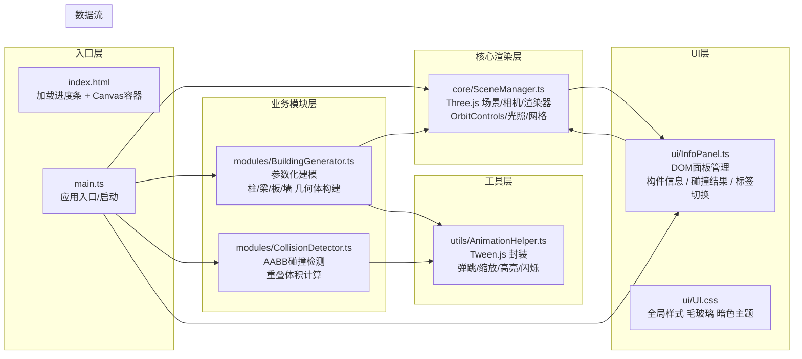

## 1. 架构设计



**模块数据流向说明**：
- `SceneManager`（单例）：被所有模块引用，提供场景/相机/渲染器/控制器访问入口
- `BuildingGenerator`：接收建筑参数 → 生成Mesh数组 → 通过SceneManager注入场景 → 调用AnimationHelper播放弹跳
- `CollisionDetector`：接收选中Mesh对 → 计算AABB重叠 → 调用AnimationHelper高亮闪烁 → 返回结果给InfoPanel
- `InfoPanel`：监听SceneManager射线拾取事件 → 显示/隐藏面板 → 订阅CollisionDetector结果更新列表
- `AnimationHelper`：纯工具类，被生成器和检测器调用，封装Tween.js动画

---

## 2. 技术选型说明

| 分类 | 技术 | 版本 | 选用理由 |
|------|------|------|----------|
| 语言 | TypeScript | ^5.x | 严格类型检查，避免三维场景坐标/向量运算类型错误 |
| 构建 | Vite | ^5.x | 冷启动快，HMR热更新流畅，原生TS支持 |
| 3D引擎 | Three.js | ^0.160.x | 成熟稳定，几何体/材质/阴影/射线拾取开箱即用 |
| 类型声明 | @types/three | ^0.160.x | 与Three.js版本同步的完整类型 |
| 动画库 | @tweenjs/tween.js | ^23.x | 轻量补间动画，弹跳/缓动函数丰富，与Three.js生态兼容 |
| CSS | 原生 + CSS变量 | - | 零额外依赖，通过backdrop-filter实现毛玻璃 |
| 测试 | 无（性能通过FPS监控） | - | 项目较小，以浏览器实测验证性能指标 |

**初始化方式**：手动搭建 Vite + TypeScript 骨架（不使用create-vite模板，避免冗余文件）

---

## 3. 目录结构与文件职责

```
auto49/
├── package.json              # 依赖声明 + dev脚本
├── vite.config.js            # Vite基础配置（server端口/路径别名）
├── tsconfig.json             # strict严格模式
├── index.html                # 入口HTML（进度条+canvas容器+样式外链）
└── src/
    ├── main.ts               # 应用入口：串联所有模块、启动渲染循环
    ├── types/
    │   └── bim.ts            # 全局类型：BuildingParams/ComponentInfo/CollisionResult
    ├── core/
    │   └── SceneManager.ts   # 场景管理：单例模式、相机/渲染器/光照/拾取
    ├── modules/
    │   ├── BuildingGenerator.ts   # 参数化建筑生成器
    │   └── CollisionDetector.ts   # AABB碰撞检测
    ├── ui/
    │   ├── InfoPanel.ts      # DOM面板管理（构件信息/碰撞列表/工具栏/构件列表）
    │   └── styles.css        # 全局样式、暗色主题、毛玻璃、动画
    └── utils/
        └── AnimationHelper.ts    # Tween动画封装
```

---

## 4. 核心类型定义（types/bim.ts）

```typescript
export type ComponentType = 'column' | 'beam' | 'slab' | 'wall';

export interface BuildingParams {
  floors: number;          // 楼层数
  floorHeight: number;     // 层高 (米)
  columnSpacingX: number;  // X向柱间距 (米)
  columnSpacingZ: number;  // Z向柱间距 (米)
  columnsX: number;        // X向柱数
  columnsZ: number;        // Z向柱数
  wallMaterial: string;    // 外墙材料名称
}

export interface ComponentInfo {
  id: string;                 // 构件编号 如 C-01-02
  type: ComponentType;        // 类型
  width: number;              // 宽 (m)
  height: number;             // 高 (m)
  length: number;             // 长 (m)
  material: string;           // 材料
  position: { x: number; y: number; z: number };  // 世界坐标
}

export interface CollisionResult {
  id: string;
  componentA: ComponentInfo;
  componentB: ComponentInfo;
  isColliding: boolean;
  overlapVolumePercent: number;  // 相对于A的重叠百分比
  thumbnailA?: string;           // 缩略图dataURL（渲染到离屏canvas）
  thumbnailB?: string;
  timestamp: number;
}

export interface BIMMeshUserData {
  componentInfo: ComponentInfo;
  originalEmissive: number;
  originalEmissiveIntensity: number;
}
```

---

## 5. 模块接口设计

### 5.1 SceneManager (单例)

```typescript
class SceneManager {
  static getInstance(): SceneManager;
  get scene(): THREE.Scene;
  get camera(): THREE.PerspectiveCamera;
  get renderer(): THREE.WebGLRenderer;
  get controls(): OrbitControls;
  get buildingGroup(): THREE.Group;
  
  init(container: HTMLElement, onProgress?: (p:number)=>void): Promise<void>;
  render(): void;                           // 单帧渲染
  startLoop(): void;                        // 启动requestAnimationFrame循环
  stopLoop(): void;
  resize(): void;                           // 视口resize
  resetCamera(): void;                      // 重置视角
  setInteractionMode(mode: 'orbit'|'pan'|'zoom'): void;
  raycast(screenX:number, screenY:number): THREE.Intersection[];  // 射线拾取
  addBuildingMeshes(meshes: THREE.Mesh[]): void;   // 添加模型
  clearBuilding(): void;                   // 清空模型
  onPick(callback: (info:ComponentInfo|null, mesh:THREE.Mesh|null)=>void): void;
  onFrame(callback: (dt:number)=>void): ()=>void;  // 注册帧回调（给TWEEN.update用）
  dispose(): void;
}
```

### 5.2 BuildingGenerator

```typescript
class BuildingGenerator {
  constructor(sceneManager: SceneManager, animHelper: AnimationHelper);
  generate(params: BuildingParams): Promise<ComponentInfo[]>;  // 返回所有构件信息
  setParams(params: Partial<BuildingParams>): void;
  getLastComponents(): ComponentInfo[];
  private createColumn(info: ComponentInfo): THREE.Mesh;
  private createBeam(info: ComponentInfo): THREE.Mesh;
  private createSlab(info: ComponentInfo): THREE.Mesh;
  private createWall(info: ComponentInfo): THREE.Mesh;
}
```

### 5.3 CollisionDetector

```typescript
class CollisionDetector {
  constructor(sceneManager: SceneManager, animHelper: AnimationHelper);
  detect(a: THREE.Mesh, b: THREE.Mesh): CollisionResult;   // 同步AABB检测 <100ms
  batchDetect(pairs: Array<[THREE.Mesh, THREE.Mesh]>): CollisionResult[];
  highlightCollision(a: THREE.Mesh, b: THREE.Mesh, durationMs?: number): void;  // 红色闪烁
  highlightSafe(a: THREE.Mesh, b: THREE.Mesh): void;      // 绿色对勾浮层
  clearHighlights(): void;
  private computeAABB(mesh: THREE.Mesh): THREE.Box3;
  private overlapVolume(a: THREE.Box3, b: THREE.Box3): number;
}
```

### 5.4 InfoPanel (DOM层)

```typescript
class InfoPanel {
  constructor(container: HTMLElement, sceneManager: SceneManager, generator: BuildingGenerator, detector: CollisionDetector);
  build(): void;                              // 构建所有DOM结构
  showComponentInfo(info: ComponentInfo, screenX: number, screenY: number): void;
  hideComponentInfo(): void;
  addCollisionResult(result: CollisionResult): void;
  clearCollisionResults(): void;
  switchTab(tab: 'detail' | 'collision'): void;
  onGenerateRequest(callback: (params: BuildingParams)=>void): void;  // 工具栏按钮事件
  onResetView(callback: ()=>void): void;
  onCollisionModeToggle(callback: (active:boolean)=>void): void;
  updateComponentList(components: ComponentInfo[]): void;  // 更新左侧列表
  showSelectionBox(startX:number, startY:number, curX:number, curY:number): void;
  hideSelectionBox(): void;
  showLoadingProgress(progress: number): void;   // 进度条0-100
  hideLoading(): void;
}
```

### 5.5 AnimationHelper

```typescript
class AnimationHelper {
  bounceIn(mesh: THREE.Mesh, delayMs: number, amplitude?: number): TWEEN.Tween;  // 弹跳出现
  scaleIn(el: HTMLElement, durationMs?: number): TWEEN.Tween;                     // 面板缩放进入
  highlightPulse(mesh: THREE.Mesh, color:number, intensity:number, durationMs?:number): TWEEN.Tween;
  blinkRed(mesh: THREE.Mesh, durationMs?: number): ()=>void;   // 返回停止函数
  fadeOut(el: HTMLElement, durationMs?: number): Promise<void>;
  slideDown(el: HTMLElement, targetHeight: number): TWEEN.Tween;  // 列表展开
  static update(): void;  // 每帧调用 TWEEN.update()
}
```

---

## 6. 关键算法与性能策略

### 6.1 参数化建模算法（BuildingGenerator）
- 遍历楼层 `for f in 0..floors-1`
- 每层遍历柱网 `for i in 0..columnsX, for j in 0..columnsZ` → 生成柱
- 楼板：按每层整体Box（或按跨度分块），y = f*floorHeight
- 梁：沿X向在柱顶 `y = (f+1)*floorHeight - beamH` 沿每条柱列线生成
- 外墙：在4个边界沿Z/X方向生成薄板
- **性能优化**：同类型同尺寸几何体复用（`BoxGeometry` 缓存池），材质按类型共享

### 6.2 AABB碰撞检测算法
1. `mesh.updateMatrixWorld(true)` 确保世界矩阵最新
2. `new Box3().setFromObject(mesh)` 获取世界空间AABB
3. 重叠判断：`aabb1.min < aabb2.max AND aabb1.max > aabb2.min` 在X/Y/Z三轴同时成立
4. 重叠体积：`overlapX * overlapY * overlapZ`，百分比 = overlap / min(volA, volB)
5. **性能**：纯数字运算，单次检测约0.01ms，批量1000对 < 10ms

### 6.3 射线拾取
- 屏幕坐标 → NDC：`(x/w*2-1, -y/h*2+1)`
- `Raycaster.setFromCamera(ndc, camera)` → `intersectObjects(buildingGroup.children, true)`
- 按距离排序取首个命中

### 6.4 性能保障策略
| 目标 | 手段 |
|------|------|
| 首屏 < 2s | 轻量初始化、几何体缓存、无纹理、CSS先显示骨架 |
| FPS ≥ 45 | 限制Mesh数量（同尺寸merge/复用Geometry）、阴影贴图2048、关闭不必要的抗锯齿降级 |
| 碰撞 < 100ms | AABB纯数学、无物理引擎、Box3对象复用池 |
| 内存 < 200MB | 重建模型时 dispose() 旧几何体/材质、Material共享 |

---

## 7. 启动与构建脚本

| 命令 | 作用 |
|------|------|
| `npm install` | 安装 five 依赖 |
| `npm run dev` | 启动 Vite 开发服务器（默认 http://localhost:5173 ） |
| `npm run build` | 生产构建（TypeScript严格检查通过后输出 dist/） |
| `npm run preview` | 本地预览生产构建 |
