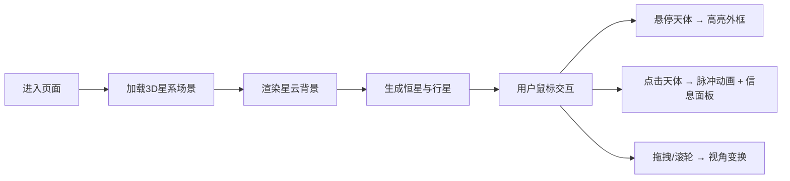

## 1. 产品概述

三维星系探索交互可视化应用，让用户在包含恒星、行星和星云的3D宇宙场景中自由漫游，沉浸式体验宇宙的深邃与壮美。

- 面向天文爱好者、教育场景用户，提供沉浸式3D宇宙探索体验
- 通过交互式可视化技术，让抽象的星系结构变得可感知、可探索
- 市场价值：科普教育、艺术展示、交互式数据可视化的标杆应用

## 2. 核心功能

### 2.1 用户角色

| 角色 | 注册方式 | 核心权限 |
|------|----------|----------|
| 普通用户 | 无需注册 | 自由浏览、点击查看天体信息 |

### 2.2 功能模块

1. **3D场景模块**：螺旋星系生成、天体渲染、星云背景
2. **交互控制模块**：相机漫游控制、天体拾取、高亮动画
3. **信息展示模块**：天体信息面板、性能监控面板
4. **视觉效果模块**：发光效果、粒子系统、过渡动画

### 2.3 页面详情

| 页面名称 | 模块名称 | 功能描述 |
|---------|---------|----------|
| 主页面 | 3D星系场景 | 渲染螺旋星系，包含50+恒星及环绕行星，支持鼠标拖拽旋转、滚轮缩放 |
| 主页面 | 天体信息面板 | 左上角半透明毛玻璃面板，显示点击天体的名称、类型、半径、温度、距离 |
| 主页面 | 性能监控面板 | 右下角实时显示FPS、顶点数、渲染调用次数 |
| 主页面 | 星云背景 | 2000个粒子组成的动态星云，色彩循环渐变 |

## 3. 核心流程

用户进入页面后，3D场景自动加载，用户可通过鼠标拖拽旋转视角、滚轮缩放距离，悬停天体时显示高亮外框，点击天体触发脉冲动画并弹出信息面板，整个过程流畅无阻。

## 4. 用户界面设计

### 4.1 设计风格

- **主色调**：纯黑背景（#000000），天体暖色（橙黄红）与冷色（蓝白），星云紫蓝与粉红渐变
- **UI元素风格**：半透明毛玻璃效果（backdrop-filter: blur(10px) + 透明度0.2
- **字体**：等宽字体（monospace），字号14px
- **布局**：信息面板左上固定，性能面板右下固定，z-index层级管理
- **圆角与阴影**：统一8px圆角，柔和内阴影
- **动画**：0.3秒淡入上滑，0.2秒脉冲缩放

### 4.2 页面设计概述

| 页面名称 | 模块名称 | UI元素 |
|---------|---------|--------|
| 主页面 | 3D场景 | 纯黑背景、螺旋星系结构、发光恒星、环绕行星、动态星云 |
| 主页面 | 信息面板 | 毛玻璃背景、等宽字体、5项信息条目、悬停tooltip |
| 主页面 | 性能面板 | 实时数据、FPS红色警告（<30）、K单位显示 |
| 主页面 | 交互反馈 | 悬停亮蓝外框（2px）、点击脉冲缩放、天体名称省略显示 |

### 4.3 响应式

桌面端优先，自适应全屏显示，支持窗口大小变化时自动调整渲染尺寸。

### 4.4 3D场景指导

- **环境氛围**：深邃宇宙感，无HDRI，纯黑背景营造星空沉浸感
- **光照设置**：自发光材质 + 点光源跟随恒星，营造恒星发光效果
- **相机设置**：PerspectiveCamera，初始距离50单位，视野角度75°
- **相机运动**：OrbitControls，拖拽旋转、滚轮缩放，阻尼0.15，平移速度0.3
- **构图**：螺旋星系居中，恒星随机分布在螺旋臂上，行星环绕恒星
- **交互与动画**：点击高亮光环闪烁、悬停外框加粗、点击脉冲缩放
- **后期处理**：发光效果（Bloom）、抗锯齿
- **资源来源**：纯程序化生成，无外部资源依赖
- **性能预算**：FPS ≥ 45，顶点数控制在合理范围，粒子系统2000个
