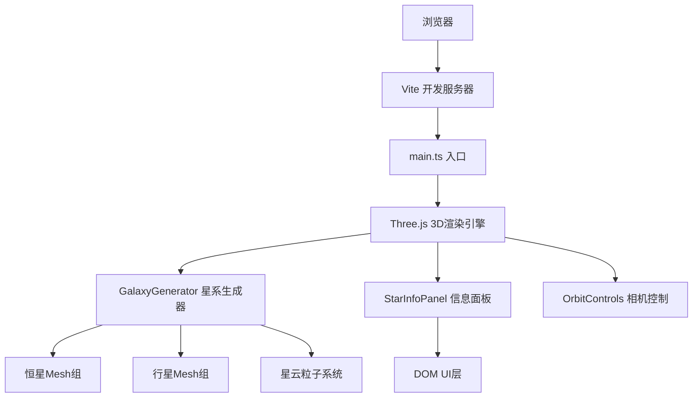

## 1. 架构设计



## 2. 技术选型

- **前端**：TypeScript + Three.js + Vite
- **3D引擎**：three@^0.160.0
- **类型定义**：@types/three@^0.160.0
- **语言**：TypeScript@^5.0
- **构建工具**：Vite@^5.0
- **无后端、无数据库，纯前端应用

## 3. 项目结构

| 文件路径 | 职责描述 |
|---------|---------|
| `package.json` | 项目依赖与脚本配置 |
| `vite.config.js` | Vite构建配置 |
| `tsconfig.json` | TypeScript严格模式配置 |
| `index.html` | 入口HTML页面 |
| `src/main.ts` | 场景初始化、相机控制、动画循环、事件调度 |
| `src/GalaxyGenerator.ts` | 星系数据生成、Mesh创建、天体属性管理 |
| `src/StarInfoPanel.ts` | UI面板组件、信息展示、动画效果 |
| `src/types/` | 类型定义目录（按需创建） |

## 4. 核心数据结构

### 4.1 天体数据类型

```typescript
interface CelestialBody {
  id: string;
  name: string;
  type: 'star' | 'planet';
  position: THREE.Vector3;
  color: THREE.Color;
  radius: number;
  temperature: number;
  distanceFromCenter: number;
  parentStarId?: string;
}
```

### 4.2 面板状态

```typescript
interface PanelState {
  visible: boolean;
  body: CelestialBody | null;
}
```

## 5. 性能监控指标

| 指标 | 目标值 |
|------|--------|
| 帧率 | ≥ 45 FPS |
| 点击响应 | ≤ 100ms |
| 缩放范围 | 5-200单位 |
| 恒星数量 | ≥ 50颗 |
| 行星数量 | 每颗恒星1-3颗 |
| 星云粒子 | 2000个 |

## 6. 核心类设计

### 6.1 GalaxyGenerator 类

- 方法：
- `generateGalaxy()`：生成螺旋星系
- `createStar()`：创建恒星Mesh
- `createPlanet()`：创建行星Mesh
- `createNebula()`：创建星云粒子系统
- `getBodyByMesh()`：根据Mesh获取天体数据
- `highlightBody()`：高亮天体（发光动画）
- `pulseAnimation()`：脉冲缩放动画

### 6.2 StarInfoPanel 类

- 方法：
- `show(body)`：显示面板（淡入上滑动画）
- `hide()`：隐藏面板
- `update(body)`：更新面板内容
- `formatTemperature()`：格式化温度显示
- `truncateName()`：名称截断处理
