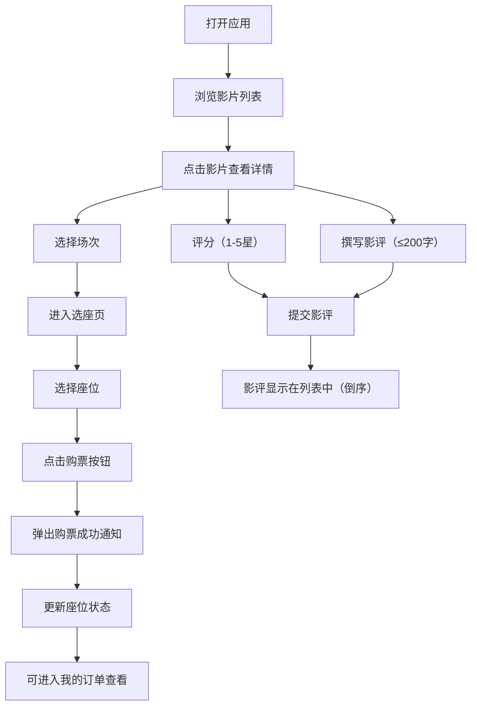

## 1. 产品概述

独立影院排片与在线选座平台，为小型独立影院提供数字化运营解决方案，帮助观众在线浏览影片、选择场次座位、完成购票并发表影评，从而提升上座率与观众互动体验。

- **目标用户**：独立影院观众（普通观影人群、影迷）
- **核心价值**：简化购票流程，提升观影体验，增强观众互动粘性
- **市场定位**：面向小型独立影院的轻量级在线票务系统

---

## 2. 核心功能

### 2.1 用户角色
| 角色 | 注册方式 | 核心权限 |
|------|----------|----------|
| 普通观众 | 无需注册（模拟用户） | 浏览影片、选座购票、查看订单、发表影评 |

### 2.2 功能模块
1. **首页/影片列表页**：影片分类展示（热映/即将上映）、影片卡片、影片详情
2. **场次选择页**：按日期分组场次、场次卡片（时间/语言/余座）
3. **选座页面**：座位网格、状态标识、选座交互、购票确认
4. **我的订单页**：历史订单列表、订单状态标识
5. **影评区**：评分组件、评论列表、新增评论

### 2.3 页面详情
| 页面名称 | 模块名称 | 功能描述 |
|----------|----------|----------|
| 首页 | 导航栏 | 品牌Logo、首页/我的订单导航、固定顶部半透明 |
| 首页 | 影片分类切换 | 正在热映 / 即将上映 Tab 切换 |
| 首页 | 影片卡片列表 | 玻璃拟态卡片：海报、片名、时长、评分、简介 |
| 影片详情 | 影片信息区 | 大幅海报、影片详细信息 |
| 影片详情 | 场次选择区 | 按日期分组，场次卡片显示时间/语言/余座，点击进入选座 |
| 影片详情 | 影评区 | 评分（1-5星）、评论输入、评论列表倒序排列 |
| 选座页 | 影厅信息 | 影片名、场次时间、影厅名称 |
| 选座页 | 座位网格 | 10排×12座，已售灰/可选绿/已选蓝，悬停放大显示行列号 |
| 选座页 | 选座信息栏 | 已选座位列表、总价、购票按钮 |
| 选座页 | 购票成功通知 | 右上角滑入通知条，3秒自动消失 |
| 我的订单 | 订单列表 | 订单卡片：影片名、场次、座位、状态色块、购票时间 |

---

## 3. 核心流程

### 主要用户流程
观众打开应用 → 浏览影片列表 → 点击影片查看详情 → 选择场次 → 进入选座页选择座位 → 确认购票（弹出成功通知） → 可查看我的订单 → 观影后回到影片详情评分并撰写影评 → 影评立即显示在列表中

---

## 4. 用户界面设计

### 4.1 设计风格
- **主色调**：暗蓝灰色 `#1A1A2E`（深色主题背景）
- **强调色**：亮红色/粉红色 `#E94560`（按钮、强调元素）
- **辅助色**：
  - 可选座位：绿色
  - 已选座位：蓝色（带呼吸光圈动画）
  - 已售座位：灰色
- **按钮风格**：圆角矩形，`E94560` 强调色，点击触感动画（缩小→恢复 0.15s）
- **字体**：现代无衬线字体，清晰层级，深色背景配浅色文字
- **布局风格**：卡片式布局，导航栏固定顶部，玻璃拟态影片卡片
- **图标风格**：`react-icons` 线性图标，简洁现代

### 4.2 页面设计概览
| 页面名称 | 模块名称 | UI 元素 |
|----------|----------|---------|
| 首页 | 导航栏 | 固定顶部，半透明背景，品牌文字+导航链接 |
| 首页 | 影片卡片 | 玻璃拟态（半透明模糊+1px白边），悬停上移4px+加深阴影（0.3s过渡） |
| 选座页 | 座位图 | 深灰背景 `#2D2D44`，居中布局，圆角矩形座位，已选座位0.5s蓝色呼吸光圈 |
| 选座页 | 座位悬停 | 放大1.2倍，工具提示显示行号座号 |
| 选座页 | 座位选中 | 变蓝色，0.3s缩放弹跳动画 |
| 全部页面 | 通知条 | 右上角滑入，半透明，左侧对勾图标，3秒自动消失 |
| 我的订单 | 订单卡片 | 左侧圆角色块（绿/红/灰）标记状态 |
| 影评区 | 星星评分 | 悬停变色，点击锁定，粒子散开动画 |

### 4.3 响应式设计
- **桌面优先**：默认桌面端多列布局
- **移动端适配**（宽度 < 768px）：
  - 影片列表：多列 → 单列
  - 座位图：自动调整座位尺寸，适配屏幕宽度
  - 导航栏：简化布局，保持可读性
  - 触摸优化：增大可点击区域

### 4.4 性能要求
- 座位图（120座）首次渲染 ≤ 500ms
- 选座/购票状态切换响应延迟 < 100ms
