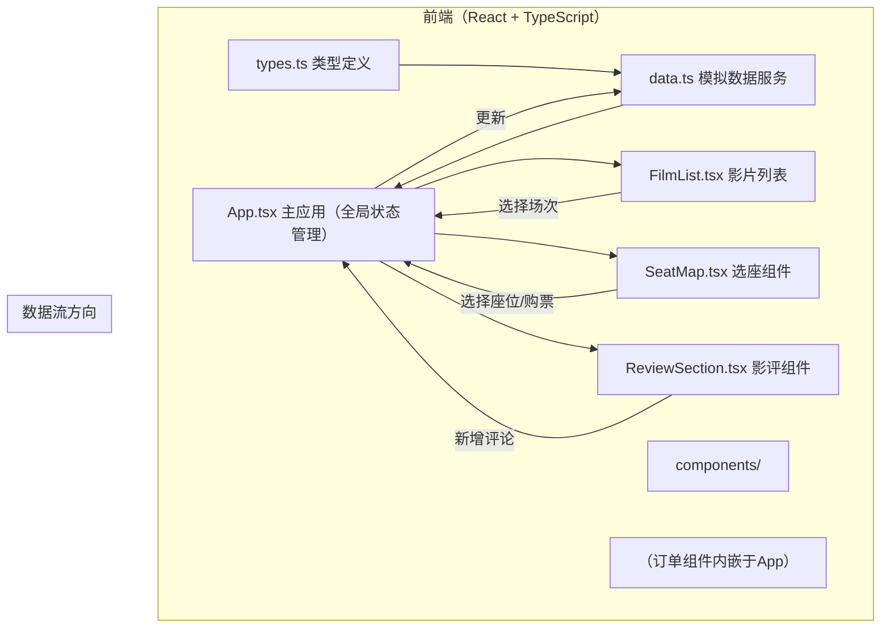
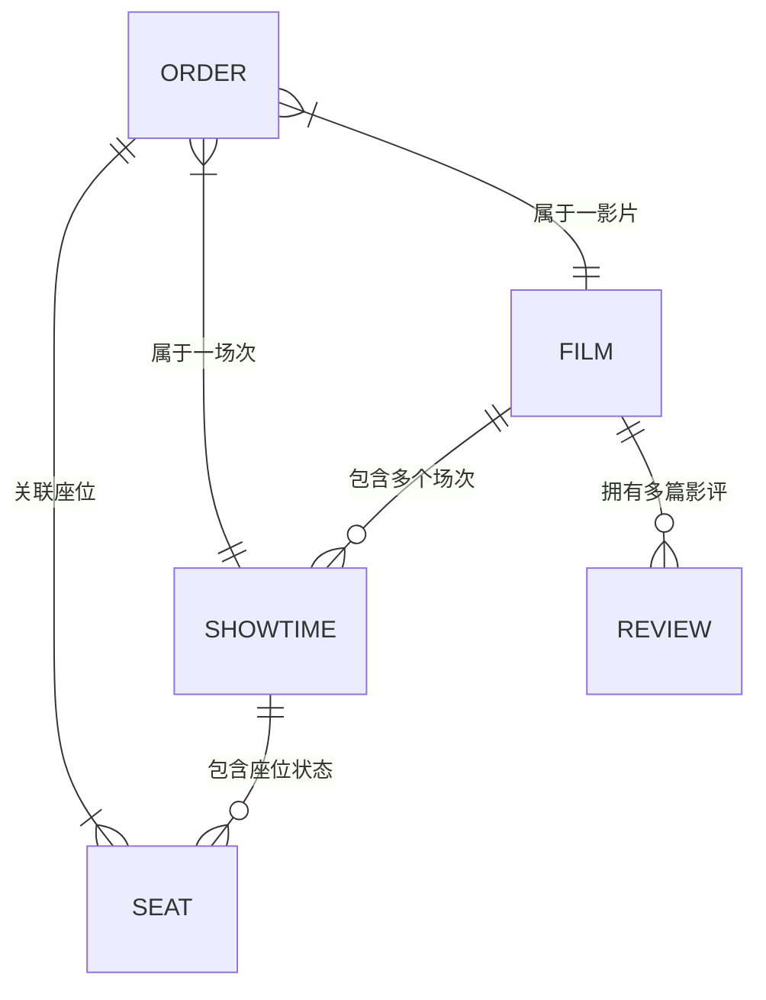

## 1. 架构设计



---

## 2. 技术选型说明

| 技术 | 版本/说明 | 用途 |
|------|-----------|------|
| **React** | 18.x | UI 组件库 |
| **TypeScript** | 5.x 严格模式 | 类型安全 |
| **Vite** | 5.x | 构建工具，HMR 开发服务器 |
| **@vitejs/plugin-react** | - | React 构建插件 |
| **react-hot-toast** | - | 轻量通知组件（购票成功提示） |
| **react-icons** | - | 图标库（星星、对勾、导航图标） |
| **CSS** | 原生 CSS（无需 Tailwind） | 用户要求自定义样式、动画效果 |

> **说明**：用户未要求 Tailwind，且有大量自定义动画/玻璃拟态/呼吸光圈等特殊样式需求，使用原生 CSS 配合 CSS 变量更灵活可控。

---

## 3. 页面路由（单页应用，基于状态切换视图）

| 视图状态 | 说明 | 触发条件 |
|----------|------|----------|
| `home` | 首页 - 影片列表 | 默认视图 / 点击"首页"导航 |
| `filmDetail` | 影片详情 + 场次选择 | 点击影片卡片 |
| `seatSelection` | 选座页面 | 点击场次卡片 |
| `myOrders` | 我的订单 | 点击"我的订单"导航 |

> **说明**：使用 App 内部状态切换视图而非 `react-router`，保持项目简洁符合用户"轻量级"文件结构要求。若后续扩展可引入路由。

---

## 4. 数据模型（TypeScript 类型）

### 4.1 核心类型定义



**类型定义对应 src/types.ts：**

| 类型名称 | 字段说明 |
|----------|----------|
| **Film** | `id`, `title`, `poster`, `duration`, `rating`, `description`, `status` (now_showing/coming_soon), `releaseDate` |
| **Showtime** | `id`, `filmId`, `date`, `time`, `language`, `hallName`, `totalSeats`, `soldSeats` (座位ID数组) |
| **Seat** | `row` (1-10), `col` (1-12), `id` (如 'R5C8'), `status` (available/sold/selected) |
| **Review** | `id`, `filmId`, `userName`, `rating` (1-5), `content`, `createdAt` |
| **Order** | `id`, `filmId`, `showtimeId`, `seats` (Seat[]), `purchaseTime`, `status` (completed/cancelled/used) |

---

## 5. 文件结构与调用关系

```
src/
├── types.ts            # 类型定义（所有组件 import）
│   └── 定义 Film, Showtime, Seat, Review, Order 等
│
├── data.ts             # 模拟数据服务（所有组件 import）
│   ├── films[]         # 影片数据
│   ├── showtimes[]     # 场次数据
│   ├── reviews[]       # 影评数据
│   ├── orders[]        # 订单数据
│   ├── soldSeatsMap    # { showtimeId: Set<seatId> }
│   ├── getShowtimes(filmId) → Showtime[]
│   ├── getReviews(filmId) → Review[]
│   ├── addReview(review) → void
│   ├── markSeatsSold(showtimeId, seatIds) → void
│   ├── createOrder(order) → void
│   └── getOrders() → Order[]
│
├── App.tsx             # 主应用（管理全局状态）
│   ├── 状态：currentView, selectedFilm, selectedShowtime, selectedSeats, orders, reviews
│   ├── 导入：FilmList, SeatMap, ReviewSection
│   ├── 导入：data.ts 的读写函数
│   └── 数据流：
│       ├── App → props → FilmList (films)
│       ├── FilmList → onSelectFilm → App (选择影片)
│       ├── FilmList → onSelectShowtime → App (选择场次)
│       ├── App → props → SeatMap (showtime, soldSeats)
│       ├── SeatMap → onSeatChange → App (座位选择变化)
│       ├── App → handlePurchase → data.ts (更新座位, 创建订单)
│       ├── App → props → ReviewSection (reviews, filmId)
│       └── ReviewSection → onAddReview → App → data.ts (新增影评)
│
├── main.tsx            # 入口，渲染 App
│
├── index.css           # 全局样式（主题变量、动画关键帧）
│
└── components/
    ├── FilmList.tsx
    │   ├── 接收 props: films: Film[], onSelectFilm(film), onSelectShowtime(showtime)
    │   ├── 渲染：Tab切换(热映/即将) + 影片卡片列表
    │   └── 点击场次 → 调用 onSelectShowtime 回调
    │
    ├── SeatMap.tsx
    │   ├── 接收 props: showtime: Showtime, soldSeats: string[], onSeatChange(selectedSeats)
    │   ├── 渲染：10×12 座位网格，座位图例，已选座位汇总
    │   ├── 内部状态：localSelectedSeats (选中的seatId数组)
    │   ├── 导出：onSeatChange 回传给父组件 Seat[]
    │   └── 购票按钮 → 由父组件 App 提供 onClick 回调
    │
    └── ReviewSection.tsx
        ├── 接收 props: reviews: Review[], filmId: string, onAddReview(review)
        ├── 渲染：星星评分组件, 评论输入框(≤200字), 评论列表(倒序)
        └── 提交 → 构造 Review 对象 → 调用 onAddReview 回调
```

---

## 6. 性能优化策略

| 场景 | 优化措施 |
|------|----------|
| **座位图首次渲染** | 座位组件使用纯函数组件 + `React.memo`，避免不必要重渲染 |
| **选座状态切换** | 使用局部状态管理（SeatMap 内部维护选中状态），仅必要时回调 App |
| **影片列表滚动** | 卡片懒渲染（可选），使用 CSS transform 优化 hover 动画（GPU 加速） |
| **动画性能** | 动画属性优先使用 `transform` 和 `opacity`，避免触发 layout/paint |
