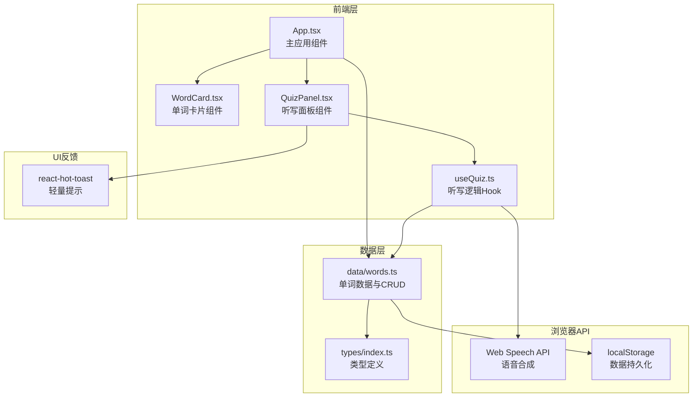
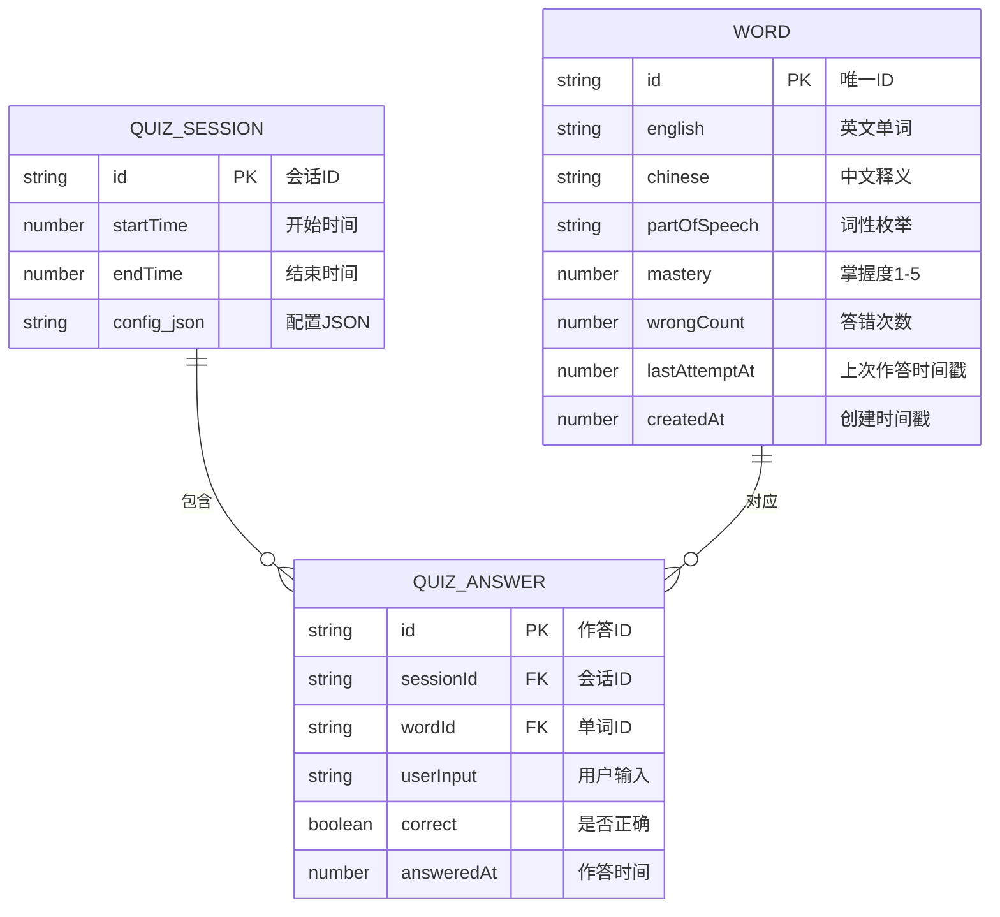

## 1. 架构设计



---

## 2. 技术选型说明

| 层级 | 技术 | 版本 | 用途说明 |
|------|------|------|---------|
| 构建工具 | Vite | ^5.0 | 快速冷启动和热更新的前端构建工具 |
| 框架 | React | ^18.2 | 基于函数组件 + Hooks 的UI构建 |
| 语言 | TypeScript | ^5.0 | 严格模式下的类型安全开发 |
| 语言支持 | @vitejs/plugin-react | ^4.0 | Vite的React+TSX支持插件 |
| 类型声明 | @types/react / @types/react-dom | ^18.2 | React API的TypeScript类型定义 |
| UI反馈 | react-hot-toast | ^2.4 | 轻量级Toast提示，用于操作反馈 |
| 浏览器API | Web Speech API | - | 原生 `speechSynthesis` 实现英文单词朗读 |
| 持久化 | localStorage | - | 浏览器本地存储单词数据和统计信息 |

**无后端架构**：本应用为纯前端实现，数据存储于浏览器 localStorage，适合个人使用场景，无需服务器部署。

---

## 3. 项目结构与路由

### 3.1 文件组织

```
auto55/
├── package.json
├── vite.config.ts
├── tsconfig.json
├── index.html
└── src/
    ├── types/
    │   └── index.ts          # Word, QuizConfig, QuizResult 等类型定义
    ├── data/
    │   └── words.ts          # 初始模拟数据 + CRUD 操作方法
    ├── hooks/
    │   └── useQuiz.ts        # 听写模式核心逻辑封装
    ├── components/
    │   ├── WordCard.tsx      # 单个单词卡片组件
    │   └── QuizPanel.tsx     # 听写控制面板与答题界面
    └── App.tsx               # 根组件：两栏布局 + 全局状态管理
```

### 3.2 路由设计

本应用为单页应用（SPA），不使用前端路由库，通过 App.tsx 中的状态切换视图模式：

| 视图模式 | 触发条件 | 说明 |
|---------|---------|------|
| 管理模式（默认） | 初次进入 / 听写结束返回 | 显示单词列表+听写配置区 |
| 听写模式 | 点击「开始听写」/「快速复习」 | 显示答题界面，顶栏滑入动画 |
| 报告弹窗 | 听写全部完成 | 得分报告模态框中心缩放弹出 |

---

## 4. API 定义（本地方法）

### 4.1 类型定义摘要

```typescript
// 词性枚举
type PartOfSpeech = 'noun' | 'verb' | 'adjective' | 'adverb' | 'preposition';

// 语速枚举
type SpeechSpeed = 'slow' | 'normal' | 'fast';

// 单词数据结构
interface Word {
  id: string;
  english: string;
  chinese: string;
  partOfSpeech: PartOfSpeech;
  mastery: number;           // 1-5 掌握度星级
  wrongCount: number;        // 累计答错次数
  lastAttemptAt: number;     // 上次作答时间戳
  createdAt: number;
}

// 听写配置
interface QuizConfig {
  selectedParts: PartOfSpeech[];
  questionCount: number;     // 5-20
  speed: SpeechSpeed;
}

// 单题作答结果
interface QuizAnswer {
  wordId: string;
  english: string;
  userInput: string;
  correct: boolean;
}

// 听写结果报告
interface QuizResult {
  totalQuestions: number;
  correctCount: number;
  accuracy: number;          // 0-100
  durationMs: number;
  answers: QuizAnswer[];
  wrongWords: Word[];
}
```

### 4.2 数据层方法（words.ts）

| 方法签名 | 说明 |
|---------|------|
| `getInitialWords(): Word[]` | 返回20+条预置模拟单词数据 |
| `loadWords(): Word[]` | 从 localStorage 读取，无则返回初始数据 |
| `saveWords(words: Word[]): void` | 写入 localStorage |
| `addWord(words: Word[], payload): Word[]` | 添加新单词，返回新数组 |
| `updateMastery(words, id, mastery): Word[]` | 更新掌握度星级 |
| `recordAnswer(words, id, correct): Word[]` | 记录作答结果（错次+时间） |
| `filterByParts(words, parts): Word[]` | 按词性筛选 |
| `sortAlphabetically(words, order): Word[]` | 按字母排序 |
| `getUrgencyScore(word): number` | 计算紧迫度分数（0-100） |
| `getMostUrgentWords(words, n): Word[]` | 获取最需复习的N个单词 |

### 4.3 自定义 Hook 方法（useQuiz.ts）

| 方法/状态 | 类型 | 说明 |
|---------|------|------|
| `quizWords` | `Word[]` | 当前听写的单词序列 |
| `currentIndex` | `number` | 当前题目索引 |
| `highlightId` | `string \| null` | 当前高亮闪烁的单词ID |
| `feedback` | `FeedbackState` | 当前答题反馈状态 |
| `startQuiz(config, words)` | `void` | 初始化听写，生成随机序列 |
| `speakWord(text, speed)` | `void` | 调用 Web Speech API 朗读 |
| `submitAnswer(input)` | `{ correct, word }` | 验证答案，更新统计，推进进度 |
| `finishQuiz()` | `QuizResult` | 生成最终报告数据 |
| `resetQuiz()` | `void` | 重置听写状态 |

---

## 5. 数据模型

### 5.1 ER 图



### 5.2 存储键名约定

| localStorage 键 | 值类型 | 说明 |
|----------------|--------|------|
| `smart-wordbook:words` | `Word[]` JSON | 全部单词数据 |
| `smart-wordbook:session` | 可选 | 最近一次听写会话缓存 |

---

## 6. 性能与交互关键点

### 6.1 语音播放延迟优化（目标 <200ms）
- 提前在 `startQuiz` 时调用 `speechSynthesis.getVoices()` 预热语音引擎
- 第一题语音在切换视图时**预触发**一次空播，避免首次调用冷启动
- 使用 `SpeechSynthesisUtterance` 的 `onend` 事件精确控制流程

### 6.2 动画策略
- 全部动画使用 **CSS transition / animation**，避免 JS 阻塞主线程
- 星级切换通过 transform: scale(1.2) + box-shadow 实现光晕，使用 transform 层提升性能
- 导航栏滑入使用 transform: translateX，得分报告使用 transform: scale + opacity

### 6.3 渲染优化
- 单词列表使用 `useMemo` 缓存筛选/排序结果
- WordCard 使用 `React.memo` 包装，减少非必要重渲染
- 听写状态变化仅触发 QuizPanel 重绘，不影响单词列表

---
