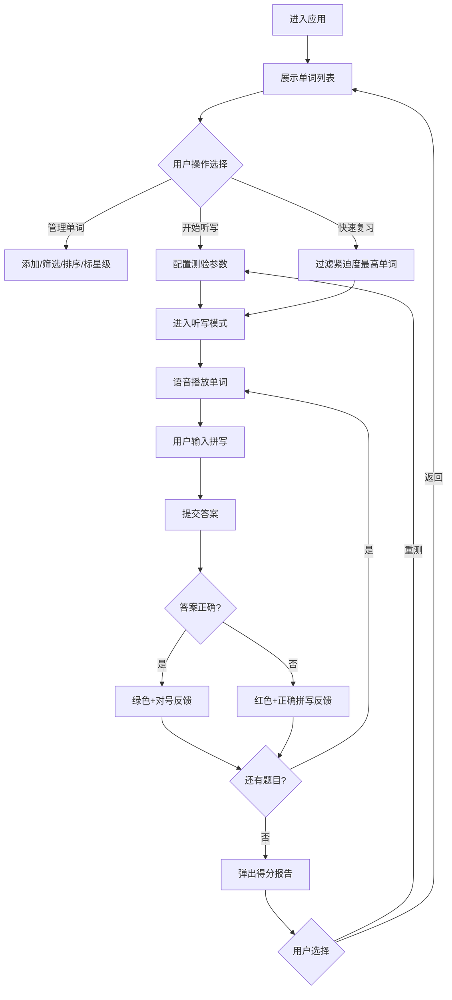

## 1. 产品概述

智慧单词本是一款面向语言学习者的个性化听写训练应用，解决背单词时容易遗忘、缺乏针对性复习计划的痛点。通过智能听写测验、掌握度追踪和复习紧迫度提醒，帮助用户高效记忆单词。

- 核心目标：提升单词记忆效率，实现针对性复习
- 目标用户：英语学习者、备考学生、语言爱好者
- 市场价值：填补「听写+智能复习」一体化工具的空白

---

## 2. 核心功能

### 2.1 功能模块

1. **单词管理区**：单词卡片展示、添加单词、词性筛选、字母排序、掌握度星级标记、复习紧迫度进度条
2. **听写控制区**：题目设置（词性选择、题量、语速）、听写答题界面、即时反馈、得分报告

### 2.2 页面详情

| 页面名称 | 模块名称 | 功能描述 |
|---------|---------|---------|
| 主界面 | 单词卡片列表 | 横向卡片展示词性标签、英文、中文释义、掌握度星级、紧迫度进度条 |
| 主界面 | 添加单词表单 | 输入英文、中文、选择词性，点击添加 |
| 主界面 | 筛选排序栏 | 按词性筛选（多选）、按字母A-Z/Z-A排序 |
| 主界面 | 听写配置面板 | 选择词性分类、设置题量(5-20)、选择语速(慢/正常/快) |
| 听写模式 | 答题界面 | 语音播放、单词高亮闪烁、拼写输入框、提交按钮 |
| 听写模式 | 即时反馈 | 正确显示绿色边框+对号，错误显示红色边框+正确拼写 |
| 听写模式 | 得分报告 | 模态框显示正确率、用时、错误单词列表，支持重测/返回 |
| 主界面 | 快速复习入口 | 紧迫度最高的单词一键进入听写模式快速复习 |

---

## 3. 核心流程

### 3.1 主要用户流程

**单词管理流程**：用户进入应用 → 浏览单词列表 → 点击星级调整掌握度 → 按词性筛选或排序 → 添加新单词（填表单→提交→即时显示）

**听写测验流程**：用户在右侧配置 → 选择题性分类 → 设置题量和语速 → 点击开始 → 进入听写模式（导航栏滑入动画）→ 系统随机朗读单词 → 用户拼写提交 → 显示即时反馈 → 下一题 → 完成后弹出得分报告 → 选择重测或返回管理

**快速复习流程**：用户查看紧迫度进度条 → 识别红色/橙色高紧迫度单词 → 点击单词卡片的快速复习按钮 → 直接进入听写模式，优先复习紧迫度最高的单词

### 3.2 Mermaid 流程图

---

## 4. 用户界面设计

### 4.1 设计风格

- **主色调**：浅米色 #FDF6EC（背景）、深蓝灰色 #2C3E50（主文字）
- **词性标签色**：名词蓝色 #4A90D9、动词绿色 #50B86C、形容词橙色 #F5A623、副词紫色 #9B59B6、介词粉色 #E74C3C
- **紧迫度渐变色**：红色（高）→ 橙色（中）→ 绿色（低）
- **卡片风格**：白色背景 + 8px圆角 + 2px浅灰色边框 + 柔和阴影 `0 2px 8px rgba(0,0,0,0.06)`
- **按钮风格**：圆角矩形，悬停时0.2s背景颜色过渡
- **布局结构**：桌面端两栏（左60%单词管理 / 右40%听写控制），<768px堆叠为上下排列
- **动画效果**：
  - 听写模式导航栏：左侧滑入 0.4s ease-out
  - 得分报告模态框：中心缩放弹出 0.3s cubic-bezier
  - 星级切换：缩放1.2倍 + 黄色光晕 0.3s ease-out
  - 词性标签：悬停背景加深

### 4.2 页面设计概览

| 页面名称 | 模块名称 | UI元素 |
|---------|---------|---------|
| 主界面 | 顶部标题栏 | 应用名称「智慧单词本」、当前单词总数统计 |
| 主界面 | 筛选工具栏 | 多选词性标签按钮组、A-Z/Z-A排序切换、添加新单词按钮 |
| 主界面 | 单词卡片列表 | 横向滚动卡片流、每张卡片含：词性彩签、英文粗体、中文灰字、掌握度星级(1-5)、紧迫度彩色进度条 |
| 主界面 | 添加单词表单 | 英文输入框、中文输入框、词性下拉选择、提交按钮（悬浮在筛选栏下方） |
| 听写配置 | 参数设置面板 | 词性多选卡片、题量滑块(5-20)、语速单选按钮组、醒目的「开始听写」主按钮 |
| 听写模式 | 答题页面 | 顶部返回导航栏（滑入动画）、当前进度指示、播放/重播按钮、大号输入框、提交按钮 |
| 听写模式 | 反馈效果 | 输入框边框变色（绿/红）+ 右侧图标（对号/叉号）、下方显示正确拼写（错误时） |
| 听写模式 | 得分报告 | 模态框遮罩层、居中卡片、得分大字显示、统计信息网格、错误单词列表、操作按钮组 |

### 4.3 响应式设计

- 桌面端（≥768px）：两栏布局，左60%右40%，卡片横向排列
- 平板/移动端（<768px）：上下堆叠布局，单词管理区在上、听写控制区在下
- 触摸优化：按钮最小高度44px，点击区域适当扩大

---
