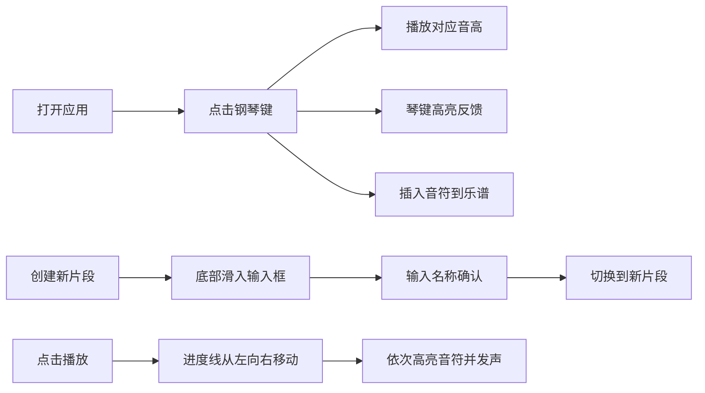

## 1. 产品概述

个人音乐创作灵感捕捉器，帮助音乐创作者随时记录脑海中的旋律片段、和弦进行或节奏型，通过虚拟钢琴键盘快速试听调整，并组合成完整乐谱草稿。

- 目标用户：音乐创作者、词曲作者、音乐爱好者
- 核心价值：降低灵感记录门槛，快速将音乐想法转化为可视化乐谱

## 2. 核心功能

### 2.1 功能模块
1. **虚拟钢琴键盘**：两排八度共16键，点击发声并高亮
2. **乐谱编辑区**：展示和编辑音符序列，带五线谱参考线
3. **灵感片段管理**：多片段独立管理，标签切换
4. **播放控制**：播放/暂停/停止，进度线动画，速度调节

### 2.2 页面详情
| 页面名称 | 模块名称 | 功能描述 |
|---------|---------|---------|
| 主页面 | 播放控制条 | 播放、暂停、停止按钮，速度调节 |
| 主页面 | 乐谱编辑区 | 五线谱背景，音符横向排列，音高纵向区分，红色进度线 |
| 主页面 | 片段标签栏 | 多片段切换，新增片段按钮，滑动动画 |
| 主页面 | 虚拟钢琴键盘 | 16键钢琴，点击发声高亮，插入音符 |

## 3. 核心流程

用户打开应用 → 点击钢琴键试听音高 → 音符自动插入乐谱 → 创建/切换灵感片段 → 点击播放预览旋律 → 调整完善片段

## 4. 用户界面设计

### 4.1 设计风格
- 深色主题：背景#1E1E2E，乐谱区#2D2D44，键盘区#3D3D5C
- 圆角设计：所有按钮标签 border-radius: 8px
- 交互反馈：悬停背景变浅+轻微上移2px，0.2s ease过渡
- 钢琴配色：白键白色、黑键黑色，按真实钢琴排列

### 4.2 页面设计概览
| 页面名称 | 模块名称 | UI元素 |
|---------|---------|-------|
| 主页面 | 播放控制条 | 播放/暂停/停止按钮，速度滑块，水平布局 |
| 主页面 | 乐谱编辑区 | 五线谱虚线参考线，音符标记，红色垂直进度线 |
| 主页面 | 片段标签栏 | 横向标签，选中下划线从左向右滑动动画 |
| 主页面 | 虚拟钢琴键盘 | 两排16键，白键50px黑键30px，黄高亮反馈 |

### 4.3 响应式
- 桌面优先，移动适配
- 屏幕<600px时键盘按键宽度缩小60%，白键最小30px
- 触控优化：增大触控区域

### 4.4 动效设计
- 琴键高亮：黄色高亮，0.15s渐变为原色
- 标签切换：下划线从左向右滑动，0.3s ease-out
- 新增片段：输入框从底部滑入，0.25s ease-out
- 按钮悬停：背景变浅+上移2px，0.2s ease
- 播放进度：红色进度线匀速移动
- 音符播放：顺序高亮对应音符
