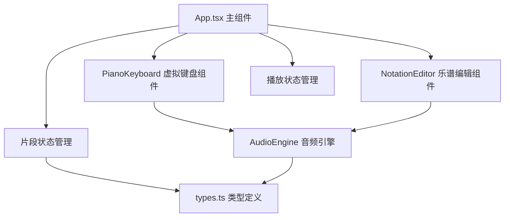

## 1. 架构设计

纯前端单页应用，分层架构：组件层、业务逻辑层、音频引擎层



## 2. 技术说明

- 前端框架：React 18 + TypeScript
- 构建工具：Vite
- 音频处理：Web Audio API（原生）
- UI样式：纯CSS（CSS Modules / styled-components，采用内联样式+CSS变量方案）
- 状态管理：React useState/useReducer（轻量级，无需额外状态库）
- 提示库：react-hot-toast

## 3. 文件结构

| 文件路径 | 用途 |
|---------|------|
| package.json | 依赖配置与脚本 |
| vite.config.ts | Vite构建配置 |
| tsconfig.json | TypeScript严格模式配置 |
| index.html | 入口页面 |
| src/types.ts | 音符Note、片段Segment类型接口定义 |
| src/audioEngine.ts | Web Audio API封装，音高生成与播放管理 |
| src/keyboard.tsx | 虚拟钢琴键盘组件，接收音符回调 |
| src/notationEditor.tsx | 乐谱编辑区组件，展示编辑音符序列 |
| src/app.tsx | 主组件，管理灵感片段列表和播放逻辑 |

## 4. 数据模型

### 4.1 Note（音符）
```typescript
interface Note {
  id: string;
  pitch: string;      // 音高名称，如 'C4', 'C#4'
  frequency: number;  // 频率Hz
  startTime: number;  // 起始时间（相对于片段开始，秒）
  duration: number;   // 持续时间（秒）
}
```

### 4.2 Segment（灵感片段）
```typescript
interface Segment {
  id: string;
  name: string;       // 片段名称
  notes: Note[];      // 音符列表
  createdAt: number;
}
```

## 5. 核心技术实现

### 5.1 音频引擎
- 使用 AudioContext 管理音频上下文
- OscillatorNode 生成正弦波
- GainNode 实现淡入淡出（0.02s淡入，0.1s淡出）
- 每个音符独立创建振荡器，确保快速连击无延迟
- 单例模式，全局共享一个AudioContext

### 5.2 钢琴键盘
- 两排八度共16键（C4-B4 + C5-B5，含黑键）
- 白键宽度50px，黑键宽度30px
- 点击事件：触发音频播放 + 高亮动画 + 音符插入回调
- 高亮效果：黄色背景，0.15s渐变过渡

### 5.3 乐谱编辑器
- 五线谱参考线：虚线，间距40px
- 音符横向排列，音高对应纵向位置
- 红色进度线：播放时从左向右匀速移动
- 支持速度调节

### 5.4 片段管理
- 底部标签切换，选中态下划线滑动动画（0.3s ease-out）
- 新增片段：输入框从底部滑入（0.25s ease-out）
- 每个片段独立存储音符数据

### 5.5 播放控制
- 播放/暂停/停止三态控制
- requestAnimationFrame 驱动进度线动画
- 按时间顺序调度音符播放
- 速度可调（BPM或倍速）

## 6. 性能优化

- 音频节点及时清理，避免内存泄漏
- 键盘事件使用节流/防抖优化快速连击
- 乐谱编辑区使用 CSS transform 优化重绘
- 音符渲染使用 React memo 减少不必要重渲染
