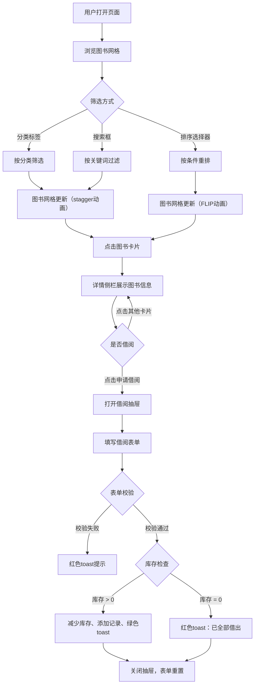

## 1. 产品概述

墨香书馆——一家小型独立书店的线上图书浏览与借阅申请平台，旨在让顾客在线浏览图书分类、查看书籍详情与库存状态，并便捷提交借阅申请，提升实体店服务效率与顾客体验。

- 目标用户：独立书店的周边社区居民及阅读爱好者
- 核心价值：将线下图书借阅流程数字化，降低信息查询成本，提高借阅效率

## 2. 核心功能

### 2.1 用户角色

| 角色 | 注册方式 | 核心权限 |
|------|----------|----------|
| 顾客 | 无需注册 | 浏览图书、分类筛选、搜索排序、查看详情、提交借阅申请 |

### 2.2 功能模块

1. **主页**：导航栏、分类标签栏、搜索与排序、图书网格展示
2. **详情侧栏**：选中图书的详细信息、库存进度条、借阅记录、申请借阅入口
3. **借阅抽屉**：借阅表单、校验与提交反馈

### 2.3 页面详情

| 页面/区域 | 模块名称 | 功能描述 |
|-----------|----------|----------|
| 主页 | 导航栏 | 深棕色背景，左侧显示"墨香书馆"书馆名，右侧含搜索框和排序选择器 |
| 主页 | 分类标签栏 | 文学、历史、哲学、科学、艺术五个分类标签，点击筛选对应分类，激活标签深棕色白字带过渡动画 |
| 主页 | 图书网格 | 每行4列响应式网格，展示图书卡片，筛选时stagger滑入动画 |
| 主页 | 搜索框 | 实时过滤书名或作者，0.2s防抖，匹配文字黄色高亮 |
| 主页 | 排序选择器 | 按书名A-Z、按作者、按库存从多到少，FLIP动画重排 |
| 图书卡片 | 卡片内容 | 封面缩略图、书名、作者、库存状态标签、悬停上移阴影效果 |
| 详情侧栏 | 图书详情 | 封面大图、完整信息、库存进度条（绿→黄→红色变化）、最近3条借阅记录 |
| 详情侧栏 | 借阅按钮 | 点击"申请借阅"打开右侧抽屉表单 |
| 借阅抽屉 | 借阅表单 | 借阅人姓名、手机号、预计归还日期，校验后提交，成功绿色toast，失败红色toast |
| 借阅抽屉 | 抽屉交互 | 从右滑入350px宽，半透明遮罩blur(2px)，关闭时渐出0.3s |

## 3. 核心流程

用户打开页面 → 浏览图书网格 → 通过分类标签/搜索/排序筛选图书 → 点击卡片查看详情 → 点击"申请借阅"打开抽屉 → 填写表单并提交 → 库存充足则借阅成功（库存减少、添加记录、绿色toast）→ 库存不足则提示"已全部借出"（红色toast）→ 关闭抽屉表单重置

## 4. 用户界面设计

### 4.1 设计风格

- **风格定位**：复古书卷风，营造传统书店的温暖沉稳氛围
- **主色**：深棕色 #8B4513（Saddle Brown）
- **背景色**：米白色 #F5F0E8
- **辅助色**：浅棕色 #D2B48C（Tan）
- **点缀色**：金色 #FFD700
- **成功色**：#50B86C
- **错误色**：#E74C3C
- **深文字**：#3B2E1E
- **浅文字**：#8B7355
- **按钮风格**：圆角矩形，深棕色主按钮，悬停加深
- **字体**：Noto Serif SC（主字体），italic变体用于书店名
- **布局风格**：左右分栏（2/3 + 1/3），卡片网格
- **圆角**：统一12px
- **卡片效果**：白色背景，1px浅棕色边框，2px内阴影浮雕感

### 4.2 页面设计概述

| 页面/区域 | 模块名称 | UI元素 |
|-----------|----------|--------|
| 导航栏 | 顶部导航 | 深棕色背景56px高，左侧"墨香书馆"italic白色字，右侧搜索框+排序选择器 |
| 主页左区 | 分类标签栏 | 浅棕色圆角矩形标签，激活标签深棕色白字0.3s过渡 |
| 主页左区 | 图书网格 | 4列网格（>1024px），2列（768-1024px），1列（<768px），卡片stagger动画 |
| 主页右区 | 详情侧栏 | 白色圆角卡片，封面大图200x280，信息文字，库存进度条，借阅记录列表 |
| 借阅抽屉 | 抽屉表单 | 右侧滑入350px宽，半透明遮罩，表单输入框+日期选择器+确认按钮 |

### 4.3 响应式设计

- **桌面端（>1024px）**：左区2/3图书网格（3列），右区1/3详情侧栏
- **平板端（768-1024px）**：左区图书网格2列，右区详情侧栏
- **移动端（<768px）**：单列网格，详情区折叠到底部，按钮控制展开/收起

### 4.4 动画规范

- 分类筛选：卡片stagger从底部滑入，每张间隔0.1s，动画0.4s ease-out
- 排序重排：FLIP动画0.4s ease
- 卡片悬停：上移5px + 阴影增强，0.3s ease
- 抽屉打开：从右滑入0.3s ease-out
- 抽屉关闭：渐出0.3s ease-in
- 标签切换：背景色0.3s过渡
- 所有交互：0.2-0.4s CSS过渡
