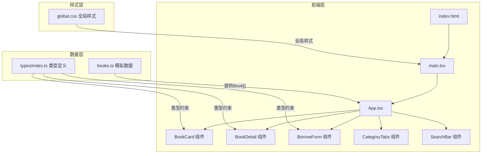
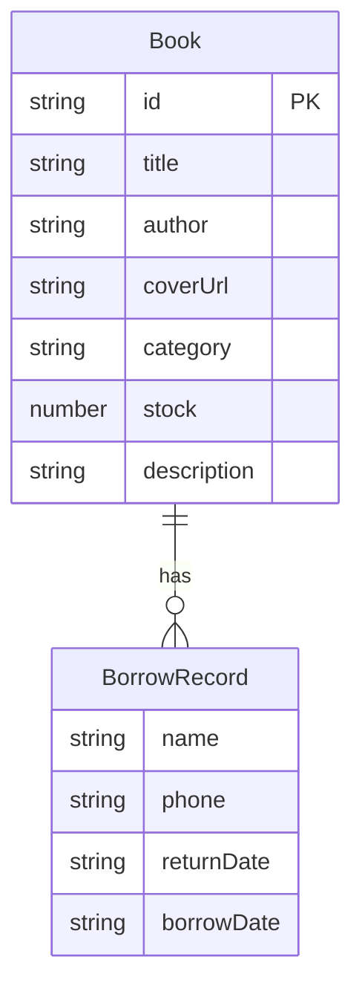

## 1. 架构设计



**数据流向**：
- `books.ts` → `App.tsx`（状态管理：books数组、选中图书、分类筛选、搜索关键词、排序方式）
- `App.tsx` → `BookCard`（Book props + onBorrow回调 + onClick回调）
- `App.tsx` → `BookDetail`（Book props + onBorrow回调）
- `App.tsx` → `BorrowForm`（onSubmit回调）
- `BorrowForm.onSubmit` → `App.tsx`（更新books数组中的stock和borrowRecords）

## 2. 技术说明

- **前端框架**：React 18 + TypeScript（严格模式）
- **构建工具**：Vite + @vitejs/plugin-react
- **路径别名**：@ → src/
- **状态管理**：React useState/useReducer（无需额外状态库，数据量小且单一页面）
- **样式方案**：全局CSS + CSS变量（复古书卷风定制设计系统）
- **通知提示**：react-hot-toast
- **图标库**：react-icons
- **字体**：Google Fonts - Noto Serif SC
- **后端**：无（纯前端，数据仅内存操作）
- **数据库**：无（模拟数据模块 books.ts）

## 3. 路由定义

| 路由 | 用途 |
|------|------|
| / | 单页应用，所有功能在同一页面内完成（分类筛选、搜索排序、详情展示、借阅申请） |

本项目为单页应用，无需路由。所有交互在同一页面通过状态切换实现。

## 4. API定义

无后端API，所有数据操作在前端内存中完成：
- 筛选/搜索/排序：纯前端数组操作
- 借阅申请：修改内存中的books数组（stock减1，borrowRecords添加记录）

## 5. 数据模型

### 5.1 数据模型定义



### 5.2 TypeScript 类型定义

```typescript
interface BorrowRecord {
  name: string;
  phone: string;
  returnDate: string;
  borrowDate: string;
}

interface Book {
  id: string;
  title: string;
  author: string;
  coverUrl: string;
  category: '文学' | '历史' | '哲学' | '科学' | '艺术';
  stock: number;
  description: string;
  borrowRecords: BorrowRecord[];
}
```

### 5.3 文件结构与调用关系

```
project/
├── index.html                    # 入口页面，引入Noto Serif SC字体
├── package.json                  # 依赖与脚本
├── vite.config.ts                # Vite配置，路径别名@→src/
├── tsconfig.json                 # TypeScript严格模式配置
└── src/
    ├── main.tsx                  # React渲染入口 ← 引入global.css
    ├── App.tsx                   # 主组件 ← 状态管理中心
    │                             #   ← 调用 books.ts 获取数据
    │                             #   ← 传递数据给子组件
    ├── types/
    │   └── index.ts              # Book、BorrowRecord类型定义
    ├── data/
    │   └── books.ts              # 模拟数据 ← 导入types定义类型
    ├── components/
    │   ├── BookCard.tsx          # 图书卡片 ← 接收Book props + onBorrow + onClick
    │   ├── BookDetail.tsx        # 图书详情 ← 接收Book props + onBorrow
    │   └── BorrowForm.tsx        # 借阅表单 ← 接收onSubmit回调
    └── styles/
        └── global.css            # 全局样式 + CSS变量 + 动画关键帧
```
